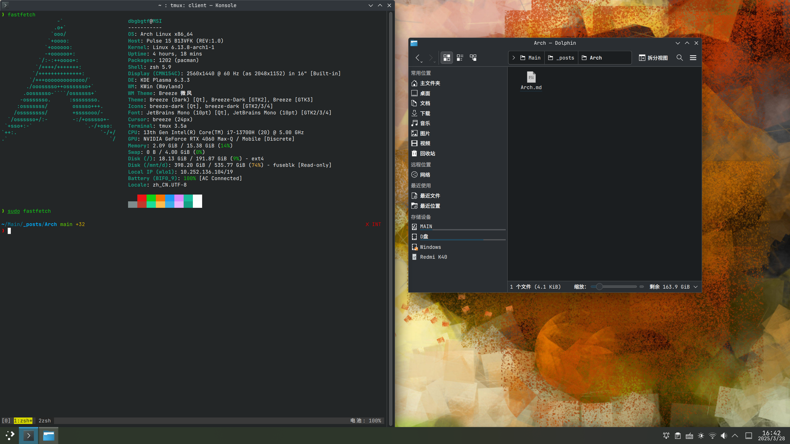

# 前言
火箭作为一个折腾大王，一直喜欢折腾各种奇葩的配置(但还真可以)
Arch物理机+neovim+ghidra的配置应该算是及其小众了。
顶不住火箭老是拉我入坑Linux物理机，加上wsl确实不像是一个正经玩意，
于是就打算尝试一下。

我是比较懒得记录这些完整流程的，而且反正有Archwiki和网上的很多资料。
[英文安装wiki](https://wiki.archlinux.org/title/Installation_guide)
[中文安装wiki](https://wiki.archlinuxcn.org/wiki/%E5%AE%89%E8%A3%85%E6%8C%87%E5%8D%97)
[一个不错的中文安装教程](https://arch.icekylin.online/guide/)

我就记录一下我折腾比较久没解决的问题以及安装大致原理吧
# Windows
据火箭所说(反正我是没试过)，如果把windows和Linux装到同一个盘，
windows可能会在更新的时候覆盖Linux的grub,导致每次出现这样的问题都要再配置一次grub
他的解决方案是力大砖飞，再搞一个硬盘，双盘双系统，这也是比较主流的配置

但是！！问题是我的电脑(微星魔影15)不支持双硬盘！
不过吧，俺寻思☝️应该把grub放到u盘就好了，用u盘作为引导盘。
🤔好像还真可以

...(省略中间的安装过程)

到了需要安装grub的时候了，我却发现怎么也没办法把grub写入u盘。
后来发现是grub-install的参数理解不到位，总之，我把正确的写法放这

```sh
grub-install --target=x86_64-efi --efi-directory=/mnt --boot-directory=/boot --removable /dev/sda --bootloader-id=Arch
grub-mkconfig -o /mnt/grub/grub.cfg
```
注意，这里的mnt需要挂载你想要写入grub的u盘，并且在写入前要对其进行格式处理(忘记要转成什么格式了waaaagh)
removable参数是我看到archwiki推荐微星电脑加上的，不确定有没有用
/dev/sda是你的u盘，efi-directory也选择u盘的挂载位置，而boot-directory则选择Arch系统下/boot目录的位置即可
因为我只需要grub项即efi在u盘上，防止被windows干掉就行，boot项完全可以放在电脑盘上加快启动速度
(这时系统已经启动了，但是这个系统的启动引导项还没有配置好，等会再说)

# 安装大致原理
首先安装Linux系统需要一个u盘作为媒介，因为windows系统下无法直接访问Linux的ext4系统
只能先在u盘上启动一个小的Linux系统，去把电脑上准备作为Linux系统的硬盘分区设置好才行
包括常规目录，基础包，时区，主机名等等

所以实际上第一步是准备一个u盘，用ventoy,rufus等工具把官网下到的iso镜像刷到u盘上
还要用diskgenius等工具划出一片硬盘空间供Linux使用

然后插u盘，开机进Bios，把启动设为u盘，这样等会就可以进入小的Linux系统，为设置真正要用的系统做准备了
经过一些繁琐的设置，再设置好了真正要用的系统时，就可以使用Arch-chroot进入系统了

在这之后，就需要写入grub了
如果你和我一样用u盘做引导方案，最好用两个u盘，这样如果主系统的引导项出问题
作为小系统的u盘随时可以通过同样的方式进入系统救砖(是的我因为显卡的问题救了好几次)

所以上面我的grub脚本的工作情景是你有两个u盘，通过第一个u盘启动了小系统，然后arch-chroot到了真正的系统里
再挂载上第二个u盘到/mnt，这时才能用这个脚本写入grub引导项。并且也不用担心windows把grub项干掉了

而且经过我的测试，尽管我拿了一个垃圾u盘作为引导盘，但是启动速度没有什么影响，不会出现格外慢的情况
所以不想再买一个硬盘的可以大胆尝试，只要每次启动时插上u盘就行(当然还要设置好bios启动顺序优先u盘，这样会方便点)

# 后记
作为一个一年多的wsl用户，终于还是抛弃了wsl
这玩意倒不是说不好，只是我最近时不时启动wsl失败闪退，而且完全无法解决，而且性能上也不如物理机，有些东西玩不动

但是好处就是比较方便，懒得折腾的话用起来还是可以的(装个Linux乱七八糟的配置折腾死我了)

最后就是Arch用户喜闻乐见的fastfetch

