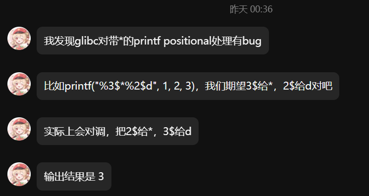
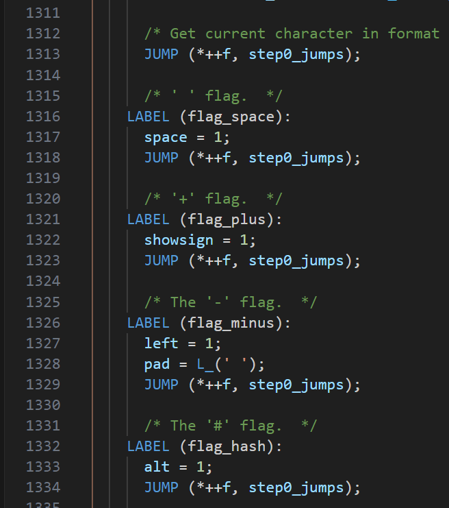

# 起因
前两天火箭发给我一个奇怪的东西

PS:聊天记录中多打了一个百分号，他的实际意思是下面这行代码
```c
printf("%3$*2$d",1,2,3);
```
# 理解过程
咋一看似乎很明确，`3$`取参数会取到3，将其赋值给`*`，`2$`会取到2，将其赋值给`d`。也就是说格式化宽度为3，内容为2。
但是结果是` 3`，也就是宽度为2，内容为3。

于是我尝试跟进了一下源码

vfprintf在图中的位置JUMP，但是之后的调试就跟不住了，完全不知道跳到哪。


不过好在我灵机一动，我发现了盲点。
`%3$*2$d`实际上由`vfprintf`解析时，肯定是看到%，向后取一个参数，看到*向后取一个参数。
而不是一开始以为的先取参数在给后面的符号赋值，毕竟`2$`这种字符串究竟是`2$`字符本身还是表示取第二个参数，是取决于是否有没有空位存放这个参数。

下面这个例子也可以试试
```
#include<stdio.h>
int main()
{
    printf("%2$*3$d",10,20,30);
}
```
