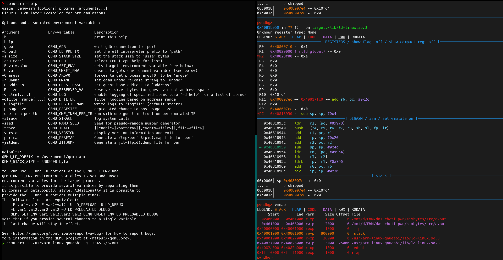

# 前言
这两天老摸鱼，不知道干啥，比赛也没啥比赛，出题也出差不多了。
于是天天怪物猎人文明六，昨晚还在玩冰汽时代。
干脆把最近arm环境搭建记录一下。
# 搭建
apt需要安装的东西基本网上都挺全乎的。
我安装的时候都是一股脑全装上去，这点东西能有多大。
(不过导致我现在不知道哪些包对应有哪些用处)

还有就是arm分挺多种类的，有点烦。
由gpt得到一个简单分类
```
ARM（32位架构）：

ARMel：使用软浮点，浮点运算通过软件实现，性能较armhf低。
ARMhf：使用硬浮点，浮点运算通过cpu实现，性能较armel高。

AArch64（64位架构）：

AArch64：ARMv8的64位执行状态

ARMv7和ARMv8：

ARMv7：32位架构，支持armel和armhf
ARMv8：支持AArch32和AArch64指令集。
```

## 运行arm程序
```shell
apt install qemu qemu-user qemu-user-static
apt search qemu | grep arm
apt install qemu-system-arm
```

安装完qemu的组件就可以直接运行静态arm程序了
```shell
qemu-arm ./arm_static_program
```

如果要运行动态链接的arm程序
```shell
apt search  libc6- | grep 'arm'
apt install libc6-arm64-cross #比如安装这个 
qemu-arm -L /usr/arm-linux-gnueabi ./arm_dynamic_program
```
> qemu-arm -help
> usage: qemu-arm [options] program [arguments...]
> 其中options是对于qemu-arm的，而arguments是给程序的参数。
> 也就是意味着所有在程序后面的参数都会被传进程序本身

## gcc-arm-linux-gnueabi
那如何获得arm程序嘞
```shell
apt install gcc-arm-linux-gnueabi gcc-aarch64-linux-gnu
arm-linux-gnueabi-gcc ./test.c -o ./arm_program
```

## gdb-multiarch
最后是如何调试
```shell
apt install gdb-multiarch
```
网上大多都只是提供了如何调试，而没有提供一个方便的调试方法
> (gdb)表示在gdb里面的操作
```shell
qemu-arm -L /usr/arm-linux-gnueabi -g 12345./arm_dynamic_program
gdb-mutiarch
set architecture arm(gdb)
target remote: 12345(gdb)
```


## pwntools-gdb-mutiarch
最后，最重要的是介绍一下如何pwntools一键启动程序和gdb-mutiarch
> 感谢[Rocket](https://rocketmadev.github.io/)上课的时候做我旁边教了我如何使用pwntools一键启动程序和gdb-mutiarch
> Rocket一直有个很神奇的能力，就是能从开发者依托屎的文档里找出如何做到他要做的事

```python
from pwn import *
import os

os.environ['QEMU_LD_PREFIX'] = '/usr/arm-linux-gnueabi/'
context(terminal = ['tmux','splitw','-h'], arch = "arm", log_level = "debug")

io = gdb.debug('./pwn')

io.interactive()#
```
# 后记
真正的研究还没开始，把SCTF的题目记录完，过两天也许会看看之前int_巴比氨酸给我的一个arm程序，真实环境下的一个监控器所用的软件。不过其依赖比较特殊，也许需要完全使用和机子上相同的依赖才能运行。
就先这样，以后可能得搞一个arm架构的qemu来方便arm学习，就类似于有人在docker里面配置自己的工作环境一样，只不过完全体的qemu是系统级别的。
