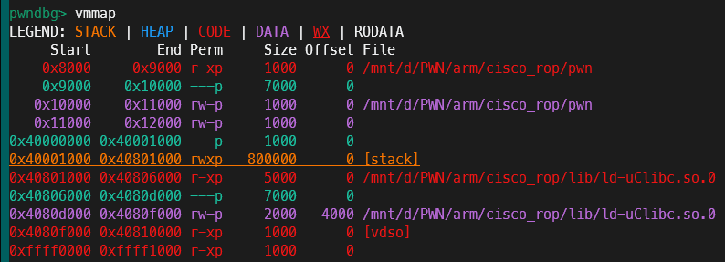

# 前言
本来这篇文章是会不存在的，因为每次我搭建完一个新的环境都头昏脑涨的，根本想不起来搭建的具体步骤，以及问题是如何得到解决的。
但是由于我前两天不小心把我的wsl镜像给覆盖了，导致丢失Linux所有环境，必须从头再来，于是就有了这一篇搭建arm-system的文章。

# qemu-system模式介绍
qemu分为两种模式，usermode是相对简易的模式，其将每条arm指令翻译成你的平台使用的架构，然后交给平台去执行，这么做的好处就是不需要一个完整的异构环境，实现和使用相对简单。这么做的坏处就是没有一个完整的异构环境，一些东西不够全乎，就拿gdb举例，我在使用gdb调试由qemu-arm，也就是usermode的qemu启动的程序时，vmmap和procmaps都看不到完整的内存段，居然只能看到ld段。而且更搞的是，procmaps和vmmap看到的地址固定存在0x10000的偏移？而且procmaps还看不到可执行段？也许是qemu-arm的特殊处理？


无论怎么讲，目前最好的办法肯定是想办法搞到一个完整的aarch64环境，要不通过qemu-system，要不直接买一个开发板用来研究。
我决定先搞个qemu-system试试。

# 制作过程
由于我参考的文章是自己编译Linux内核，自己制作根文件系统，所以我也选择了这样的方式。
必要的依赖就不说了，大体就是qemu-system-aarch64，交叉编译工具，aarch64的lib库。
## Linux内核交叉编译
首先去官网把你想要的源码版本下下来，我这里选择了6.11.5

解压后进入文件夹
```bash
make nconfig ARCH=arm64
```
我由于不会配置具体需要，我就保持默认，不过这样编译的内核文件想必一定很臃肿，要是我看得懂配置的话我肯定会裁剪掉的。
```bash
make CROSS_COMPILE=aarch64-linux-gnu- ARCH=arm64 -j16
```
这里的CROSS_COMPILE和ARCH实际上都是可以在nconfig找到的，只不过图方便就在命令行以环境变量传进去。-j16是使用多少个CPU进行编译，我的笔记本有20个，就使用-j16。

## busybox
busybox是一个简易的工具箱，其包含了基础的Linux命令，这里交叉编译后放进qemu，我们就可以使用其包含的命令了。
[busybox下载](https://www.busybox.net/downloads)
可以去选择自己想要的版本下载，我选择了`busybox-1.36.1`
busybox似乎不支持nconfig，所以我使用menuconfig，这里需要改两个设置(应该也可以通过前面的传环境变量)
```menuconfig
Settings->Build static binary # 这个勾上
Cross compiler prefix # 选择aarch64-linux-gnu，或者你的交叉编译链工具去掉末尾的gcc
```
这个版本有个bug，把`networking/tc.c`的文件移出去就行，否则不能正常编译。
然后就可以make了，别忘记-j选择使用多少个cpu，要不编译会很慢。
安装后的东西默认在`your_path_to_busybox/busybox-1.36.1/_install/`
等会会用到

## rootfs根文件系统配置
```bash
mkdir -p etc dev mnt proc sys tmp mnt root etc/init.d/ lib
touch etc/inittab etc/fstab etc/profile etc/init.d/rcS
chmod +x etc/inittab etc/init.d/rcS
cp -r /usr/aarch64-linux-gnu/lib ./lib
cp -r your_path_to_busybox/busybox-1.36.1/_install/* .
```
这样文件系统的基本架构就有了。

下面是几个启机脚本的配置，好像并不是每一行都必须要。
我也是从参考文章中抄过来的。


到现在，最麻烦的步骤以及结束了。
## 一键启动脚本
qemu的启动首先需要把一个文件系统镜像，还需要配置各种东西，导致启动所需的命令很长，建议自己试两次，以后就用脚本启动就行。
```bash
find . | cpio -o -H newc |gzip > ../rootfs.cpio.gz # 将rootfs文件夹下的所有东西打包成.gz，作为qemu启动所使用的文件系统。

qemu-system-aarch64 \
-machine virt,virtualization=true,gic-version=3 \ 
# -machine 有很多机器模板可选择，virt是通用的，符合我的需求。
-nographic \
# 不使用图形化界面
-m size=1024M \
# 指定使用内存大小
-cpu cortex-a57 \
# 指定使用CPU类型
-smp 4 \
# 指定使用多少CPU
-kernel your_path_to_linux/linux-6.11.5/arch/arm64/boot/Image \
# 刚刚编译好的Linux内核镜像现在就可以用到了，/arch/arm64/boot/Image路径是固定的，只需要手动设置前面
-initrd ../rootfs.cpio.gz \
# 使用rootfs.cpio.gz作为文件系统
-append "root=/dev/ram console=ttyAMA0 rdinit=/linuxrc" \
# 不懂，抄的
-fsdev local,security_model=passthrough,id=fsdev0,path=/root/share \
-device virtio-9p-pci,id=fs0,fsdev=fsdev0,mount_tag=hostshare
# 设置共享文件夹
```
最后两行如果不需要即时的和宿主机共享文件夹，可以直接去掉
如果需要的话，启动脚本进入qemu之后，再执行
```bash
mkdir /mnt/share
mount -t 9p -o trans=virtio,version=9p2000.L hostshare /mnt/share
```

# 参考文章
[SegmentFault思否的一篇](https://segmentfault.com/a/1190000044621368)
[知乎的一篇](https://zhuanlan.zhihu.com/p/340362172)
[博客园的一篇](https://www.cnblogs.com/alone153/p/15779775.html)
