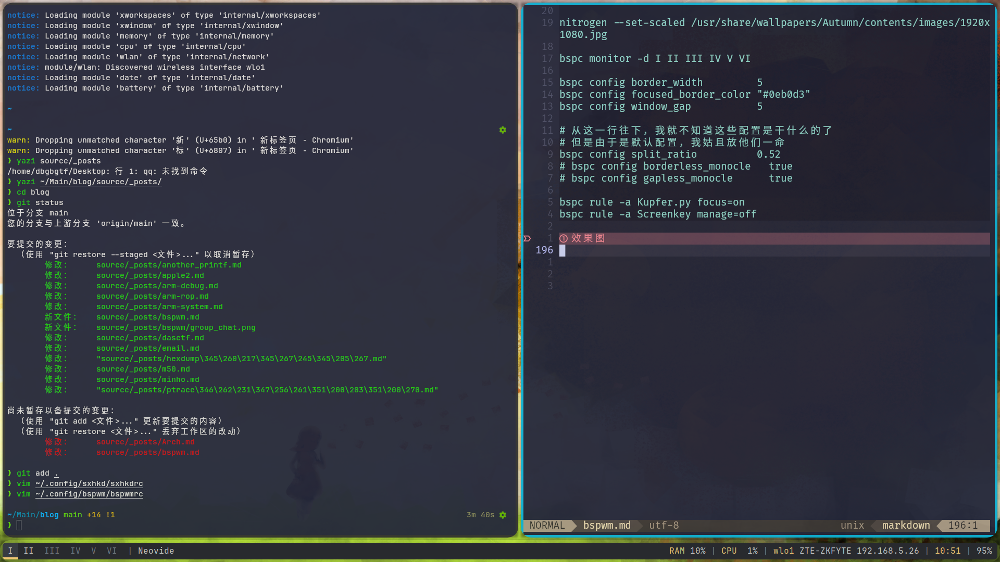
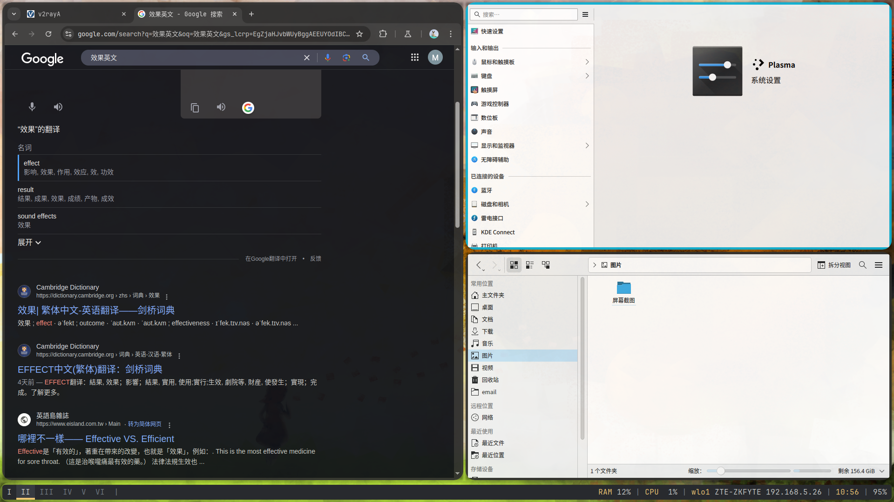

# 前言
最开始我用ArchLinux(其实也就一个月左右吧)，是用的🚀推荐的kde全家桶
kde的优点和缺点都很明确

优点:像windows,更适合平滑过度
缺点:密码的我为什么要用一个Linux版本的windows,甚至一些细节还不如windows

最开始我只是觉得kde自带的窗口管理器有点烦
作为一个被tmux惯坏的孩子，我更希望我能轻松快速切换窗口，而不是`alt+tab`

tmux可以随时看到每一个窗口在执行什么命令
在我的配置后，长按`alt+->`即可向右窗口切换
切换过程是即时的，没有什么花哨的动画
也就是我只需要看一眼状态栏，然后长按`alt`再按几下右键头或者左箭头就行

对比kwin或者windows的窗口管理方式
我必须长按`alt`的同时一下一下的按`tab`
并且不停观察当前属于什么窗口，到了要的窗口再停下来
最要命的是我在使用过程中经常为了抠出屏幕空间，不停的调整布局，比如一会全屏浏览器，一会全屏终端，一会半屏浏览器和终端
总结就一个字`烦！`

我在ArchLinuxCn群聊向大伙问了一下，热情的群友向我推荐平铺式窗口管理器

# 平铺式？堆叠式？
平铺就像tmux一样，不允许多个窗口堆叠
而堆叠就像windows一样，字面意思很好理解

平铺的优势就是可以让你拥有多个窗口，并且充分利用其中每一个
比如tmux可以随时创建和删除窗口，你只需要在每个窗口分配一个工作即可

堆叠的优势？我不知道堆叠这种东西为什么还存在，可能是给大众用的吧

# 几种平铺式窗口管理器
我尝试了三种，更多可以在[ArchWiki](https://wiki.archlinuxcn.org/wiki/%E7%AA%97%E5%8F%A3%E7%AE%A1%E7%90%86%E5%99%A8)找到

在配置窗口管理器的过程中，我的血压一直很高
因为在配置好之前，我必须忍受各种奇葩的默认设置(没错说的就是你i3)
或者是不停的重启来测试
又或者是失去电源管理powerdevil，导致我无法合上我的笔记本盖来使用主显示器(后来才知道可以直接该系统配置文件，不过tty的时候还强制用笔记本屏幕，所以🙅‍♀️)
还由于必须在登陆界面选择窗口管理器(我没有深入了解，但是似乎比较通用的解法都是这样的)
最离谱的是我长时间必须在tty和正常窗口直接切换来测试效果如何
(有些窗口管理器默认启动后会纯黑屏🙅‍♀️，谁知道呢)

总得来说，要是语言过激，请不要喷我

## i3
我试了i3，i3的默认设置可以说是`braindead`
当我启用i3，我在默认设置下无法让任何一款应用占满屏幕
甚至当我再打开一个应用，原来的应用会变小，始终在我的桌面中间空着一大片
i3开发者希望我欣赏桌面壁纸？nothanks

默认设置当然不是一切
i3的用户很多，文档也很多，但是我始终无法找到任何关于占满屏幕的设置
plus，i3底部的状态栏也是💩，为什么不让其他组件来完成状态栏，不乐意写就别写，更别提i3的状态栏加上kde的状态栏，我的桌面底部就会非常奇怪

可能有些过激了，但是我最后因为这些原因放弃了i3

## herbstluftwm
首先这个名字也是`braindead`，但是我还是试了一下
他和`bspwm`有些像，启动后是纯绿屏，然后我尝试了最简单的配置
由于不知道怎么让他执行命令，放弃了(这个大概是我的问题，因为我经常读不懂文档)

## bspwm
有请唯一真神！(指我用过的)

关于配置可以参考[config](https://dev.to/l04db4l4nc3r/bspwm-a-bare-bones-window-manager-44di)

### 安装
对于Arch用户，神圣的pacman(或者yay)将引导我们
```zsh
sudo pacman -S bspwm sxhkd
```
使用pacman的好处在于连续安装多个包比较方便

然后根据环境不同，我已经看到了N种启动新窗口管理器方式了

> [ArchWiki](https://wiki.archlinuxcn.org/wiki/KDE#%E6%9B%BF%E6%8D%A2KWin%E6%9C%8D%E5%8A%A1)中描述的通过systemctl启动，这种方式应该是适用于依然使用kde的桌面环境的窗口管理器(对于我来说，i某3)
> 这种启动方式除了麻烦没有好处，你如果需要kwin的时候还得再启动

> 对于我的登陆管理器sddm来说，bspwm似乎不需要这样
> 在安装之后，你的`/usr/share/xsessions/`目录下会多出一个
> `bspwm.desktop`，在每次启动系统，进入登陆界面时可以选择`bspwm`

但是先不要重启，因为如果你不熟悉`tty`的话，必须在kde下完成最后一件事

```zsh
cp /usr/share/doc/sxhkd/examples/background_shell/sxhkdrc ~/.config/sxhkd/sxhkdrc

cp /usr/share/doc/bspwm/examples/bspwmrc ~/.config/bspwm/bspwmrc
```
`bspwm`和`sxhkd`都读取`.config`下的配置，所以在`.config`下更改
然后至少在`sxhkdrc`中加上
```rc
super + Return
    kitty # 或者其他terminal，konsole好像不行🙅‍♀️
```
最后在`bspwmrc`加上`sxhkd &`

### bspwm,⚠️启动！

对于sddm来说，只需要在输入密码的界面更换就行了，换成bspwm后启动！

在黑屏中按`super + Return`启动`terminal`，对于windows键盘布局来说，按`win + Enter`

但是在`sxhkdrc`中还是以`mac`的布局为准，我们还是把`Enter`叫做`Return`，`win`叫做`super`

接下来在终端中可以尝试一下`bspc`的功能，因为接下来的配置会需要用到

下面是我的sxhkdrc配置，真正的热键在这里配置
```rc
# 开启终端
super + Return
    kitty
# 启动菜单
super + q
    exec rofi -show run
# 截图
super + Print
    exec spectacle
# 关闭当前节点
super + c
    bspc node -c
# 杀死当前节点
super + k
    bspc node -k
# 当前窗口切换浮动
super + m
    bspc node -t '~floating'
# {对调,聚焦}{上下左右}节点
{_,shift + } super + {Up,Down,Right,Left}
    bspc node -{f,s} {north,south,east,west}
{_,shift + } super + {k,j,l,h}
    bspc node -{f,s} {north,south,east,west}

# 去{下/上}一个桌面
alt + {Right, Left}
    bspc desktop {next,prev} -f
alt + {l,h}
    bspc desktop {next,prev} -f
# 拖拽当前节点至{下,上}一个桌面
shift + alt {Right,Left};
    desktop={next,prev};bspc node -d "$desktop" && bspc desktop "$desktop" -f
shift + alt {l,h};
    desktop={next,prev};bspc node -d "$desktop" && bspc desktop "$desktop" -f

# 重启sxhkd热键
shift + alt + Escape
    pkill -USR1 -x sxhkd
# {退出,退出}当前桌面环境
shift + alt + {q,r}
    bspc {quit, wm -r}
```
注意每次更改热键后都要用重启`sxhkd`，然后就可以尝试一下各种基础操作了
也可以试试别的，sxhkd的语法还是很好理解的

至于`bspwm`的配置，我还启动了一些美化插件，`picom`和`nitrogen`和`polybar`
`picom`是窗口合成器，提供一些窗口透明度，背景模糊的效果
`nitrogen`我只用来设个背景
`polybar`是状态栏，会显示你一些基本信息，但是不能向windows一样点击来交互

`fcitx5`是我在kde时候用的中文输入法，也顺便启动了，要不然他不会自动启动
```rc

#! /bin/sh

sxhkd &
picom &
fcitx5 &
polybar example -q &

nitrogen --set-scaled /usr/share/wallpapers/Autumn/contents/images/1920x1080.jpg

bspc monitor -d I II III IV V VI 

bspc config border_width         5
bspc config focused_border_color "#0eb0d3"
bspc config window_gap           5

# 从这一行往下，我就不知道这些配置是干什么的了
# 但是由于是默认配置，我姑且放他们一命
bspc config split_ratio          0.52
# bspc config borderless_monocle   true
# bspc config gapless_monocle      true

bspc rule -a Kupfer.py focus=on
bspc rule -a Screenkey manage=off
```

# 效果图




# 最后
其实到这里之后还有很多细节没有说，
比如截图软件选择，电源管理选择，音量软件及快捷键配置，屏幕亮度等等
但是这些东西太过于个性化了

比如对于我来说，电源我只需要改一下合上笔记本继续向主屏输出即可，没什么频繁变更的需求，完全可以通过更改系统配置文件做到

音量配置的话我可以用`mate-volume-control`呼出菜单更改就差不多了，没必要再设置快捷键(其实可能还是有必要的，但是刚配完这么多有点累)
