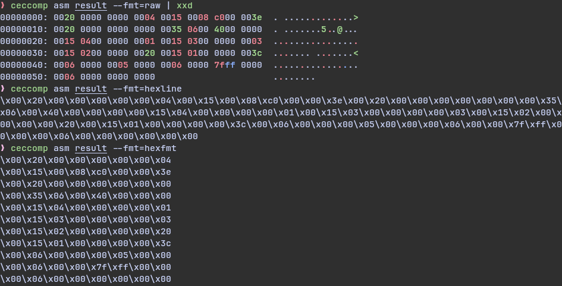

# NAME

ceccomp - the seccomp analyze tools

# SYNOPSIS

```
usage: ceccomp [subcommand] [args] [options]
    [subcommand]: asm|disasm|emu|trace|version|help
```

# CONCEPT

Kernel load the seccomp with ***RAW BPF BYTES***  
which may look like this


After ceccomp resolve the ***RAW BPF BYTES***, it can print out ***HUMAN READABLE TEXT***  
May look like this


I will call ***HUMAN READABLE TEXT*** with ***TEXT***
, and ***RAW BPF BYTES*** with ***RAW*** later

Note that the `Line CODE JT JF K` are not necessary part of ***TEXT***, I just decided to print it  

> So be sure to understand what ***TEXT*** and ***RAW*** means

# DESCRIPTION

ceccomp is a seccomp analyze tool written in C.

Asm can transfer ***TEXT*** to ***RAW***  
Disasm can transfer ***RAW*** to ***TEXT***  
Emu can show what will happen(KILL?ALLOW?TRACE?) when the given syscall_nr are called.  
Trace can atomaticlly trace the given program, and try to analyze its seccomp rules.

### INSTALL

Only github install is available now:)
```
git clone git@github.com:dbgbgtf1/Ceccomp.git
cd Ceccomp
make ceccomp
sudo make install
```

### Trace

`ceccomp trace PROGRAM [ program-args ]`

Trace can trace program ***RAW*** out, and then print it out to ***TEXT***

> It can be useful when you want to know what seccomp a program loads

Example:  


### Emulate

`ceccomp emu [ --arch= ] bpftext syscall_nr [ args[0-5] ip ]`

Emulate what will happen if `syscall (nr, args ...)` were called

`args[0-5]` and `ip`(instruction pointer) are default as 0  
`arch` is set to your cpu arch when not specified  
(This is only tested in x86_64 and aarch64, if anything goes wrong, open an issue plz

> It can be useful when you don't want to read ***TEXT***

Example:  


### Disassemble

`ceccomp disasm [ --arch= ] bpftext`

Disassemble from ***RAW*** to ***TEXT***

`arch` is set to your cpu arch when not specified  
(This is only tested in x86_64 and aarch64, if anything goes wrong, open an issue plz

> It can be useful when the program don't load seccomp at once  
> So you can use gdb to get the ***RAW*** manually, Disasm will do the rest for you

Example:  


### Assemble

`ceccomp asm [ --arch= ] [ --fmt= ] bpftext`

Assemble the ***TEXT*** to ***RAW***

`arch` is set to your cpu arch when not specified  
(This is only tested in x86_64 and aarch64, if anything goes wrong, open an issue plz  
`fmt` can be set to `hexfmt`, `raw` and `hexline`, default as `hexline`

> It could be useful when you need to write your own seccomp

(but make sure you write the asm in correct way
I might write a simple guide about the asm rules)



# SUPPORTED ARCH

- i386
- x86_64
- x32
- arm
- aarch64
- mips
- mipsel
- mipsel64
- mipsel64n32
- parisc
- parisc64
- ppc
- ppc64
- ppc64le
- s390
- s390x
- riscv64

# I Need You

Tell me what do you think!
Pull request or issue is welcome!

[Project Repo](https://github.com/dbgbgtf1/Ceccomp)
