# NAME

ceccomp - the seccomp analyze tools

# SYNOPSIS

```
usage: ceccomp [subcommand] [args] [options]
    [subcommand]: asm|disasm|emu|trace|probe|version|help
```

# CONCEPT

Kernel load the seccomp with ***RAW BPF BYTES***  
which may look like this  
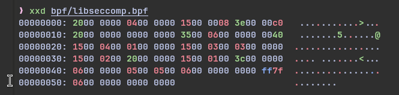

After ceccomp resolve the ***RAW BPF BYTES***, it can print out ***HUMAN READABLE TEXT***  
May look like this  
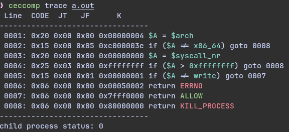

I will call ***HUMAN READABLE TEXT*** with ***TEXT***
, and ***RAW BPF BYTES*** with ***RAW*** later

Note that the `Line CODE JT JF K` are not necessary part of ***TEXT***, I just decided to print it  
> So be sure to understand what ***TEXT*** and ***RAW*** means

# DESCRIPTION

ceccomp is a seccomp analyze tool written in C.

Asm assemble ***TEXT*** to ***RAW***  
Disasm disassemble ***RAW*** to ***TEXT***  
Emu show what will happen(KILL?ALLOW?TRACE?) when the given syscall_nr are called  
Trace trace the given [ program or pid ], and try to analyze its seccomp rules  
Probe trace the given PROGRAM, and emulate common syscall_nr with quiet mode

# INSTALL

For archlinux users, try `yay ceccomp`
It's on the aur repo now!

For others, github install is available now  
Ceccomp is still actively update, so remember to update sometimes:)
```
git clone git@github.com:dbgbgtf1/Ceccomp.git
cd Ceccomp
make ceccomp
sudo make install
```

# USAGE

## Assemble

`ceccomp asm     [ -a ARCH ] [ -f FMT ] [ text ]`

Assemble the ***TEXT*** to ***RAW***

`fmt` can be set to `hexfmt`, `raw` and `hexline`, default as `hexline`  
`file` should be the ***TEXT*** file, but it is default as `stdin`

> It could be useful when you need to write your own seccomp

But make sure you write the asm in correct way  
I might write a simple guide about the asm rules  
Before that, take the disasm result as example

Example:  
> `--fmt` examples

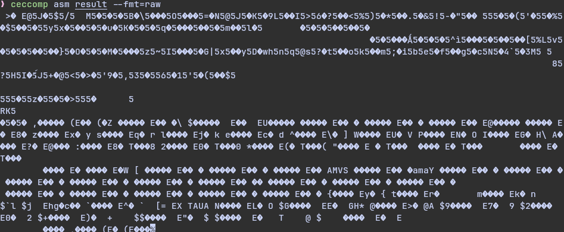  
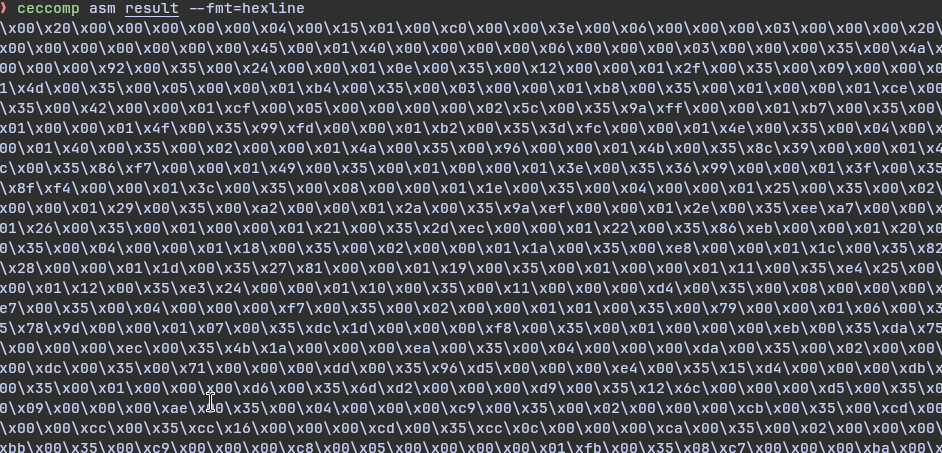  
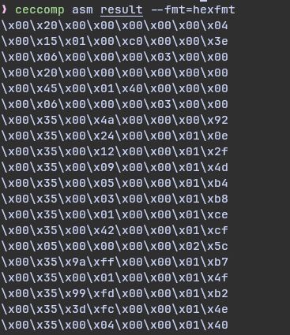

## Disassemble

`ceccomp disasm  [ -a ARCH ] [ raw ]`

Disassemble from ***RAW*** to ***TEXT***

> It can be useful when the program don't load seccomp at once  
> So you can use gdb to get the ***RAW*** manually, Disasm will do the rest for you

Example:  
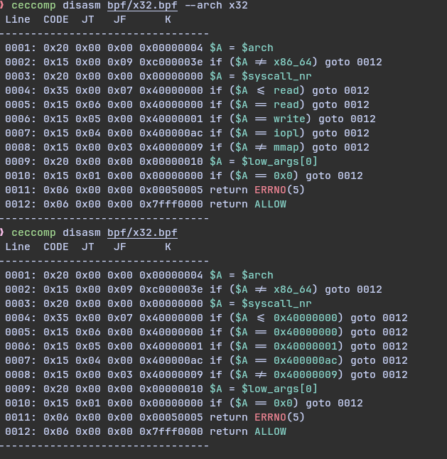
> asm and then disasm!

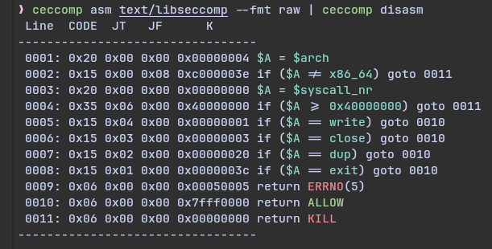

## Emulate

`ceccomp emu     [ -a ARCH ] [ -q ] text syscall_nr [ args[0-5] ip ]`

Emulate what will happen if `syscall (nr, args ...)` were called

`args[0-5]` and `ip`(instruction pointer) are default as 0  
`--quiet` mode only show the return value of emu

> It can be useful when you don't want to read ***TEXT***

Example:  
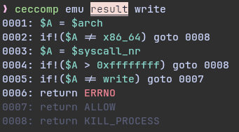
> '--quiet' mode can be useful when you only need result

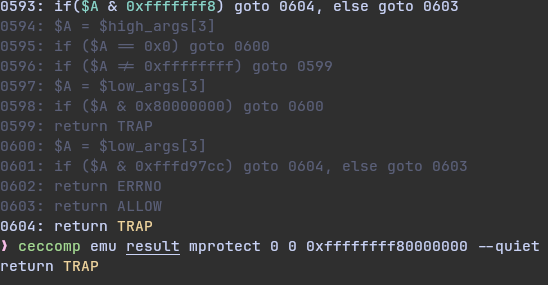

## Probe

`ceccomp probe   [ -a ARCH ] [ -o FILE ] PROGRAM [ program-args ]`

Probe can trace the program and then emulate the common syscall_nr

> It can be useful to run a quick check. Pretty useful most times

Example:  
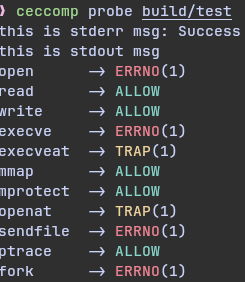

## Trace

```
ceccomp trace   [ -a ARCH ] [ -o FILE ] -p PID
                [ -o FILE ] PROGRAM [ program-args ]
```

Trace can trace program ***RAW*** out, and then print it out to ***TEXT***  
Trace can also trace a specified pid, and then print the filter of pid out to ***TEXT***  
(note that sudo is necessary for pid trace)

> It can be useful when you want to know what seccomp a program or a pid loads

Example:  


> Special thanks for [rocketma](https://rocketma.dev/) for zsh completion script  
> It's aswesome and has everything you need   


> I trace chromium seccomp with `--pid=`

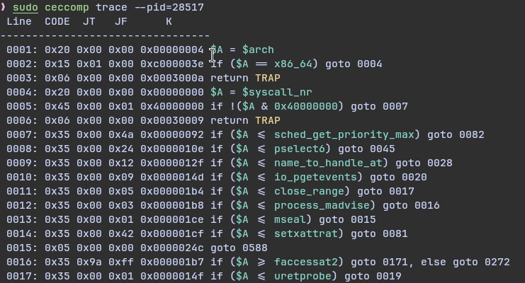

## Option

`arch` can be set to your cpu arch when not specified  
if this won't work for you, `--arch=` will be necessary
> This is only tested in x86_64 and aarch64, if anything goes wrong, open an issue plz  

`output` is used to avoid ceccomp output mixed with program output, and default as stderr
if `stderr` still mixed with program stderr output  
use `--output=file`, ceccomp output will be written into the file
> asm disasm emu still print to stdout  
> trace probe print to stderr as default

### output tricks

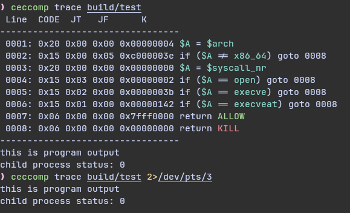
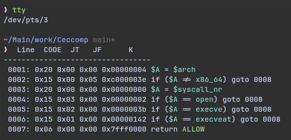

# SUPPORTED ARCH

- i386
- x86_64
- x32
- arm
- aarch64
- mips
- mipsel
- mipsel64
- mipsel64n32
- parisc
- parisc64
- ppc
- ppc64
- ppc64le
- s390
- s390x
- riscv64

# SUPPOERED INS

[chk_code_allowed](https://elixir.bootlin.com/linux/v6.14.4/source/net/core/filter.c#L981)
```c
BPF_LD | BPF_W | BPF_ABS:
// BPF_LDX | BPF_W | BPF_ABS:
// BPF_LDX | BPF_ABC doesn't belong to cBPF
BPF_LD | BPF_W | BPF_LEN:
BPF_LDX | BPF_W | BPF_LEN:
BPF_LD | BPF_IMM:
BPF_LDX | BPF_IMM:
BPF_LD | BPF_MEM:
BPF_LDX | BPF_MEM:

BPF_ST:
BPF_STX:

BPF_ALU | BPF_ADD | BPF_K:
BPF_ALU | BPF_ADD | BPF_X:
BPF_ALU | BPF_SUB | BPF_K:
BPF_ALU | BPF_SUB | BPF_X:
BPF_ALU | BPF_MUL | BPF_K:
BPF_ALU | BPF_MUL | BPF_X:
BPF_ALU | BPF_DIV | BPF_K:
BPF_ALU | BPF_DIV | BPF_X:
BPF_ALU | BPF_AND | BPF_K:
BPF_ALU | BPF_AND | BPF_X:
BPF_ALU | BPF_OR | BPF_K:
BPF_ALU | BPF_OR | BPF_X:
BPF_ALU | BPF_XOR | BPF_K:
BPF_ALU | BPF_XOR | BPF_X:
BPF_ALU | BPF_LSH | BPF_K:
BPF_ALU | BPF_LSH | BPF_X:
BPF_ALU | BPF_RSH | BPF_K:
BPF_ALU | BPF_RSH | BPF_X:
BPF_ALU | BPF_NEG:

BPF_JMP | BPF_JA:
BPF_JMP | BPF_JEQ | BPF_K:
BPF_JMP | BPF_JEQ | BPF_X:
BPF_JMP | BPF_JGE | BPF_K:
BPF_JMP | BPF_JGE | BPF_X:
BPF_JMP | BPF_JGT | BPF_K:
BPF_JMP | BPF_JGT | BPF_X:
BPF_JMP | BPF_JSET | BPF_K:
BPF_JMP | BPF_JSET | BPF_X:

BPF_MISC | BPF_TAX:
BPF_MISC | BPF_TXA:

BPF_RET | BPF_K:
BPF_RET | BPF_A:
```

# I Need You

Tell me what do you think!
Pull request or issue is welcome!

[Project Repo](https://github.com/dbgbgtf1/Ceccomp)
