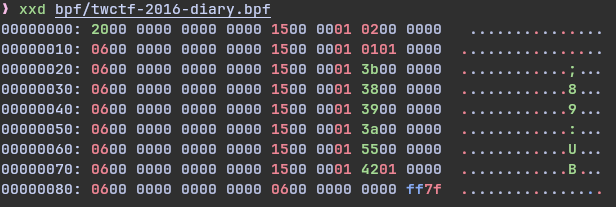
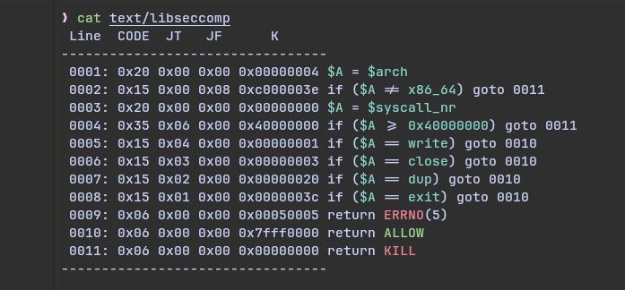
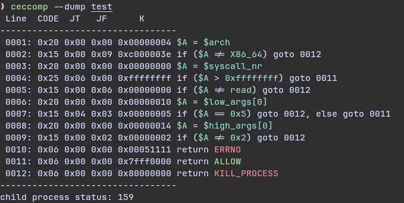

## Doc

> some concept to be clear

Kernel load the seccomp with raw `bpf`
raw `bpf` might look like this


After Ceccomp resolve the `bpf`, it can print it to `human readable text`
Might look like this


I will call the `human readable text` with `text` later
Note that the Line Code JT JF K are not necessary part of `text`, I just decided to print it

**So be sure to understand what `text` and `bpf` means**

### Install Guide

Only github install is available now:)

```
git clone git@github.com:dbgbgtf1/Ceccomp.git
cd Ceccomp
make ceccomp
make install
```

### Dump

#### what dump does

Dump mode can dump program `bpf` out, and then print it out to `text`

> It can be useful when you want to know what seccomp a program loads

#### what dump looks like



#### dump usages

`ceccomp --dump program [ program-args ]`, add program-args if necessary

Find a program that will load seccomp

### Emulate

#### what emu does

Emulate what will happen if `syscall (nr, args ...)` were called

> It can be useful when you don't want to read `text`

#### what emu looks like

A code block won't show color, so take a look at the picture


#### emu usages

`ceccomp --emu text arch nr [ argv[0] - argv[5] ]`
(default as 0)

`arch` must be specified
Otherwise the Ceccomp can't transfer something like `write` to its syscallnr

### Disasm

#### what disasm does

Disasm from `bpf` to `text`

> It can be useful when the program don't load seccomp at once

So you can use gdb to get the raw `bpf` manualy, Disasm will do the rest for you

#### what disasm looks like


#### disasm usages

`ceccomp --disasm arch xxx.bpf`

Just like emu, arch must be specified
Then just add the `bpf` you want to resolve

### Asm

#### what asm does

Asm the `bpf` from `text`

> It could be useful when you need to write your own seccomp

(but make sure you write the asm in correct way

I might write a simple guide about the basic rules)

#### what asm looks like

It might look too simple
I designed asm this way, copying `bpf` will be easier


#### asm usages

`ceccomp --asm arch text`

Just like disasm, emu, `arch` must be specified, then add the `text
And you can write you own `text`, asm will asm `text` to `bpf`

## Supported architecture
- X86
- X86-64
- X32
- ARM
- AARCH64
- MIPS
- MIPSEL
- MIPSEL64
- MIPSEL64N32
- PARISC
- PARISC64
- PPC
- PPC64
- PPC64LE
- S390
- S390X
- RISCV64

## I Need You

Tell me what do you think!
Pull request or issue is welcome!

`https://github.com/dbgbgtf1/Ceccomp`
