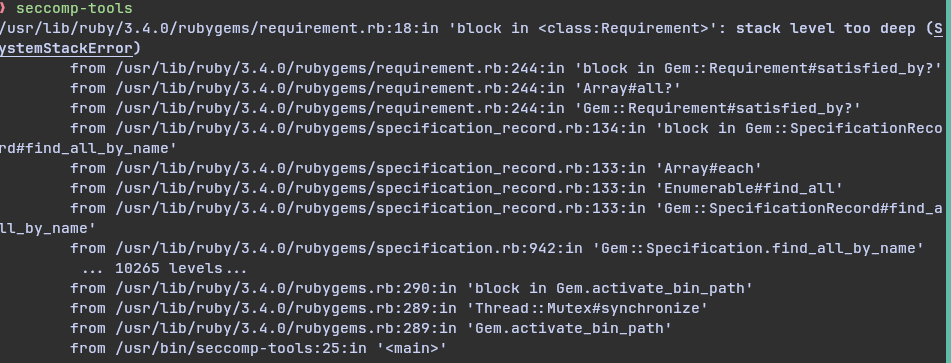

# 前言

前段时间特别的无聊，想找点事情做，然后🚀向我推荐写个C语言版本的`seccomp-tools`
其实早就他有说过想干类似的事了，但是他忙很多别的事

然后由于我的机子上的`seccomp-tools`出现了奇怪的问题


我又不想学太过古老的`ruby`(现在真有人用这玩意吗)
那就来吧，自己写一个C版本的`seccomp-tools`

# 命名

我将之命名为`ceccomp`，也就是将`seccomp`的`s`改为`c`，毕竟是`c`写的😎

# 实现功能

其实这方面应该看文档([here](https://dbgtf.org/ceccomp-doc/))
和`seccomp-tools`没啥差别，`seccomp-tools`有的基本也都有了
(甚至还有新功能probe，可以一把梭，模拟常见的syscall是否allow👍)
```
asm
disasm
dump
emu
probe
```
我还是比较满意的，而且效果看起来也不错，在文档里也有效果演示

# 一些细节

其实我觉得思路上没有特别新奇或者难以理解的，还是比较基础的
拿解析`raw bpf bytes`到文本来说，其实最难的部分是上网查资料
我看到不错的参考资料是[这个](https://www.ffutop.com/posts/2019-10-12-bpf/)
相对来说比较全，然后还发现可以从linux kernel中找到一些检查bpf的函数
通过这些函数可以知道linux kernel如何支持bpf加载，哪些操作不被允许，从而做到更严格的检查

[bpf_check_classic](https://elixir.bootlin.com/linux/v6.14.4/source/net/core/filter.c#L1072)
其中检查了基本的一些东西

[check_load_and_store](https://elixir.bootlin.com/linux/v6.14.4/source/net/core/filter.c#L928)
这里则是检查了内存是否在赋值前被使用(bpf允许使用`uint32_t mem[16]`)

[chk_code_allowed](https://elixir.bootlin.com/linux/v6.14.4/source/net/core/filter.c#L981)
这里是包含了全部可用的指令

[seccomp_check_filter](https://elixir.bootlin.com/linux/v6.14.4/source/kernel/seccomp.c#L278)
这里则是seccomp支持的指令，实际上filter这个机制主要是给net检查数据包用的
在沙箱这一块并没有支持全部指令
PS: 这一部分为v2.3时期补充，发现当前没有和内核完全贴合，然后我根据内核实际允许加载的code进行修正，推出了v2.4

# 收获？

大概是第一次写上千行的`C`项目，以前真的没写过更复杂的，😂
这次之后对`C`更有感觉了，一点点组织代码实现功能的感觉真得很棒！
目前看了一下，`./src ./include ./completion`总共加起来3041行
几乎全部都是我写的，还挺有成就感的

顺便大致学了一下`makefile`写法，十来个文件的c项目用makefile管理还是很方便的
除了`$^ $@ $<`实在疑似反人类
在v2.3使用makefile提供了一个简单的检查
将系统中以安装的`ceccomp`的输出结果和`./build/ceccomp`的输出结果进行`diff`
来保证更新的代码不会出现和以前没有的错误

# 最后

快去试试吧！如果有问题欢迎提`issue`或是`pr`！

[项目地址](https://github.com/dbgbgtf1/Ceccomp/tree/main)

