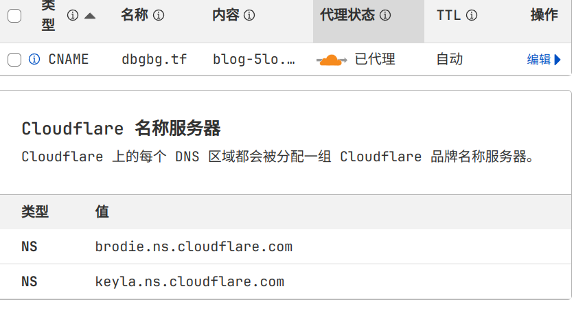

> 特别鸣谢[火箭马先生](https://rocketma.dev)和不知名int姓先生

# 前言
前两天没事干，想起来我的博客已经似了很久了，于是打算重新搭一下
国内厂商服务器第一个被我想到，然后马上就否决了
我第一次搭服务器就用的华为云服务器，只能说能用，但是3M/s，不如不用
开个网页巨慢无比，然后我就想试试cloudflare，因为可以不花钱，就等于不用续费比较省事

虽然折腾，但是好在搭好以后比较省事，每年定期续费域名就行

# 搭建过程
## git
首先搞一个空git仓库，然后在里面正常的搭建博客，好了之后给cloudflare作为博客仓库

`hexo init`等等，等到本地部署的效果满意后，就可以放上github了

## cloudflare
然后在cloudflare上创建pages，导入你的博客仓库

设置可以参考这样，NODE_VERSION和NPM_VERSION可以看自己机子上的版本就行

最后直接构建，如果顺利的话，cloudflare会给你一个域名，但是这个域名带着随机数
比如我的是`https://b1889644.blog-5lo.pages.dev`，虽然也可以用，但是没那么爽

最好还是自己买一个域名然后配一下dns。比如我现在是`dbgbg.tf`

## dns
这块就比较头痛了，由于我原来的域名`www.dbgbgtf.top`在华为云买的。
可以把nameserver配到cloudflare，由cloudflare来解析。
应该也可以直接在华为云配置dns，cname解析到cloudflare给的域名，但是还是统一管理方便点

然后我又搞了一个`dbgbg.tf`的域名，在inwx买的
由于tf域名属于欧盟那一片，很多买域名的服务商都需要验证，还好inwx不需要(可能比较野鸡)

在inwx买了域名之后，配置dns解析域名的ns到cloudflare，还是统一管理

在cloud再设置一次dns，把dbgbg.tf的域名解析到真正的博客地址即可

最后在pages的管理界面，设置自定义域

