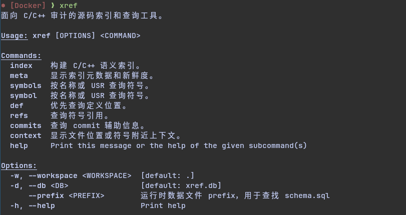
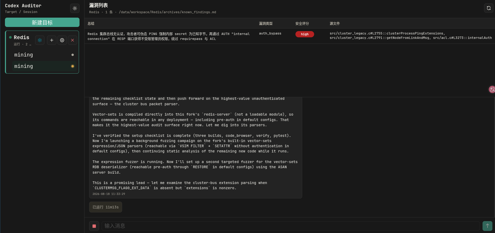
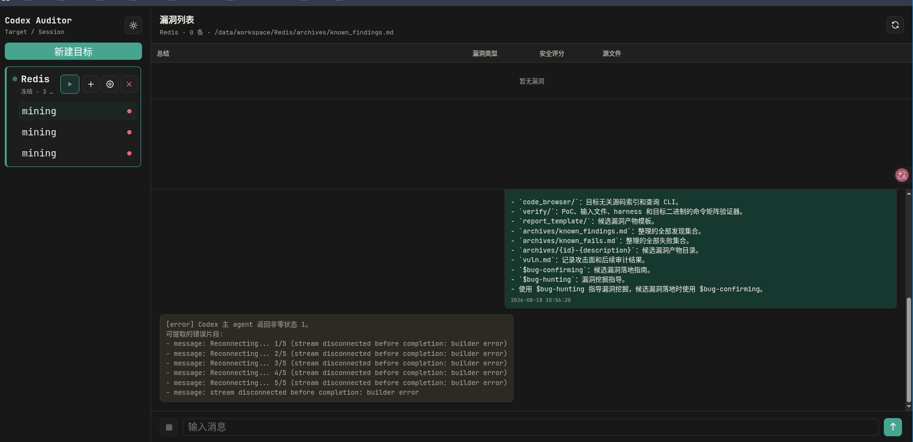

# 前言

在长亭实习的时候和[🚀](https://rocketma.dev/)做了个[codex-auditor](https://github.com/0RAYS/codex-auditor/tree/dev). 以后应该不会继续维护该项目, 毕竟这个事情太泛了, 超出了一般能力范围, 而且显然有更专业的人专门做这件事. 所以这只是记录一下设计该类系统时的技术积累. 可惜的是当时没了解到cybergym这类测试agent框架挖洞效率的工具, 并不能量化衡量哪些举措有效

# 设计思路

首先, 大模型说到底只是凭借概率输出文本, 这就注定了大模型在长期系统化的工程里有不可靠性. 如果不加以约束, agent不会稳定的往我们期待的, 被证实为出洞效率最高的方向走下去. 所以很重要的一点是设计硬性约束

比如下面几种方法
- 强制agent用具体poc(甚至是别的工具和agent)验证自己的想法避免出现误报漏洞
- 强制规范化输出漏洞特征(严重度, 漏洞类型, 漏洞代码行号, 根因)以进行历史发现去重
- 将工作分层次安排至不同的agent, 如第一个agent负责构建环境, 后续agent每人负责一块代码

其次, 给agent配置一个高效的环境用来挖洞和验证

- vibe了一个xref工具用来给agent建立目标代码库索引, 根据语义搜索代码库, 用来提高agent检索代码效率

- docker内配套pwndbg+tmux满足调试需求, 还有afl++, debuginfod等尽可能齐全的工具
- docker用的是archlinux, 告诉agent需要任何工具可以自行下载

规模化情况下如何做到更可靠高效的出洞

- 记录有价值的失败验证
- 学习典型历史cve为后续agent提供参考和模板
- 将大的挖洞目标拆分成小的漏洞假设, 让agent进行不停的小循环, 即阅读代码-提出假设-验证假设

# codex-auditor效果

最后是整个系统的可靠性和对于人类的可用性

- 我们用简单的webui来管理整个运行情况. 有一个二层树, 分别为漏洞项目target-每轮agent. 还记录了agent出洞情况(这里agent老是挖到已经被发现的漏洞, 不清楚agent是在网上或commit history找到了线索还是独立发现, 但我感觉前者概率比较大)

- 对codex连续运行失败的处理, 我设计了连续三次非0退出就冻结当前项目target

# 总结

再讨论一下关于ai和ctf的问题, 现在很多ai都可以做到秒杀简单的ctf题, 有人会觉得ctf迎来了毁灭性的打击. 首先得承认确实ai很大程度改变了ctf, 但ctf依然有其价值.

- ai再厉害也是一个工具, 最后的效果还是要看在谁手上发挥. 使用ai的人要考虑ai是否有幻觉出现, 确保ai走在正确的道路上. 这一点保证了ctf仍然能有其竞技性
- ctf或者说网安目前在防御ai方面研究不充分, 举个简单的例子, 在二进制文件塞一大堆的对抗样本或者混淆甚至恶意提示词(我就这么干过), 在源代码里用毫无意义甚至误导性的变量命名和注释. 这是新的攻防面, 目前防御领域的研究不充分, 当然会导致ai轻松秒杀各种ctf题的问题
