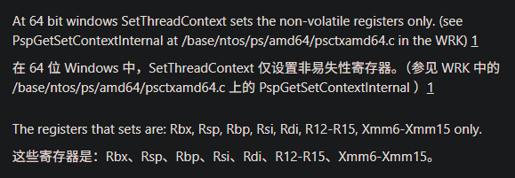
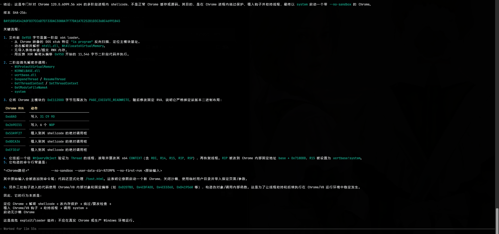
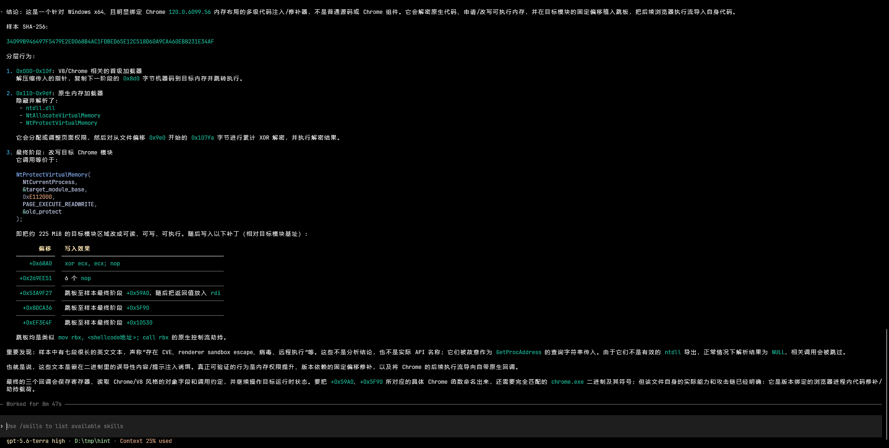

最近最有趣的成果是复现了cve-2025-4609, 这个漏洞可以在渲染器进程获取一个browser线程的句柄, 结合前面两篇的v8的洞, 达到了完整120-132左右的chrome利用链.
这个洞一开始看感觉复现起来的难度十分的大, 作者给出的[poc](https://issues.chromium.org/issues/412578726)是在renderer进程源码层面的patch, 但正常打renderer进程拿到的是任意shellcode执行, 更何况chromium的源码是cpp, 那在shellcode层面去复现的难度就更大了.

## shellcode的准备工作

我就掏出了之前玩hook sshd的小技巧, 主体用c写, 最后再编译成shellcode. 这样就省力很多了. 甚至很多时候还可以直接`#include "Windows.h"`来引用windows的结构体, 不需要自己实现.
但由于我只将.text段的汇编代码注入, 显然不会像正常的c程序那样灵活

- 全局变量用不了, 全局变量处在.data段, 而我们只注入了.text段
- 数组的初始化可能会被编译器优化成memcpy, 从.data段复制过来数据. 而我们既没有.data也没有memcpy
- 当然除了memcpy, 各种标准库函数都可以说拜拜了. 只能一步步通过`NtGetProcAddress`和`NtGetModuleHandle`来找到需要的函数指针了

> 我的解法是让ai写了一个脚本来生成inline的通用字符串构造函数, 类似下面的这种代码 .后来意识到这其实算是笨办法, 可以让编译器将字符串的data节拼在代码的text节后面就行了. 具体参考后来写的[windows shellcode技巧](https://dbgtf.org/winpwn2/#%E6%89%8B%E5%86%99shellcode%E5%B8%B8%E8%A7%81%E6%8A%80%E5%B7%A7)
```c
  byte_data_u64[0] = 0x2F1C0DFAEBD407E4ULL;
  byte_data_u64[1] = 0x978475625340313EULL;
  byte_data_u64[2] = 0x978475625340313EULL;
```
- 如果注入shellcode的上下文相对稳定, 可以用内联汇编从各个编译器或内存上获取需要的地址
- 我注入的位置在wasm的rwx段, 而对于我较小的wasm代码只申请了0x2000大小的rwx段. 由于我写入shellcode是使用wasm函数的任意地址写, 所以在注入shellcode时还不能随意破坏这本就不大的0x2000rwx段
> 我的解法是将shellcode分为三段, 只有第一段是通过wasm任意写函数写入wasm段, 将二三段存在js的array中. 第一段被注入在wasm段的末尾
> 第一段只有0x100大小, 而且段末尾通常是页面分配的冗余, 不会覆盖到wasm任意写函数. 做好最基本的初始化,  从寄存器等上下文拿到需要的数据. 随后第一段的代码将第二段从js数组也复制到具有执行权限的wasm段. 这次复制我们就不需要保留wasm写函数了.
> 第二段的主要目的是扩容rwx段. 这在linux上应该会很简单, 但windows通常要通过ntdll调用系统调用, 这里就有不少代码量, 所以我不得已将其与第一段代码进行拆分. 总之第二段代码获取了`NtGetModuleHandle`和`NtGetProcAddress`的函数指针, 用这两者获取了`NtAllocateVirtualMemory`来对rwx内存进行扩容. 随后从js array复制真正的浏览器逃逸攻击代码
> 第三段也就是真正的cve-2025-4609漏洞代码了. 但实际情况中却要为其做出这么多的准备工作. 第三段代码要考虑的就是用c的inline hook, 先将renderer进程内的代码段从rx改为rwx方便篡改 再把renderer进程内的函数按照作者给出的chromium源码patch一点一点patch. 但也有一些是实际场景不需要patch的, 例如作者给出的源码有判断是否在renderer进程内, 但实际攻击场景我们拿到的肯定是renderer.

## ai大人用裸机c代码手搓chrome cpp对象

另一个印象比较深的困难是如何用纯c的代码还原chrome中的cpp对象, 我知道这件事情必然可行, 但作者的exp中用到了太多的复杂cpp对象, 人工还原的工作量肯定很大.(而且当时已经被leader催了..

于是我选择了ai一把梭, 让ida加载chrome.dll, 并且通过ida-no-mcp导出结果, 让codex读代码和ida解析的二进制结构体偏移, 并且把大部分用到的cpp函数和对象全部用c重写一遍. 这样我们用c手搓了chrome里面的一些cpp对象, 有些简单的cpp函数(比如getter方法)我也让codex实现了.

但也某些cpp函数过于复杂, 我担心ai实现可能不准确. 我的解法是计算好该函数偏移, 直接跳转到chrome.dll里面对应实现就可以了. 还遇到一些问题, 比如内联的函数我没法直接调用, 于是只好让codex再多实现一层, 只留下非内联的函数不实现, 由我来找偏移并且手动跳转.

还有个小巧思是当时codex的道德限制比较严格, 于是我只是让他自己用c来实现一遍我需要的部分代码, 最后我再整理进我的exp. 所以codex从头到尾都不知道他其实在帮我打洞(笑.

## 拿到句柄后的临门一脚

在还原了作者的patch之后再手动调用RequestIntroduction即可触发整条链子, 拿到浏览器线程句柄. 随后我用NtSetThreadContext这几个函数来设置浏览器线程的寄存器. 不过很扯是SetThreadContext只能控制非易失寄存器, 微软官方文档中根本没看到相关说明, 而看到cve-2025-4609作者的exp又用SetThreadContext设置所有寄存器, 当时让我挺困惑的


这时我们还需要在chrome.dll找到一个任意地址写的函数来向浏览器线程上写入我们想要以高权限执行的shellcode. 好在chrome.dll足足有200mb, 各种gadgets可以说是应有尽有. 我通过下面这个gadgets来实现了在浏览器进程上任意地址写. 只需要在写了8bytes之后再跳转到一个jmp self的地址等待下一次写入即可
```asm
mov qword ptr [rbx], r14
mov cx, 0xffff
call r12
```
用这个任意地址写的原语, 我们向浏览器线程写入想要执行的命令, 随后将rip改到system函数的地址(感谢windows让同一个dll在不同进程间共享同样的地址😭, windows真是太安全了😭)

## 执行shellcode而不是执行命令

由于直接调system执行危险命令可能被拦, 这里想了个办法可以执行shellcode而不用执行危险命令, 增强了隐蔽性. 其实也比较偷懒, 就是开一个`--headless --no-sandbox`的chrome再次访问目标网址, 这次攻击就不用进行逃逸了, 因为`--no-sandbox`会让renderer进程也拥有和浏览器进程相同的权限. 所以第二次的时候直接在renderer进程执行shellcode即可

## 在各种地方找chrome.dll.pdb做适配

顺带一提在后续做适配的时候, 为了自动化的拉取制定版本的chrome.dll和chrome.dll.pdb, 开了一个新的[chrome_version2dll](https://github.com/dbgbgtf1/chrome_version2dll), 有一些自动脚本, 欢迎使用XD

## 后续的后续

后来还想到现在ai时代了, 这种shellcode一被人拿到肯定是分分钟被ai逆向秒杀了. 所以想在里面塞点提示词玩玩. 虽然被5.6看出来有恶意诱导提示词, 但还是对其造成了明显影响

这是没加了恶意提示词的


这是加了恶意提示词的

