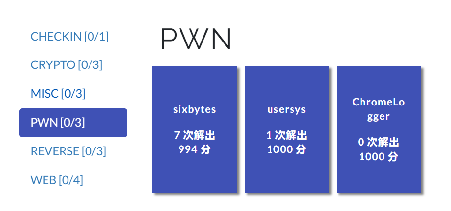
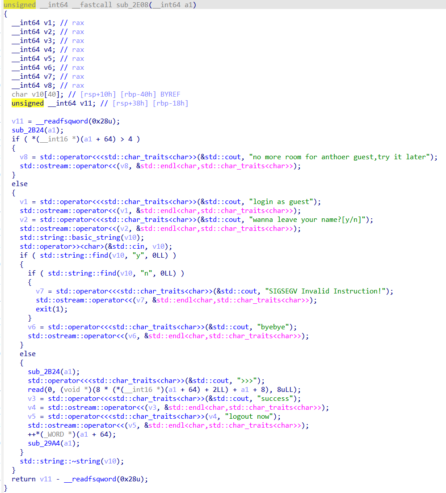

# 前言
dasctf这次我出了两道题，一道usersys，一道sixbyte。我还是比较满意的，我的想做的就是拿一些一些平常不经常见到的漏洞，所以一道考点在条件竞争，一道在测信道。并且由于我不喜欢太过复杂的利用，也不喜欢在题目限制各种条条框框。所以这两道题的利用层面还是相对简单的。

另一道pwn是火箭师傅出的，可以去看看他的[ChromeLogger博客](https://rocketmadev.github.io/2024/10/23/ChromeLogger/)


# usersys
[题目源码](./dasctf/usersys.cpp)
这个题目的考点是文件相关的条件竞争，算是比较冷门的考点？
但是漏洞本身还是很清晰的，下面代码中，在通过检查后，还有一个`GetGuestData`从文件中读取数据。
也许是cpp逆向花了一些时间，导致没有那么快的看出漏洞。不过cpp的逆向还不算是很离谱，认真看看还是能接受的(又不是go(doge))

```cpp
class Guest : public User
{
public:
    char      guest_book[5][8];
    short int login_count;

    void operation() override
    {
        GetGuestData();

        if (login_count < 5)
        {
            cout << "login as guest" << endl;
            cout << "wanna leave your name?[y/n]" << endl;
            string oper;
            cin >> oper;

            if (oper.find("y") == 0)
            {
                GetGuestData();
                cout << ">>>";
                read(0, &guest_book[login_count], 8);
                cout << "success" << endl << "logout now" << endl;
                login_count++;
                StoreGuestData();
                return;
            }

            else if (oper.find("n") == 0)
            {
                cout << "byebye" << endl;
                return;
            }

            else
                SIGSEGVERR;
        }

        else
            cout << "no more room for anthoer guest,try it later" << endl;
    }
};
```
这个题目最后的利用是这里的`double fetch`，改写`GuestBookIndex`，从而达到堆上任意地址读入。
再通过覆写cpp虚表，将其篡改为`root`用户的`operation`后门函数。
下面是本地调试的exp，如果还有兴趣的话可以自己试试。
[exp](./dasctf/usersys.py)

# sixbyte
[题目源码](./dasctf/sixbyte.c)
这道题就更不用说了，其实只要听过测信道的人应该都能很明确的做出来。
我猜有部分人可能因为不知道flag存在字符"-"导致没爆出来？
不过再怎么说也能用`0-255`强行爆破的，所以还是能做的。

这题禁用所有系统调用，而且`shellcode`只有6个字节。
但是在`call shellcode`时，有`rdi`指向`flag`地址。
这么看的话，题目就很明确了。尽管没有任何回显，我们却还是能通过程序运行状态来判断。

程序运行状态归根到底可以分为运行和不运行。
比如使用下面的code，可以比较0x61和flag的第一位字符的大小
当结果为大于时，程序就会无限循环跳转。
如果结果为小于，程序不跳转，就会继续向下运行，必然导致`EOFError`
通过不断地进行比较，就可以判断出整个flag的值。
（这样的无回显二分法比较实在是太优雅啦！）
```asm
loop:
cmp 0x61, [rdi+1]
jg loop
```

下面是本地调试的exp，有兴趣的人可以自己试试。
[sixbyte](./dasctf/sixbytes.py)

# 总结
阿巴阿巴，我感觉出的还行，满足我的审美，但是可惜做出的人太少了。
后来usersys问了北邮的师傅，他说是感觉挺明确的，doublefetch逻辑明确，然后就跟着改虚表逻辑走。
不是太喜欢出为难人的题，所以我把usersys做得指向性比较明确，总的逻辑就是往虚表走，要是在后面硬加难度也可以，只不过我觉得核心难度就放在doublefetch就行了，要是再加难度显得过于刻意。
