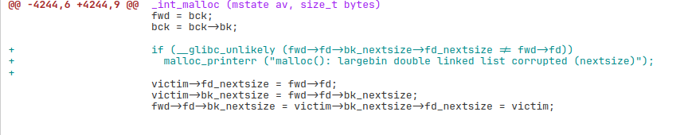
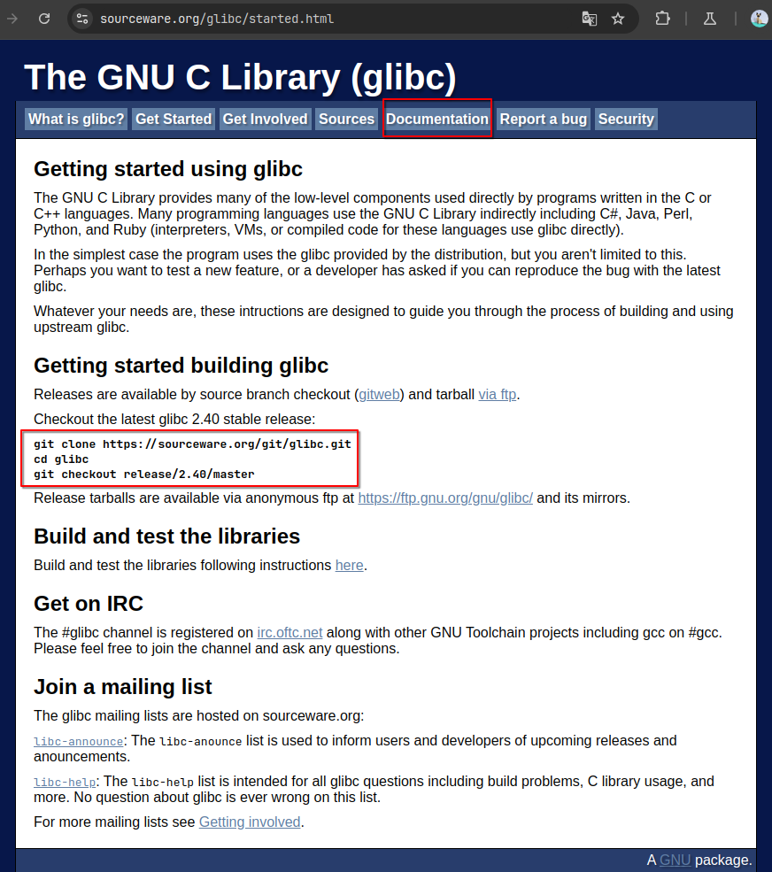
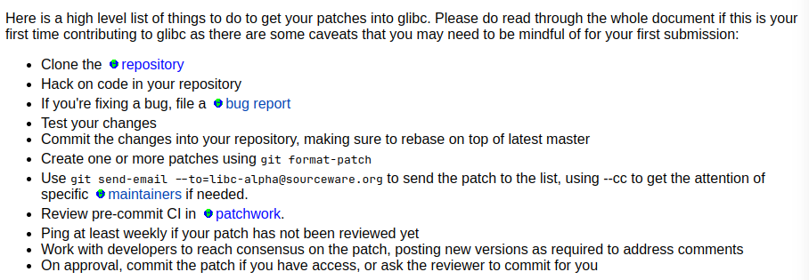
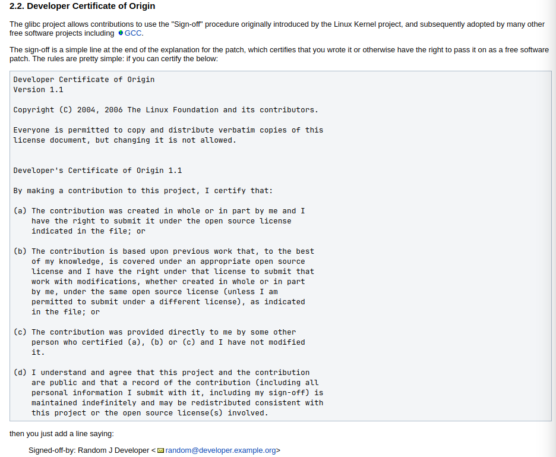
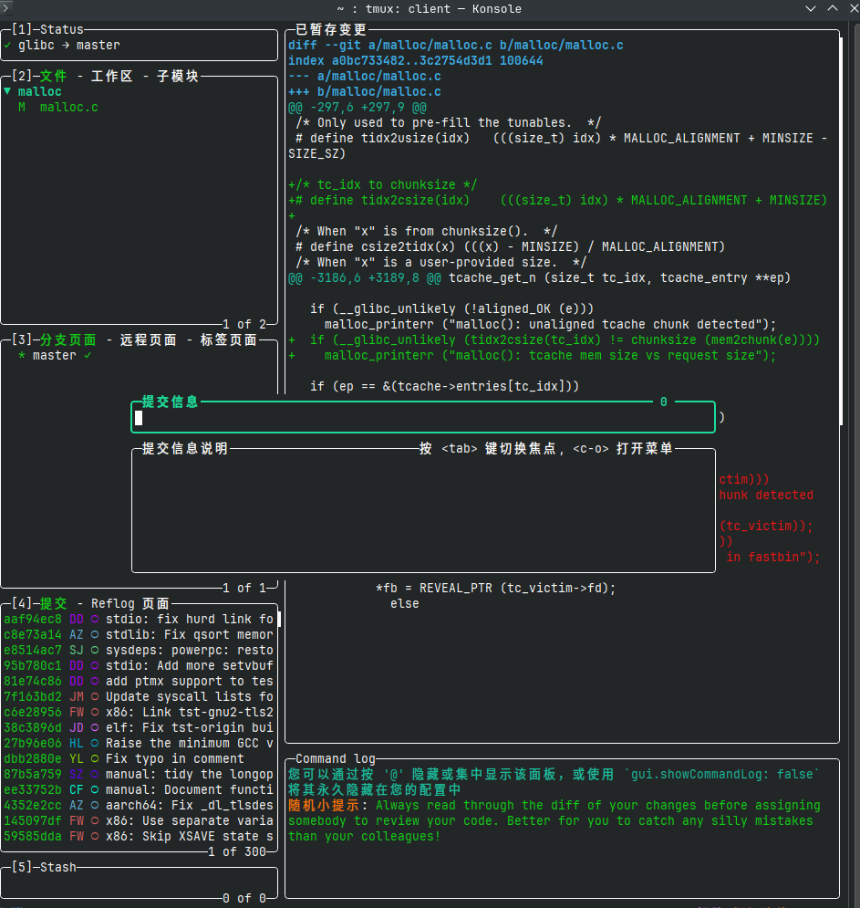
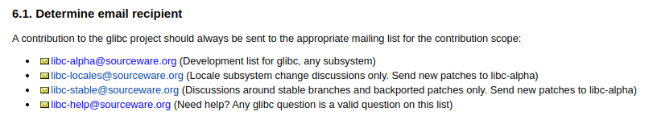

> 特别鸣谢[🚀](https://rocketma.dev)帮助我配置邮箱等等

# 前言
起因是火箭前两天翻glibc的更新，看到一个对`largebin attack`的修复
当时有点启发我，虽然咱只是个打CTF的，但是修个洞说不定还真行


[修复](https://patchwork.sourceware.org/project/glibc/patch/20250214053454.2346370-1-benjamin.p.kallus.gr@dartmouth.edu/)

打CTF的时候，一直都是跟在别人的脚步后面亦步亦趋，在别人制定的规则里面找漏洞，
我就想，要不我也交个patch试着修点东西？

不过这篇博客暂时不会记录修复的patch具体内容
这篇暂时先记录一下向glibc发送patch的过程本身遇到的各种问题

# email
首先，向glibc发送patch，至少得知道他们怎么接受新的patch
在[sourceware](https://sourceware.org/)上找到glibc项目，
然后需要按他说的，先`git clone`下整个仓库
然后阅读Documentation，其中完整讲解了如何发送patch，做contribution
(或许有点太完整了，乱七八糟的让人看不过来)
我会介绍一下比较重要的部分


## 流程
这里是大致的一个流程
> 1. 克隆仓库
> 2. 按照你的想法更改代码
> 3. 如果你认为你找到了一个bug, 根据bug report的流程来做
> 4. 测试你的代码是否奏效
> 5. 如果没问题，就用`git add`和`git commit`提交，就像平常的推代码流程一样，只不过不要push
> 6. 用`git format-patch`来生存你的patch文件
> 7. 用`git send-email`向libc-alpha@sourceware.org发送代码
> 8. 在[patchwork](https://patchwork.sourceware.org/project/glibc/list/)中查看你的patch的处理情况
> 9. 即使没有任何消息，也至少等一周再催


## FSF CopyRight
这是一个署名条款，大致就是你遵循他们公开代码的那一套原则，同意公开你的代码等等
你需要做的就是在email的最后加上一个签名
`Signed-off-by: your-name-example <your-email@example.com>`
等会介绍更简单的自动加上签名的方法，不过了解一下这个原理也是不错的



## Commit格式

你需要在commit中描述一下你的patch作用，分为标题和主体
并且标题和主体中必须隔开一段，推荐用`lazygit`来写commit，而不是`git commit`
`lazygit`会帮你自动处理好这个分段，这样写起来会清晰不少



## 发送到哪？
> libc-alpha接受针对所有系统的patch
> libc-locale只接受针对某种特定系统的patch
> libc-stable只接受对稳定发行的版本的patch和讨论
> libc-help接受对于libc的一些疑问🤔



我这次想增加新功能，所以向`libc-alpha`发送

## 如何发送
向libc发送邮箱还不是通过现代的图形化邮箱界面来发送
需要用古老的`git format-patch`将你本地的新`commit`生成为patch邮件
再通过`git send-email`来发送，而且还需要邮箱客户端来认证你的身份

我这里就只介绍我的方法了(其实都是🚀教的，可以参考[他的博客](https://rocketma.dev/2024/11/23/PRbyMail/))
### 邮箱客户端
安装`msmtp`，在家目录下配置.msmtprc
> 据🚀所说，outlook不行🙅‍♀️，所以我就按他说的用了gmail
```rc
account default # 可以理解为msmtp的账户，等会还要用到
host smtp.gmail.com
port 587
auth on
user dudududuMaxVer@gmail.com
password 等会介绍如何获得
tls on
tls_starttls on
logfile ~/.msmtp.log
from dudududuMaxVer@gmail.com
```
### gmail
> 可以参考[这篇文章](https://www.ibest.com.tw/news-detail/gmail-smtp/)
总之，在开启两步验证后，搜索`通行密钥和安全密钥`，然后为msmtp新建一个
用google给你的密码填到`.msmtprc`中
相当于谷歌看到msmtp提供这个密码，就认为可以信任`msmtp`使用你的邮箱身份发送邮件✉

### git config
你现在已经有一个邮件客户端，可以在不使用浏览器的情况下发送邮件
现在需要让你的git知道用什么邮件客户端来发消息，以及一些杂七杂八的
`vim .git/config`
```config
[format]
    signOff = true
# 上面说的有更方便的方法添加签名就是这个，可以读取你的identity和邮件自动加
[sendemail]
    identity = dbgbgtf
# 你可以指定你的名字，用在format里面的signOff
    suppressCc = all
# 不给任何人抄送，需要的时候可以手动指定
    confirm = always
# 永远需要确认，要是发送之后发现错了可太尴尬了，毕竟邮件完全不能撤回的
    smtpServer = /usr/bin/msmtp
    smtpServerOption = -a
    smtpServerOption = default
# -a指定msmtp的账户，由于我上面msmtprc用的default作为账户名，这里也是default
```

# 完整过程
总结一下
1. `git clone git://sourceware.org/git/glibc.git`
2. 做你想要的更改
3. `git add .`或者只加你更改的文件，然后推荐在`lazygit`写commit
4. `git format-patch origin/master`，其中`originmaster`指定与谁对比来生成`
diff`
会生成一个000什么什么的.patch文件

> 5. `git send-email`可以参考[git-send-email](https://git-scm.com/docs/git-send-email/zh_HANS-CN)
> 如果发送新patch，直接设置`--to`为`libc-alpha`邮件地址即可
> 如果发送对于审核人员回复的回复，就比较复杂一点
> 建议随便在[commit-preview](https://patchwork.sourceware.org/project/glibc/list/)找一篇，点进`mailing list archive`
> 会有关于`reply`的方法，下面以我的[commit](https://inbox.sourceware.org/libc-alpha/20250403111659.7687-1-dudududuMaxVer@gmail.com/)为例
> 介绍一下如何回复我的这封邮件

找到想回复的`Message-id`，然后将其放到`--in-reply-to=`后面
`--to=`参数设为你要回复的人的邮件地址，这里是我的gmail
`--cc=`参数设为`libc-alpha`

> `git send-email` 最后再加上你的.patch文件即可

# 最后
这种邮件的话还是比较正式的，尽可能注意礼貌
并且由于邮件远远没有现在的qq等即时通讯方便，最好讲得详细一些


