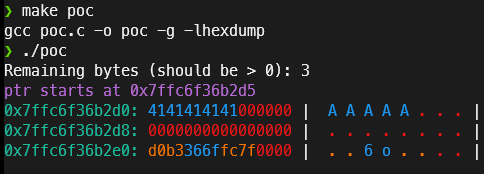

# 前言
前两天看火箭写了个小工具,刚好我也需要用,于是自己写了个试试,顺便熟悉一下如何编译lib库,并且在其他程序使用

# 实际需求
虽然gdb这样的工具很方便,能够看到内存布局,但是对于测试中频繁更改的程序,如果每次更改都用gdb调试,还是会有些浪费时间
所以这个工具就定位为在别的程序中使用的一个函数,输出任意地址的内存(并且尽可能好看,颜值就是生产力!)
# 代码
考虑到输入的ptr可能不是整数,我用一个包装函数初步处理了一下
> 把输出ptr原本的值并用一个新的值保存ptr末位取0的结果
> 其次是把size向上取8,防止输出不完全
```c
#include <stdbool.h>
#include <string.h>
#include <stdio.h>
#include <stdint.h>
#include <stdlib.h>

#define DEFAULT(x) "\x1b[0m"x
#define RED(x) "\x1b[31m"x
#define GREEN(x) "\x1b[32m"x
#define YELLOW(x) "\x1b[33m"x
#define BLUE(x) "\x1b[34m"x
#define Magenta(x) "\x1b[35m"x
#define Cyan(x) "\x1b[36m"x

typedef enum
{ SMALLER, PRINTABLE, LARGER }char_type;

char_type isPrintAble(uint8_t check)
{
    if (check > 0x7e)
        return LARGER;
    else if (check < 0x20)
        return SMALLER;
    else
        return PRINTABLE;
}

void __hexdump(const uint8_t* ptr, const uint64_t size)
{
    uint8_t* format = (uint8_t*)malloc(0x80);
    uint8_t* string = (uint8_t*)malloc(0x80);

    uint8_t* Ptr = (uint8_t*)malloc(size);
    memcpy(Ptr, ptr, size);
    for (int i = 0; i < size; i+=8)
    {
        format[0] = '\0';
        string[0] = '\0';
        printf(Cyan("%p: "), &ptr[i]);
        for (int j = i; j < 8 + i; j++)
        {
            switch (isPrintAble(ptr[j]))
            {
            case PRINTABLE:
                strcat(format, BLUE("%02x"));
                strcat(string, BLUE(" %c"));
                break;
            case SMALLER:
                strcat(format, RED("%02x"));
                strcat(string, RED(" %c"));
                Ptr[j] = '.';
                break;
            case LARGER:
                strcat(format, YELLOW("%02x"));
                strcat(string, YELLOW(" %c"));
                Ptr[j] = '.';
                break;
            }
        }
        printf(format, ptr[i], ptr[i+1], ptr[i+2], ptr[i+3], ptr[i+4], ptr[i+5], ptr[i+6], ptr[i+7]);

        printf(DEFAULT(" | "));

        printf(string, Ptr[i], Ptr[i+1], Ptr[i+2], Ptr[i+3], Ptr[i+4], Ptr[i+5], Ptr[i+6], Ptr[i+7]);

        puts(DEFAULT(" | "));
    }
}

void hexdump(const uint8_t* ptr, const uint64_t size)
{
    uint8_t* Ptr = (uint8_t*)((long)ptr &~ 0xf);
    uint8_t Size = size | 8;
    printf(Magenta("ptr starts at %p\n"), ptr);
    __hexdump(Ptr, Size);
}

int main()
{
    char buf[0x20];
    strcpy(buf, "\x30\x93\xa0\x20\xfd");
    hexdump(buf, 0x8);
}
```
# 编译过程
## hexdump.h
我希望这个代码被编译成一个lib库,在编译时使用`-lhexdump`来使用这个库的`hexdump`函数
为了给外界提供函数api,我写了一个`hexdump.h`
```
#ifndef HEXDUMP_H
#define HEXDUMP_H
#include <stdint.h>
void hexdump(const uint8_t* ptr, const uint64_t size);
#endif
```
> 上面那两行代表检查是否存在`HEXDUMP_H`的定义,如果没有就定义之
> 作用是防止重复`include`,然后提供一个简单接口`hexdump`

## 编译指令
> 编译`hexdump.c`时加上`-fPIC -shared`参数
我的完整指令是这样的
```
gcc hexdump.c -g -o libhexdump.so -fPIC -shared
```
`-g`加上调试符号以防哪天出了小bug需要调试,`-o`指定名字为`libhexdump.o`作为动态链接库
这样就能获得一个可用的动态库了
然后需要把这个`lib`复制到系统lib目录,我放到了`/lib/x86_64-linux-gnu/`,ld`在加载程序时会查找这个目录

还有就是需要把`hexdump.h`放到`gcc`的`include`目录下,给系统`gcc`用

## 使用操作
使用时就跟平常的库没什么差别,可以类比seccomp
使用`#include <hexdump.h>`,然后直接用`hexdump`函数

在编译时使用`-lhexdump`参数告诉编译器使用这个库


# 后记
其实这玩意也不复杂,就是顺便了解一下动态库编译知识
