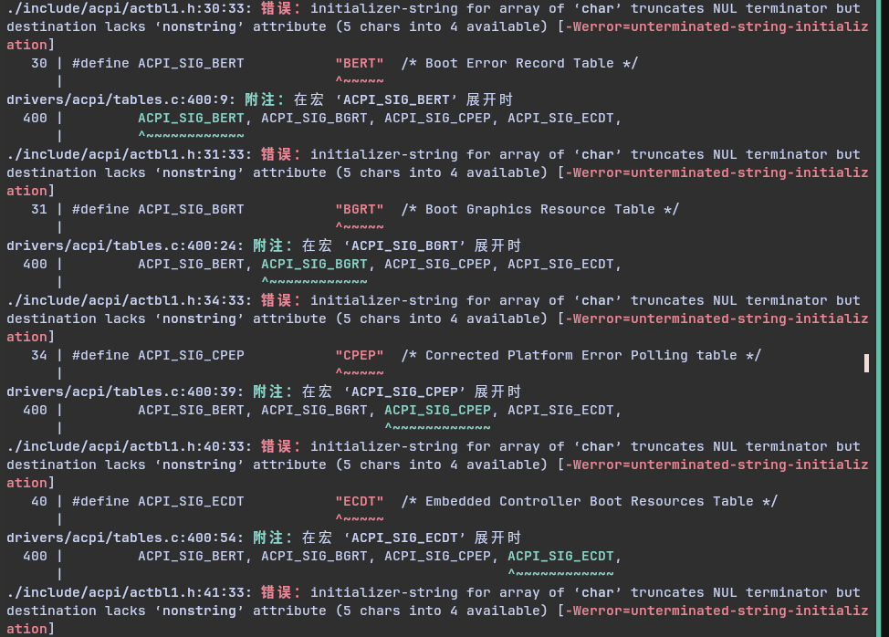
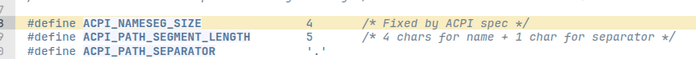
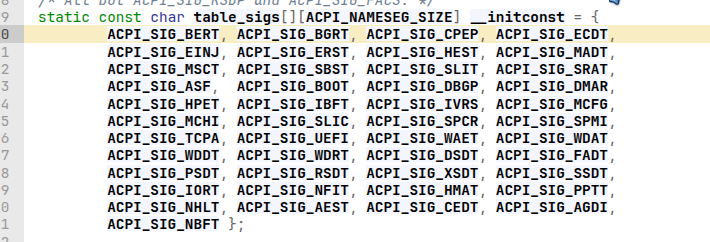
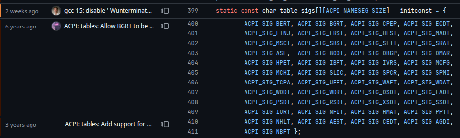

# 错误发生过程

早上的时候想着编译一个linux内核，说不定以后调内核能用到
然后我就从[kernel.org](https://www.kernel.org/)下载了稳定版本的`Latest Release`


然后就很正常的编译
```zsh
make x86_64_defconfig
make menuconfig
```
改了改不想要的选项，然后`make -j 14`，然后就寄了


# 查错

看了一下，说是`"abcd"`这样的长度为5的字符串被赋值到长度为4的buffer?
翻了一下源码，确实是有一个字符串长度为4的字符串数组被赋值了类似`"abcd"`这样的长度5的字符串

(但其实这里的真正含义是字节数组的数组，并非字符串数组)

这里有个宏定义，声明了字节数组长度为4


这里是字节数组的数组的定义


然后就翻了一下这段代码是谁写的，在github上用blame看了一下


哎这对吗，linus老爷子亲自写了这行代码😂

完整的commit信息在[这里](https://github.com/torvalds/linux/commit/9d7a0577c9db35c4cc52db90bc415ea248446472)
linus老爷子在两周前发现了这个问题，在commit中说到`__nonstring`不被`gcc14`接受
因为这是一个字符数组的数组，`gcc14`无法理解这种情况下的`__nonstring`

老爷子说自己被这个破属性设计搞的很烦，于是最后用`CFLAG`屏蔽了这个错误
```makefile
#Currently, disable -Wunterminated-string-initialization as an error
KBUILD_CFLAGS += $(call cc-option, -Wno-error=unterminated-string-initialization)
```
改为了
```makefile
#Currently, disable -Wunterminated-string-initialization as broken
KBUILD_CFLAGS += $(call cc-option, -Wno-unterminated-string-initialization)
```
然后删去了原来的数组定义中的`__nonstring`，大概是防止`gcc14`报错？

emm,看到这样一个问题还挺有意思的，而且发现写内核的人对于代码的理解真的是在另一个层次
比如字节数组，我是真没想到过还可以这样玩。

仿佛是一个开发前线反馈给`gcc`要求新功能的缩影，很有意思

