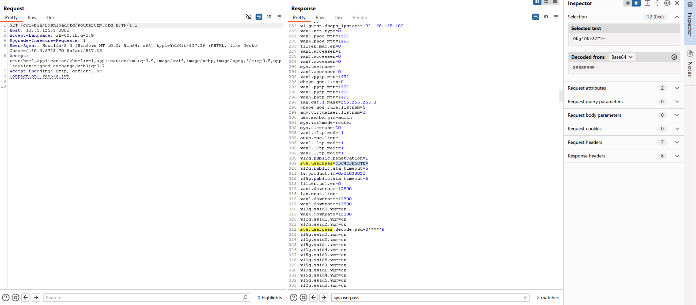

# 前言
最近接到一个项目，需求是利用获取针对一台路由器的一键获取shell的脚本。
指导老师给我的建议是利用现有的cve复现即可，因为甲方没有要求挖出新的cve。

这就是现有的cve，在这个仓库记录了三四种获取shell的办法，不过这些方法的前提是能访问到路由器内部的漏洞域名，从而访问到漏洞函数。
> https://github.com/zp9080/Tenda/blob/main/Tenda-G3v3.0%20V15.11.0.20-formSetDebugCfg/overview.md
至于如何获得内部域名的访问权限，则是需要利用另一个公开漏洞，访问`/cgi-bin/DownloadCfg/RouterCfm.cfg`域名以下载到`RouterCfm.cfg`文件，其中保护了路由器的配置文件信息，最关键的是包含了网页管理员密码的base64加密。

# 利用链
## 获取网页管理员密码
这里用从甲方那边拿的测试机子进行测试。
先使用burpsuite进行测试，这样结果更加直观一些(pwner也是玩上burpsuite了)

在直接访问时会被重定向到`login.asp`界面。很明显，为了安全考虑，开发厂商不可能让你随便访问任意域名。

但是，我们如果访问`/cgi-bin/DownloadCfg/RouterCfm.cfg`，就可以获取到`RouterCfm.cfg`文件，其中搜索`sys.userpass`项，可以找到网页管理员密码的base64加密，由burpsuite自动解密得到密码

## 利用漏洞域名命令执行
在获取密码后，我们对`httpd`二进制程序进行分析。由于该路由器采取前后端分离的架构，后端的处理全部集中在`httpd`二进制程序中，就可以通过分析`httpd`来找出漏洞函数以及该漏洞函数对应的域名。

这里就可以通过`https://github.com/zp9080/Tenda/blob/main/Tenda-G3v3.0%20V15.11.0.20-formSetDebugCfg/overview.md`仓库中公开的cve来进行分析，这里我仅仅展示最简单的`setDebugCfg`(因为懒得看其他的)

如果了解过路由器程序的人，一眼就能看出其中的漏洞。
`websGetVar`函数的功能是获取`get, post`等请求附带的参数，比如这里就会获取`enable, level, module`参数，将其赋值到`pEnable, pLevel, pModule`变量，下面就是一个命令执行。

很难想象一个短短23行漏洞函数有三个命令执行。

## url限制分析
对于厂家来说，其实最大的问题是url的检查不够严格，`/cgi-bin/DownloadCfg/`属于内部api，绝不是应该开放给外界提供访问的。

于是我在漏洞版本的`httpd`程序中找到了对url进行处理以及检查的代码，分别有两处，一处是处理，一处是检查。

处理函数是`websNormaliszeUriPath`函数，其功能是处理路径中多余的`"."和"/"`，所以最后的结果就是最简的访问路径，而这一最简访问路径将交由`cgi_auth_check_url_pass`函数检查合法性。

可以看到，该函数先检查了`urlbuf`中是否存在`"."`字符，如果存在，就检查是否为`".htm"`和`".asp"`文件，这里的本意是防止攻击者访问静态资源。

问题出在检查到`"."`字符之后，就默认只是读取静态文件，而忽略了对于api的调用检查，再反过来看我们获取网页管理员的方法，`/cgi-bin/DownloadCfg/RouterCfm.cfg`其中正好有一个`"."`，这也就导致这段url可以绕过对于api调用的检查，从而获取网页管理员密码，进一步利用。

## 修复建议
首先加强对url的检查，不能想当然认为文件和api调用无关，分开检查。
其次是把漏洞函数也修复，至少也要检查非法字符，不能出现裸的命令执行，一点检查都没有。

