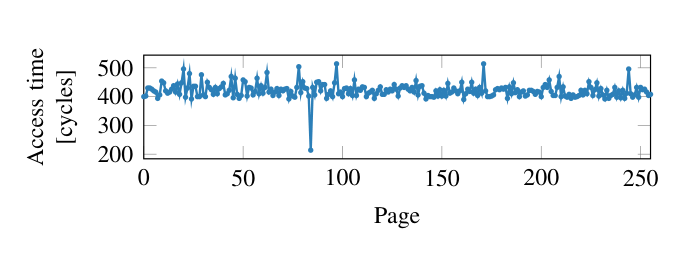

既然前两天都看了prefetch, 那干脆再往前看看也很经典的meltdown和spectre漏洞. 不过很可惜meltdown漏洞已经在硬件上被修复了, 我无法在自己的电脑上进行复现, 以后要是能玩到旧cpu就试试看. (TODO: spectre倒是可以试试)

# 两者共同原理

> 由于amd不受meltdown漏洞影响, 讨论前提为intel cpu

## 相关概念

1. 架构规定软件可依赖的机器状态和行为, 例如寄存器语义, 内存访问规则和地址转换机制. 微架构则指具体实现方式, 例如流水线, 缓存和 TLB 的组织. 缓存和 TLB 主要用于加速. 具体实现方式会根据cpu不同而变化, 但它们必须遵守架构的正确性要求, 软件也需要执行架构规定的维护与同步操作. 打个比方来说, 架构是一道题, 而不同的微架构是对该题的不同解法, 微架构可能会影响速度, 但都应该给出符合架构要求的答案
2. 现代cpu会在分支时进行推测执行, 尝试性提前执行时, 会对架构和微架构造成不同的影响; 当推测错误, 需要推翻刚才的推测的提前执行结果, 但只有架构上的错误一定被回滚, 而部分微架构上可能留下可被观测的侧信道影响
3. intel的cpu在修复meltdown漏洞之前, 在权限检查上也有类似cpu推测提前执行的问题, 即使最终权限检查会抛出异常并回滚架构上的错误状态, 但还是同样会在微架构上留下可被观测的侧信道影响

## 共同原理

meltdown利用的是3, spectre利用的是2. 但原理上都是利用推测执行留下的副作用来获取侧信道泄漏数据. 典型的演示代码如下, 4096是为了确保不同的`address[i]`值会导致不同页被加载进缓存里. meltdown和spectre对这段代码的使用场景不同, 稍后再区分
```c
    uint8_t *probe = malloc(0x100 * 4096);
    uint8_t tmp;
    // 在开始之前还需要保证任意probe页都不存在于缓存中
    if (i < len)
        // i < len是spectre的演示, meltdown漏洞可能是访问某个无权限地址(如用户态程序访问内核地址)
        // 共同点是这里存在一个条件判断来引发cpu的推测执行
        tmp = probe[address[i] * 4096];
    // address + i是想要泄漏数据的地址, cpu在推测执行时将address[i]的数据取出并当作idx
    // 由于发生了一次对probe[address[i] * 4096]的访问, 该地址被放进缓存
    for (int j = 0; j < 0x100; i++)
        test_time (probe[j * 4096]);
    // 遍历i, 如果某次probe[i * 4096]的速度远快于其他轮次, 那么可以推断probe[i * 4096]已经在缓存中
    // 从而得到address[i] == j, 泄漏出address[i]的数据
```


# 两者场景差别

## meltdown

meltdown主要场景是攻击者编写自己的用户态程序, 通过侧信道来泄漏该进程中所有对内核映射地址上的数据, 甚至基于内核上的物理地址信息推断出其他进程的数据. 修复上有两种. 在硬件修复提出前的修复方法是软件层面的KPTI, 只保留必要的用户态进程上对内核映射的地址而不是完整内核地址. KPTI介绍可以参考我上篇文章中的介绍[prefetch bypass kaslr虚拟化研究](https://dbgtf.org/winaslr1/#KPTI). 在后续intel修复了硬件的cpu上, KPTI就完成了历史使命默认被关闭了.

## spectre

spectre的典型场景是ebpf, js, 跨进程泄漏, 即在受控情景下泄漏非受控的内存. 但局限性是需要被攻击的程序有类似`tmp = probe[address[i] * 4096]`的gadget, 感觉这点局限性实在太大了, 不如meltdown那么强大和可靠. 但spectre利用攻击程序自己权限来读取的特殊性也赋予了他难以修复的特性. 直到现在还有非常多变体存在利用可能性

### spectre可用案例

> 由于spectre的场景比较多样, 具体讲讲一个案例

[spectre论文](https://spectreattack.com/spectre.pdf)中描述windows下的一种情景, 一个储存着某种秘密的进程A加载了, 而ntdll.dll中存在`adc edi, dword ptr [ebx+edx+13BE13BDh]; adc dl, byte ptr [edi]`gadget, 代码中存在可控ebx, edi的内存跳转B(jmp [address]), **该跳转的位置可以不受攻击者控制**, 但ebx和edi必须可控. 仅仅满足这样的条件就可以泄漏进程A的数据. 过程如下

> `edi`初始值记为E, `ebx + edx + 13BE13BDh`记为M, `[ebx + edx + 13BE13BDh]`为泄漏目标S
> 如果要控制`ebx + edx + 13BE13BDh`的值理论上需要ebx和edx都可控, 但论文中只说了ebx可控, 猜测在跳转B的位置edx是一个固定的值

1. 攻击者开一个一模一样的进程C, 但将跳转B的address强制修改为gadget的地址, 并且不停的执行进程C来训练CPU预测跳转B的位置应该跳转到gadget
2. 训练完成后执行进程A, CPU推测跳转到gadget, 访问了攻击者控制的地址M, 并将`E + S`当作地址访问
3. A进程发现推测执行错误, 对架构状态回滚, 但`E + S`的地址访问已经在缓存留下了痕迹
4. 攻击者通过检查`E - (E + 0x100000000)`中间的地址访问时间得出`S`的值

> 由于gadget中访问S是用`dword ptr`, 所以一次必然会得到一个dword的秘密. 但这样遍历效率太低了, 论文中给出的解决办法是错位, 在已知S的三个bytes的情况下去遍历剩下这个byte的0x100大小
