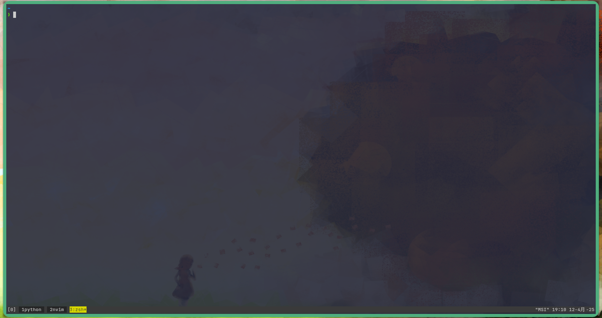
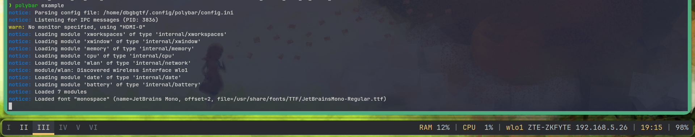
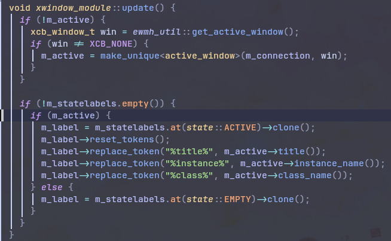
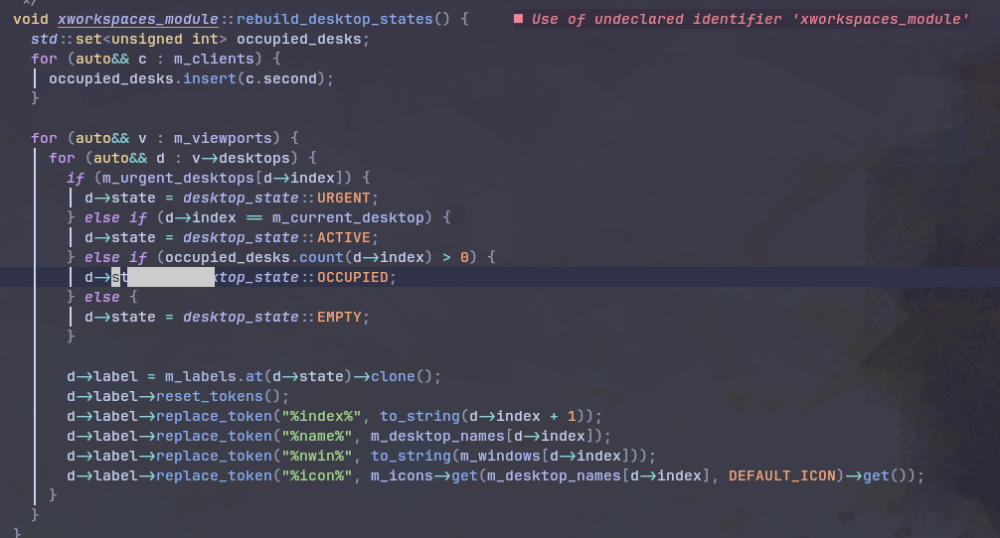
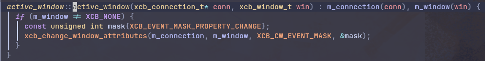
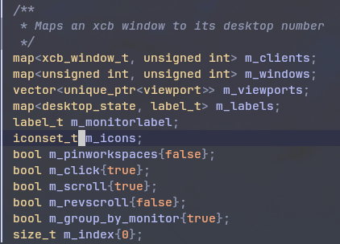
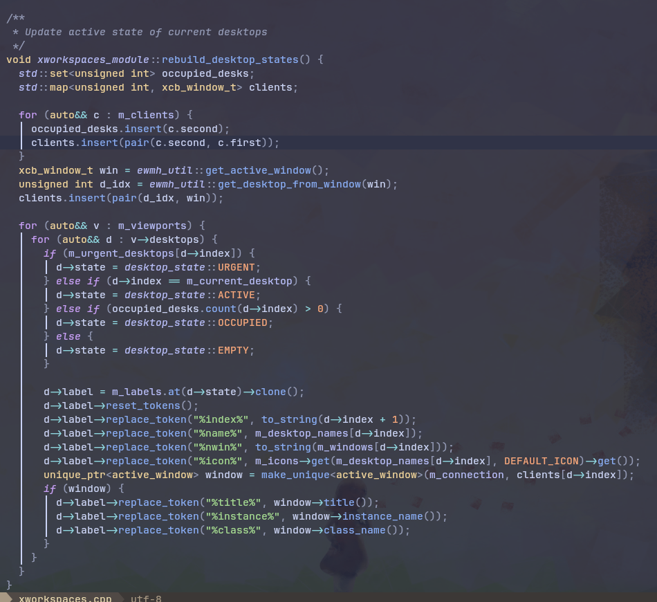

# 前言
让我先从`tmux`说起，tmux在终端上的体验一直让我很惊艳
- 快速在多个窗口切换
- 每个窗口自动命名，方便在切换的时候快速找到要切的位置
- 可定制性高，时不时可以自己换换配色
- 轻松分屏，临时执行一些任务

自从我上次换掉`kde`自带的窗口管理器`kwin`之后，
就一直在用`bspwm`作为我的平铺式窗口管理器，同时`polybar`做状态栏
(可以参考我的上一篇[博客](https://dbgtf.org/bspwm/)配置`bspwm`)

但是`polybar`有一点让我很不满意，不支持显示窗口正在执行什么工作
这对于平铺式简直是致命的！

想象一下，如果你的电脑开了好几个桌面，每个桌面都在执行不同的任务
假设你想要快速切换到正在执行`neovide`的桌面来继续编辑工作，
你看了一眼你的状态栏，如果不显示桌面内容，那你难道只能记住`neovide`在哪吗？！
还是说你必须每个都切一遍找到`neovide`？！

这一点一直让我十分困扰，然后我决心自己研究一下`polybar`源码
主要是在`xworkspace`旁边的`xwindow`可以显示当前桌面的执行工作
所以我的初步思路是把`xwindow`的相关代码迁移到`xworkspace`

# 代码
## 代码分析
事情比我想的稍微复杂一点，虽然`polybar`是我相对熟悉的cpp
但是cpp的代码复杂起来也够我喝一壶的了

首先，我找到了`xworkspace`和`xwindow`解析`token`的代码
比如`%instance%`, `%name%`等值会被解析成真正的值然后输出

(xworkspace因为我自己的仓库已经是更改过的代码
所以单独拿了一个文件展示原来的代码，有lsp报错不必在意)

这里我想要`xworkspace`也能使用`xwindow`的`%class% %instance% %title%`三个`token`
看起来需要用`d->label->replace_token("%class%", ????)`来将其替换

由于获取`class instance title`三个字符串的函数都已经在`xwindow`实现了
我希望能直接使用，所以我的思路就是在`xworkspace`里`make_unique<active_window>`
获得这个类，从而获得调用的三个函数(`m_active->title()`)

## 难顶的map
然后我就看了一下`active_window`的初始化函数

需要两个变量，才能初始化`active_window`类
其中`m_connection`在`xworkspace`类中也有，于是可以直接用
但是`xcb_window_t`这个变量就没有办法直接获得了，不过我找到了👇这个`xworkspace`成员变量

`m_clients`!这个变量是一个`xcb_window_t`与`unsigned_int`的`map`
在我参考了与之相关的代码之后看出来，这里的`unsigned_int`代表`desktop`的`index`

所以这样看起来思路就很明确了，我只需要从这个`m_clients`中拿出每一个`xcb_window_t`
用来创建`active_window`对象，然后调用`title()`那三个函数来`replace_token`

emm，问题是在`xworkspace`的大循环中，只有`desktop->index`可以直接给我用
？！问题是`map`只能根据`key`找`value`，`value`找`key`只能遍历一边！？

我最后的解决办法是在上面关于`m_clients`的小循环中，顺便创建一个`key`和`value`反过来的`map`
然后在大循环中用`d->index`来索引得到`xcb_window_t`的值，再创建`active_window`类
> `talk is cheap, here is my shit mountain!`

## m_clients?
然后我就被这帮写代码不写注释的人坑了(然后我在这次的代码也随着传统不写，要是合并了那真是史山的形成了)
如果当前桌面为`EMTPY`状态，`m_clients`似乎是不包含当前桌面的...

于是我就无法完成对于空的当前桌面的解析，就会出现`%name% %instance%`被解析成`I %instance%`的难泵情况
所以我在针对`m_clients`的循环后又强行插入了一个当前桌面(即`active_window`)，来保证解析不遗漏...
(好像有点史)

# 最后
如果有人觉得这个功能不错的话，请去`https://github.com/polybar/polybar/pull/3206`催更维护者更新
那是我开的`PR`(虽然`polybar`上次更新是6个月前就是说...)

