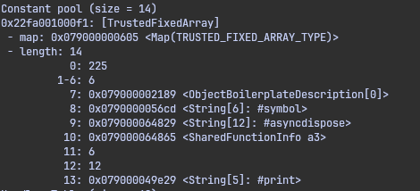
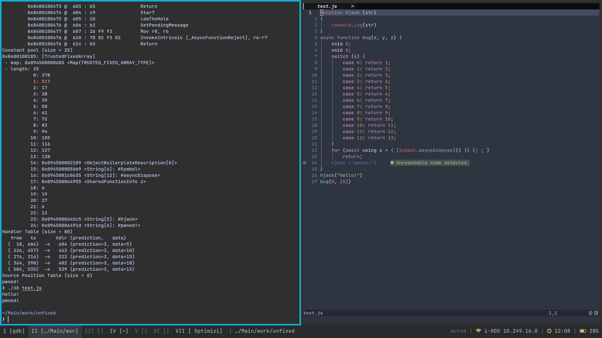
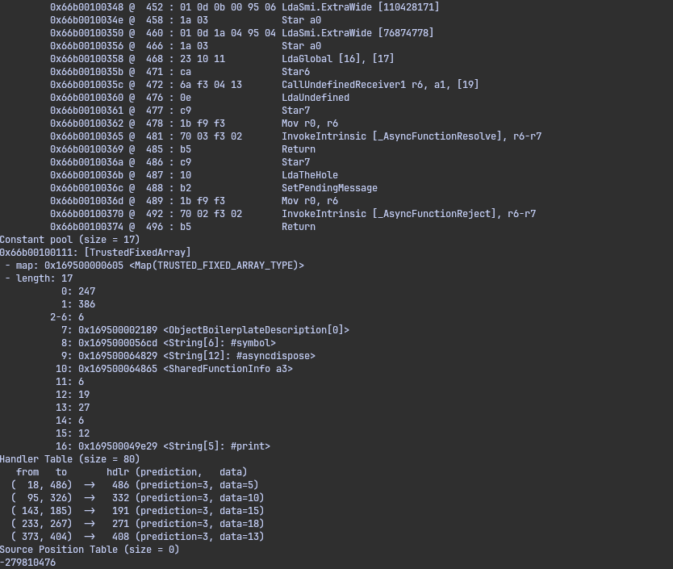

最近在面试官要求下研究v8，感觉没有想象中的那么难，还是自己给自己限制了。这篇文章总结下最近研究v8的内容和一个cve的利用尝试

# 指针压缩

由于smi很常用，所以v8的设计者将smi直接置于内存中，而不是单独为其开一个数据结构并使用指针来索引smi。
这样就需要一个将smi和其他的对象指针其分开的方式。早期32位v8采取如下方式，在内存中体现为将smi乘以二以使得末位留0，将指针末位置一。
```
                        |----- 32 bits -----|

Smi:                    |___int31_value____0|
```
```
                        |----- 32 bits -----|
Pointer:                |_____address_____w1|
```

早期64位v8采取将smi左移32位，而指针依旧保持末尾置1
```
            |----- 32 bits -----|----- 32 bits -----|
Smi:        |____int32_value____|0000000000000000000|
```
```
            |----- 32 bits -----|----- 32 bits -----|
Pointer:    |________________address______________w1|
```

后来在21年左右更新了压缩方式。将64位的堆块地址全部丢掉高32位，这高的32位作为堆块地址不显式存在在内存中。
而堆块是一个逐步分配的，最大4GB的内存段，其中足以容纳堆块地址的32位空间。
同时也作为一个沙箱的安全限制手段，一些情况下可以做到限制只能访问堆块内32位地址空间。

# Object结构

Object是v8中最重要的数据结构之一了，几乎所有东西都套上了这一层模板来表示，应该只有smi不是使用Object对象来表示的，因为smi实在太常用了。只不过根据种类不同，Object自身结构体也会由于继承而不同

下图可以看到Object延伸了N个结构，在js中可以用来操作的数组，对象，函数，在js中不可见的map，也都用Object表示。[原网址](https://v8docs.nodesource.com/node-18.2/dc/d0a/classv8_1_1_value.html)


具体Object的结构体长啥样，这方面网上资料很多，比如这个[https://blog.wingszeng.top/v8-pwn-basics-1-jsobject/]，我就简单总结下目前的理解（并且刚开始学没怎么用到这个结构体的复杂的部分，所以讲的还是比较浅显）

首先Object分为两种模式，一种叫Fast，另一种叫做Slow/Dictionary
## Fast
Map是核心控制单元，Element和Properties分别储存数字索引的元素和字符串索引的元素，并且都是采取纯数字索引。
而负责从字符串转换到Properties索引的，则是Map控制单元中的Descriptor Array。其中储存着真正的值在Properties数组的索引

并且Map和Descriptor Array都会在相似的对象中部分共用。
并且Descriptor Array会指向自己的父类（这里父类指的是生成当前这个Descriptor Array的模版，和编程语言的父类不一样，意会一下），形成类似树的结构，这套复用和树结构机制叫做Map Transition

## Slow/Dictionary
当树形结构不好维护时，或是数字索引过大，分配连续内存过于浪费空间时，会采取这种模式。
Properties通过哈希来访问，Descriptor Array和Map Transition机制弃用

# CVE-2025-9132

[CVE作者的原文](https://issues.chromium.org/issues/436181695)
这个CVE的问题出在Parser的脱糖操作上，[这篇文章](https://keenlab.tencent.com/zh/2025/08/22/2025-CVE-2025-9132/)讲解漏洞成因比较详细

## bug解析
Js由于需要处理函数/循环闭包问题，在处理for语句的时候进行一个脱糖操作。下面是v8源码中脱糖部分注释
其中指明了js在处理for循环时，会将初始语句的内容复制到AST树的两个位置，为后续处理闭包提供便利
```cpp
// ES6 13.7.4.8 specifies that on each loop iteration the let variables are
// copied into a new environment.  Moreover, the "next" statement must be
// evaluated not in the environment of the just completed iteration but in
// that of the upcoming one.  We achieve this with the following desugaring.
// Extra care is needed to preserve the completion value of the original loop.
//
// We are given a for statement of the form
//
//  labels: for (let/const x = i; cond; next) body
//
// and rewrite it as follows.  Here we write {{ ... }} for init-blocks, ie.,
// blocks whose ignore_completion_value_ flag is set.
//
//  {
//    let/const x = i;                            [1]
//    temp_x = x;
//    first = 1;
//    undefined;
//    outer: for (;;) {
//      let/const x = temp_x;                     [2]
//      {{ if (first == 1) {
//           first = 0;
//         } else {
//           next;
//         }
//         flag = 1;
//         if (!cond) break;
//      }}
//      labels: for (; flag == 1; flag = 0, temp_x = x) {
//        body
//      }
//      {{ if (flag == 1)  // Body used break.
//           break;
//      }}
//    }
//  }
```
问题出在`await using`这个关键字。`await using`是 JavaScript 中的新特性。
使用`await using`声明的变量离开其作用域时，它的`[asyncDispose]`会被异步调用。ignition会为其生成一对`SuspendGenerator/ResumeGenerator`字节码。并且如果`async function`中有`await`关键字，那么函数的开头会是一个`SwitchOnGeneratorState`字节码。

`SwitchOnGeneratorState`操作是查看Generator是否为空，如果不为空则根据跳表跳转指定的`ResumeGenerator`
`SuspendGenerator`的操作是将上下文保存到Generator，并且中止当前函数
`ResumeGenerator`的操作是根据Generator的内容，恢复上下文
可以看出一个`SuspendGenerator/ResumeGenerator`对就会需要一个跳表值

很关键的一点在于这个跳表的值，也像其他的跳表一样，储存在每个函数的constant pool中。
并且这个constant-pool是被整个函数体共用的，其中会被切分为不同的小段给不同的使用者
以下图为例，0是`SuspendGenerator/ResumeGenerator`的跳表值，1-6是一个`SwitchCase`的跳表值，还储存了一些Object指针


这个跳表的长度在Parse阶段就已经固定，长度来源于各个使用者声明的长度总和。
扫描源代码的时候只发现了一个`await using`，constant-pool理所当然的只为其留了一个空位。
但由于脱糖的操作，AST树中存在两个`await using`，也就是后续会生成两个`SuspendGenerator/ResumeGenerator`对。
在为其生成跳表值的时候，会达成一个越界写的效果，覆盖constant-pool中下一个slot

## 尝试利用

这时候已经很明确原语了，那就是可以覆盖constant-pool中的一个slot。很明显覆盖指针没有意义，这会导致原本需要索引指针的操作索引到Smi。所以我的思路放在了覆盖其他跳表值。

下面是我的初步构造，实现了一个简单的非预期执行js代码，这里的构造是通过`SuspendGenerator/ResumeGenerator`的跳表值覆盖`SwitchCase`的跳表值，从而实现在`SwitchCase`的地方跳转到下面执行hjack的位置


接下来我尝试了一些字节码错位构造，使用可自定义字节码长度最长的操作`LdaSmi.ExtraWide`(大概是最长的吧)
并且让执行流跳转到bytecode中`LdaSmi.ExtraWide`的立即数的位置。从而让v8执行看似是我的Smi的代码
经过我的测试，发现ExtraWide最多允许四字节，并且这个四字节上限是到0x3fffffff。因为smi的机制导致其只有31bit的有效位，而这其中再去掉一位符号位，就是30bit有效位
```js
async function bug(a3, a4)
{
  void 0; void 0;
  void 0; void 0;
  switch (a3) { case 0: case 1: case 2: case 3: case 4: case 5: return; };
  for (await using a3 = { [symbol.asyncdispose]() {} }; ; ) { return; }
  a3 = 0x0695000b;
  a3 = 0x0495041a;
  print(a4);
}

bug(0, 0);
```
于是达成了一种类似shellcode的执行，并且这个shellcode一段只能写四字节，考虑上去除两个字节的跳转指令，只能自己写两个字节。

最终结果是下面这样。注意constant-pool位置的1原本的值应该和4-6保持一致，但被覆盖为我构造的值。
而这个386的跳表值最终会导致控制流跳转至454，也就达成了对LdaSmi.ExtraWide的错位执行。从而达到简单的任意ignition字节码执行


至于拿这个任意字节码执行做什么，我尝试了挺多乱七八糟的，但都达不到我要的泄漏指针。(也可能因为对于v8和js的了解还是不到位)

后来误打误撞发现将读取参数的索引置为1搞出了一个栈溢出，研究的时候回想到js函数栈的知识。函数参数和rbp，返回地址等放在栈上。
并且还解决之前一个困惑的点。比如下面这个a0代表该函数的第一个参数，但字节码却体现为03。实际上这个03是索引，取0的位置会取到上层函数的rbp，取1会取到上层函数的返回地址，取2会取到当前js函数的闭包。
```
0x66b00100356 @  466 : 1a 03             Star a0
```

对于正常的程序，只要我通过构造上面这样`Star a0`的字节码，就可以通过控制非法索引，越界任意读写栈上一大片范围的完整指针，走rop就结束了。但由于v8有Smi机制，大多v8指针都被当作结构体解析打印，少部分c的原始指针，比如rbp，程序返回地址由于末位为0，被当作了smi打印低32位，由于不能得到完整指针泄漏，并且写入Smi时会将高32位置零，所以暂时没有办法进行利用。

但假设能控制一片rwx地址写入shellcode，并且这个shellcode处在constant-pool，或是栈上等bytecode可以通过索引来获取的位置，就可以通过覆盖返回地址达成利用了
