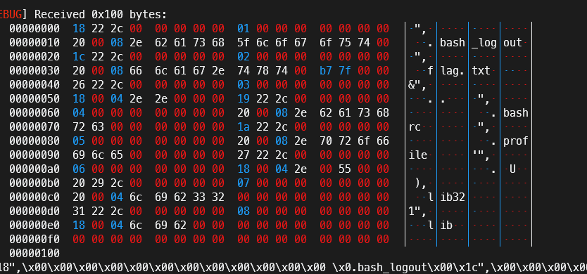

# 前言
网鼎杯也是无敌了，首先就是幽默咸鱼老哥，甚至还有出题人疑似自出自卖

一些不算简单的题目随随便便就是上百解。。。
其次是我的pwn2被打回了，不是哥们，纯签到而已，还需要wp写多详细。
最后是re2500多解，全部被打回wp，甚至没有原因？？主办方是觉得这题水平很高需要好好写wp吗。最离谱的是re2的一血也被打回wp了，搞不懂，这下真搞不懂了。

# pwn04题解
[题目附件及我的exp](./pwn4.zip)
这题考点太过分散了，每个考点难度都差不多，一道题硬是拆成三瓣，有点无语。

## 考点1-爆破
第一个考点是分别爆破用户名和密码，程序会先根据读取的长度来逐位比对输入和真正的用户名或密码，如果比对成功，则判断是否长度一致。

所以可以每次输入时都故意不输入完整长度，每次只比确认正确的用户名或密码多一位，如果返回的是长度不对，就说明对于内容的检查通过，也就是多的这一位是正确的。

输入正确用户密码后就能进入到主逻辑菜单功能。

## 考点2-加密
这个题的加密解密在每次进行Add,Edit,Delete,Show的时候都会进行一次，在功能结束的时候还会进行一次，导致在show泄露地址的时候得到的地址是被加密过的，需要手动解密。
在Add,Edit往堆上写功能时都需要写入手动加密的数据，然后经过程序解密放回堆上才是正常的数据。


加密和解密的逻辑比较复杂，难以做到在exp中自动加密解密。
不过加密逻辑根据操作流程，在固定操作流程的情况下是完全固定的。
也就意味着可以每次需要加解密时进内存查看一下加解密的key，然后手动加解密。(不过这么出题意义不大吧，除了麻烦之外没什么难度，也没什么实战意义)

## 考点3-从堆到rop
搞明白加解密之后，这道题就是一个简单堆题，只不过有不同方式可以选择，如果走apple的话肯定很麻烦，因为apple的触发必须要exit，而exit时，程序已经将写入的数据进行解密放入堆块，所以对于结构体的伪造都必须事先加密。

比赛当时看到了说2.27版本，这是在tcachebin出现后的第二个版本，一时想不起来怎么打比较方便，就问了一下火箭，他立即给我答复说`__free_hook`走`svcudp_reply`，但是我记得`svcudp_reply`是高版本的rop打法，低版本使用的是`setcontext`


然后就`tcachebin`往`__free_hook`申请了一个堆块，写上加密后的setcontext地址。成功劫持。

再free一个堆块，将堆块写上设置好的堆地址，然后就可以走rop了。

## 考点4-rop,ogw,orw
### 比赛情况
一般的题目都不需要考虑这个东西，但是这个题目的出题人不知道出于什么心理，把flag名字改为flag.txt。
正常的orw板子都默认flag就在名字叫做flag的文件里面。但是这题的flag被改为flag.txt，导致常规orw走不通。
火箭告诉我也许可以试试`getdents64`调用，先搞明白当前目录下有什么文件，我也觉得大概率是flag文件名字被改了。
由于时间不太来得及，当即从网上抄了套先mprotect再shellcode走ogw的板子，但是突然发现rop链子失效了
```python
# read
rop = p64(rax) + p64(0x0) + p64(rdi) + p64(0x0) + p64(rsi) + p64(heap_base) + p64(rdx) + p64(0x66) + p64(syscall)
# mprotect
rop+= p64(rax) + p64(0xa) + p64(rdi) + p64(heap_base) + p64(rsi) + p64(0x1000) + p64(rdx) + p64(0x7) + p64(syscall)
```
思索好久才想起来这题以回车为终止符。但是mprotect的调用号又是**0xa**!
怎么办，我决定再来一个read，只要控制读入字节为0xa个字节就行了。
```python
# read
rop = p64(rax) + p64(0x0) + p64(rdi) + p64(0x0) + p64(rsi) + p64(heap_base) + p64(rdx) + p64(0x66) + p64(syscall)
# read 读入0xa个字节保证rax为0xa
rop+= p64(rax) + p64(0x0) + p64(rdi) + p64(0x0) + p64(rsi) + p64(heap_base+0x100) + p64(rdx) + p64(0xb) + p64(syscall)
# mprotect
rop+= p64(rdi) + p64(heap_base) + p64(rsi) + p64(0x1000) + p64(rdx) + p64(0x7) + p64(syscall)
```
慌慌忙忙地调整了一下exp，最后跑通了，发现当前目录有flag.txt文件


当即直接无语了，你要是想考ogw，就把flag文件后缀改成10位随机呗，你要是不想考ogw，就不要给我整这一出行不行啊！
和着我慌慌忙忙在比赛最后半小时学了ogw怎么写，然后发现根本不用？！别的选手直接猜一下flag.txt就出了？！
### getdents64
比赛时时间太匆忙，没有仔细看getdents64怎么用。
实际上很简单

1. 只需要open一个文件夹（文件夹是特殊的文件）
2. 将得到的fd给第一个参数，第二个参数则是作为储存信息的指针，调用将会把文件夹信息写入该地址，第三个参数是写入多少字节。

最后是我写的一个简易模板，以后要是遇到类似题目就可以拿出来直接用了。
```python
# read
rop = p64(rax) + p64(0x0) + p64(rdi) + p64(0x0) + p64(rsi) + p64(heap_base) + p64(rdx) + p64(0x10) + p64(syscall)
# open
rop+= p64(rax) + p64(0x2) + p64(rdi) + p64(heap_base) + p64(rsi) + p64(0x0) + p64(rdx) + p64(0x0) + p64(syscall)
# getdents64
rop+= p64(rax) + p64(0xD9) + p64(rdi) + p64(3) + p64(rsi) + p64(heap_base) + p64(rdx) + p64(0x100) + p64(syscall)
# write
rop+= p64(rax) + p64(0x1) + p64(rdi) + p64(1) + p64(rsi) + p64(heap_base) + p64(rdx) + p64(0x702) + p64(syscall)
```
我平常喜欢把杂七杂八的记不住的丢到[这个仓库](https://github.com/dbgbgtf1/useful-stuff)

# 呃呃
就这样吧，抽象网鼎杯给我无语到了。
