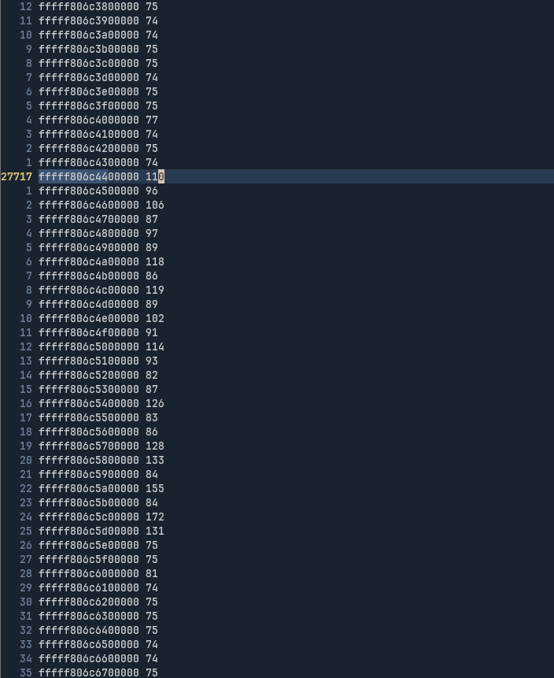
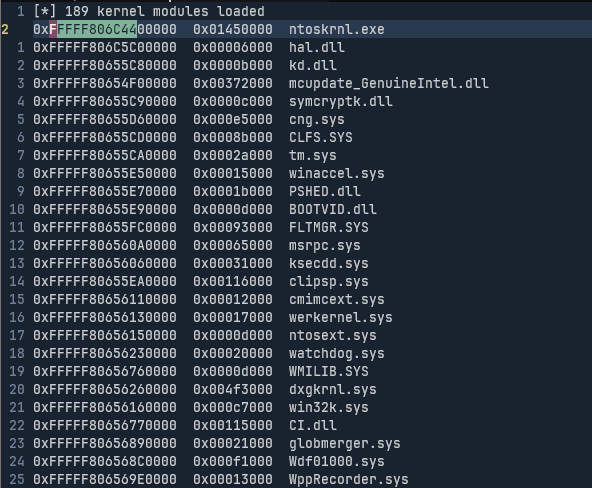
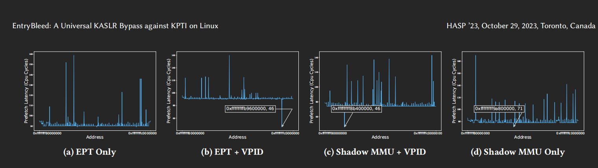

# 前言

之前看到个项目[prefetch-tool](https://github.com/exploits-forsale/prefetch-tool), 号称模仿了entrybleed, 用同样的原理在windows上bypass了kaslr. 昨天就拿来试了试, 一看发现有点意思, 在我的windows上非常稳定的可以获得ntoskrnl.exe的虚拟地址.
正当我开开心心的拿到vmware的windows中想配合cve-2026-40369研究下windows内核提权的时候, 发现在虚拟机里却用不了. 一想这也不是特别意外, 毕竟entrybleed本质是利用cpu的TLB进行侧信道, 虚拟机上和物理机有不一样也正常.

# 研究过程

## prefetch bypass kaslr介绍

### 相关概念

- 页表: 将虚拟地址翻译为物理地址的多级树状结构, 由内核进行分配和维护
- CR3(Control Register 3): 保存当前页表树的根节点的物理地址, 与当前执行环境强相关. 开启KPTI时, 用户/内核切换时会被显式重写
- TLB(Translation Lookaside Buffer): 针对页表的缓存, 保存近期页表翻译结果. 与当前执行环境未必强相关. 本质只是用于加速CR3树查找的数据结构

### 侧信道原理

> KPTI的问题留到后面再讨论, 现在先不纠结KPTI是否开启, 暂时比较笼统的说TLB中存在对内核的映射)

推荐阅读原文 [Prefetch Side-Channel Attacks: Bypassing SMAP and Kernel ASLR](https://gruss.cc/files/prefetch.pdf), 这里我只是简单记录下我的理解.

用户态进程执行syscall时, 内核将执行代码片段的内存页放入TLB页表中, 退出至用户态时, 由于内存页有G(global)位豁免, 仍然不失效. 在用户态我们用prefetch去遍历试探内核可能在的虚拟地址. 则有两种情况, 1. 命中TLB中内核页表缓存, 返回速度很快. 2. 没有命中TLB中内核页表缓存, 继续走了慢分支遍历CR3寄存器的页表树, 也没有找到. 在intel cpu上, 这两种情况的时间差被证实足够可靠用来泄露内核虚拟地址.

> TLB上的内核页有G位不失效, 是由于内核在整个系统上只有一份实例, 且虚拟地址在各个进程内也是一致的, *虚拟->物理*的映射只存在一份; 而每个普通进程内都可能存在一样的虚拟地址, 但他们对应的实例显然不同, 所以TLB保存的*虚拟->物理*的映射必须在当前进程环境下才正确

## 虚拟机中观察到的现象

> 研究该现象的时候关闭了KPTI

虽然说在虚拟机内用不了, 但我分别在虚拟机和宿主机上用`prefetch-tool -pt`观察了在每个地址上的时间, 与`NtQuerySystemInformationFn(SystemModuleInfomation, mods, len, &len)`返回的内核模块地址进行对比, 仍然发现了一些端倪.

很明显看到在`ntoskrnl.exe`的起始地址开始, 时间有明显的变长. 哎不对, 刚刚说的不是命中了TLB上的内核页会导致时间变短吗?

这里猜测是因为虚拟机实现问题, 对于命中的页表即使走了TLB或是某些快路径, 也会被访问宿主机物理地址这一步的转换给拖住, 导致整体时间更慢. 于是上网查到了[EntryBleed: A Universal KASLR Bypass against KPTI on Linux](https://dl.acm.org/doi/10.1145/3623652.3623669)

## 看看论文

`EntryBleed: A Universal KASLR Bypass against KPTI on Linux`主要是讲如何绕过KPTI, 其中也研究了prefetch的侧信道作用能否跨越虚拟机存续. 文中分析了虚拟机中可能会影响prefetch侧信道的几种优化: EPT, SHADOW MMU, VPID.

### 相关概念

- GVA, GPA, HVA, HPA: Guest Virtual Address, Guest Physic Address, Host Virtual Address, Host Physic Address
- EPT(Extended Page Tables): 虚拟化层负责`GVA->GPA`, 由硬件负责`GPA->HPA`. 构成完整的`GVA->HPA`. 现代解决方案
- SHADOW MMU: 由虚拟化软件负责维护一个软件页表`GVA->HPA`, 一步到位, 缺点是需要虚拟化软件频繁的介入
- VPID(Virtual Processor ID): 通过标记为区分虚拟化和硬件层的页表, 使得其可以共存在TLB上. 对比不开启VPID时, 切换虚拟和宿主上下文会清空TLB

### 一些猜测

> 声明一下到了这一步确实不知道还能怎么求证具体原因, 只能试着给出合理猜测

论文中对上述三个选项进行对照实验, 结果如下(EPT和SHADOW MMU显然不会在同一层虚拟化中被同时使用)

看到在开启EPT而不开启VPID的情况下, 和我观察到的结果一致. 原本预期的时间低谷变成了高峰. 这里我的猜测不完全准确, 因为在不开启VPID的情况下, TLB会被清零. 但时间更长的原因应该就是由于在第二步的`GPA->HPA`消耗了时间

而开启VPID的两种情况都能很好的保留prefetch的副作用, 还是可以用来稳定的bypass kaslr. 很显然是因为VPID保留了虚拟层的TLB项, 其中包含我们需要的虚拟层内核页表

值得一提的是论文作者表示不清楚在单独开启SHADOW MMU而不开启VPID的情况下, 为什么出现了较小但仍然可观测的时间差, 并且保留了命中时间低谷的特性. 我猜测是由于影子页表的特性, 在不更改页表映射的情况下, 不需要退出到宿主机进行二次寻址, 所以一定程度上虚拟层的TLB被保留, 出现了同样的时间低谷.

## KPTI

再聊聊KPTI. 这个东西现在被证实只能有效防御meltdown, 而对于prefetch的防御不够充分. 先解释下KPTI工作原理吧.

在没开启KPTI的情况下, 用户态进程下, 内核的全部页表会暴露在CR3寄存器的页表树之下, 导致了meltdown和spectre漏洞; 开启后, 内核将暴露的面收束到了用户态用来call内核态的一小部分页表(被叫做`trampline region`), 在切换内核/用户态时会覆盖CR3这个根节点来切换树.

对于meltdown这类依赖用户态下内核页表用来读的漏洞是致命的, 因为能够读取的范围缩小到了`trampline region`. 而对于prefetch来说, 只要用户态页表中存在一个固定内核偏移的内核态页表即可, 如果我判断到`0xffffabcd`是内核的`trampline region`, 并且确定`trampline region`相对内核本身的偏移是`0xabcd`, 那么我依然可以通过内核暴露的`trampline region`地址进行bypass kaslr

论文中给出的修复方案是将`trampline region`相对于内核本身的偏移进行随机. 因为内核暴露的`trampline region`确实对于用户态已经是必要的内容了, 没法去掉该漏洞来彻底解决问题

> 这里没有特别区分CR3页表树和TLB, 因为TLB本质只是一个CR3页表树的缓存
