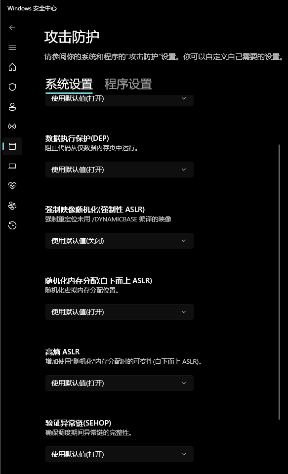

最近想开个新坑学习下windows下的二进制知识

## 判断aslr, dep(nx), cfg

aslr是地址随机化. dep和nx一个意思, 都是将执行段和数据段区分的缓解措施. 只不过在windows上更习惯叫做dep. cfg(Control Flow Guard).

windows也有checksec, 但这里先试试用msvc的dumpbin来检查这几个选项是否开启.
`dumpbin /headers .\target.exe`
找到其中`OPTIONAL HEADER VALUES`的段, 再其中有`DLL characteristics`. 可以观察到几个选项是否开启Aslr(Dynamic base), dep(NX compatible), cfg(Control Flow Guard)
```
OPTIONAL HEADER VALUES
            C160 DLL characteristics
                   High Entropy Virtual Addresses
                   Dynamic base
                   NX compatible
                   Control Flow Guard
                   Terminal Server Aware
```
对于cfg, 需要再确认一步. `dumpbin /loadconfig .\target.exe`. 确认`CF instrumented`和`FID table present`存在才可以确认开启了cfg
```
            00017500 Guard Flags
                       CF instrumented
                       FID table present
```

> [微软cfg文档](https://learn.microsoft.com/en-us/windows/win32/secbp/control-flow-guard)

## windows aslr

windows的aslr与linux有极大不同. linux上的随机以进程重启为单位, 只要进程重启, 所有受到aslr影响的基地址都会发生改变. 而windows只有在系统重启才会保证所有地址都再进行一次随机化.

| 生效时机\影响的内存段基地址 | stack | heap | exe/elf | dll/lib |
| --- | --- | --- | --- | --- |
| linux进程重启 | ✅ | ✅ | ✅ | ✅ |
| windows进程重启 | ✅ | ✅ | ❎ | ❎ |
| windows系统重启 | ✅ | ✅ | ✅ | ✅ |

windows在常规的ASLR上还有额外的两项缓解措施: Mandatory ASLR, Bottom-Up ASLR. 分别默认关闭和默认开启


### Mandatory ASLR

启用“强制映像随机化（Mandatory ASLR）”后, Windows 会尝试将原本**未声明DYNAMIC_BASE、但具备重定位信息的映像**也随机重定位并运行. 它不改变 ASLR 的随机化算法或强度, 而是扩大 ASLR 的适用对象. 此外若是再开启`DisallowStrippedImages`功能, 会导致没有.reloc段的映像无法被加载

### Bottom-Up ASLR

> 在 Windows 8 之前，自下而上和自上而下的分配不是由 ASLR 随机分配的。即通过VirtualAlloc和MapViewOfFile等函数进行的分配没有熵，因此可以放置在内存中的可预测位置（除非是非确定性应用程序行为）。虽然某些内存区域有自己的基本随机化，例如堆、堆栈、TEB 和 PEB，但所有其他自下而上和自上而下的分配都不是随机化的。
> 从 Windows 8 开始，所有自下而上和自上而下分配的基址都是显式随机化的。这是通过随机化自下而上和自上而下分配从给定进程开始的地址来实现的。通过这种方式，地址空间内的碎片最小化，同时还实现了随机化所有未显式基于的内存分配的基址的好处
以上内容节选自[ASLR机制分析报告](https://www.cnblogs.com/XiuzhuKirakira/p/18049457#bottomupaslr%E6%9C%BA%E5%88%B6)

## cfg是什么以及如何工作

网上详细的资料很多, 推荐阅读[Analysis of the Windows Control Flow Guard](https://dl.acm.org/doi/10.1145/3664476.3670432). 由于是英文, 让ai翻译了一下, 可以作简单参考. 

这里先只简单介绍下, 哪天研究更深入了再补充.

### cfg基本原理

cfg的影响范围只有*间接调用和跳转*, 比如函数指针调用(`call rax` `jmp rax`), 但不包括栈上返回地址被覆盖的情况.
其次cfg对于一个程序可以部分开启, 不是开启cfg之后所有*间接调用和跳转*都会受到影响

下面是未使用 CFG 的间接调用, 看到cfg检查入口是`__guard_check_icall_fptr`这个函数. 该函数在检查调用地址是否合法后会返回并继续正常执行流.
另一个函数是通过`__guard_dispatch_icall_fptr`函数, 差别在于该函数不会返回, 而是验证后直接跳转到调用的地址.
有趣的是这两个函数自身也通过函数指针被调用, 但他们处于ro段, 无法被直接修改.
```text
jscript9!Js::JavascriptOperators::HasItem+0x15:
66ee9558 8b03            mov     eax,dword ptr [ebx]
66ee955a 8bcb            mov     ecx,ebx
66ee955c 56              push    esi
66ee955d ff507c          call    dword ptr [eax+7Ch]
66ee9560 85c0            test    eax,eax
66ee9562 750b            jne     jscript9!Js::JavascriptOperators::HasItem+0x2c (66ee956f)
```

下面是启用 CFG 后的间接调用。
```text
jscript9!Js::JavascriptOperators::HasItem+0x1b:
62c31e13 8b03            mov     eax,dword ptr [ebx]
62c31e15 8bfc            mov     edi,esp
62c31e17 52              push    edx
62c31e18 8b707c          mov     esi,dword ptr [eax+7Ch]
62c31e1b 8bce            mov     ecx,esi
62c31e1d ff15fc43f062    call    dword ptr [jscript9!__guard_check_icall_fptr (62f043fc)]
62c31e23 8bcb            mov     ecx,ebx
62c31e25 ffd6            call    esi
62c31e27 3bfc            cmp     edi,esp
62c31e29 0f8514400c00    jne     jscript9!Js::JavascriptOperators::HasItem+0x33 (62cf5e43)
```

### cfg fun facts

> 早期动态申请rwx内存时, 新内存会默认被cfg图标记为有效. 为了解决这个问题, 微软引入了`VirtualAlloc`的`Page_TARGET_INVALID`, 使得新内存的地址为无效目标. `VirtualProtect`支持`PAGE_TARGET_NO_UPDATE`, 通常将地址改为可执行会自动将其地址设为有效目标, 设置该flag后会阻止更新cfg信息.

> 合法地址默认是在编译期间决定的, 所以对于jit这种运行时申请rwx内存并执行的情况会比较特殊. 由于上一条说到的原因, 现在的jit分配内存通常让新内存为无效目标, 需要使用`SetProcessValidCallTargets`函数来进行标记. 在此基础上`SetProcessValidCallTargets`本身受到调用抑制的限制, 也就是其不能被间接调用或跳转.

> cfg储存哪些地址合法所使用的数据结构为bitmap, 现在的cfg采取0x10字节2bit的形式, 其中`{0, 0}`无效, `{1, 0}`代表目标0x10字节对齐的情况下有效, `{1, 1}`代表非16字节对齐时有效, `{0, 1}`代表该目标因被抑制而无效

这里解释下0x10字节对其的问题, 由于受bitmap尺寸限制, 不能为每个地址在bitmap中储存一个元素. 于是采取了每0x10字节共享2bit. 以检验`0x1000-0x100f`地址为例, `0x1000`是0x10字节对齐, 按照一种情况考虑; 而`0x1001-0x100f`由于信息被压缩, 会被一起按照不对齐的情况考虑. 也就是说, 如果`0x1002`为有效地址, `0x1001-0x100f`都会被bitmap认为有效

> Windows 为降低 ASLR 成本，通常只在系统启动时随机化一次库的基址，重启后才确保产生新基址。因此同一库在多个进程中的 CFG 位图相同，可作为以页文件为后备、可共享的内存映射；物理页在 RAM 中只需一份。这样对已加载模块，主要只须计算进程私有内存的位状态，加载开销接近于零。[来源](https://dl.acm.org/doi/10.1145/3664476.3670432)[来源2](https://cloud.google.com/blog/topics/threat-intelligence/six-facts-about-address-space-layout-randomization-on-windows/)

> 加载未启用cfg的dll时, 该dll的每个地址都可以被间接调用或跳转. 所以只有每个模块都开启cfg时, cfg才可以保证完全有效.

### 绕过思路和已知弱点

- 打rop, cfg只控制间接调用和跳转, 所以ret导致的控制流并不被影响
- 利用cfg的0x10字节精度问题
- 利用未启用cfg的映像
- 更改只读段内存权限, 修改bitmap或`__guard_check_icall_fptr`指针为其他函数

##
