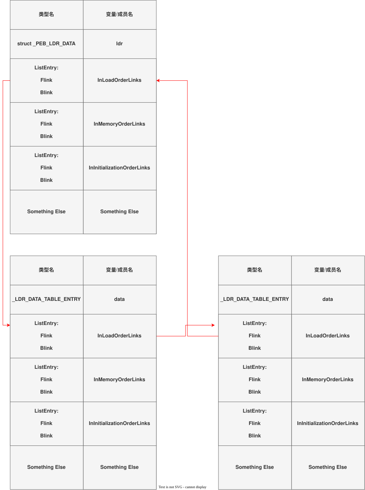
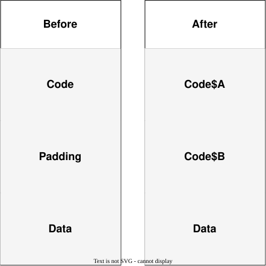

这两天研究了下windows的shellcode写法, 发现挺多值得记录的东西. 顺便整理一下之前打chrome利用链时写shellcode用到的技巧.

## linux/windows shellcode差别

最重要的差别是两者调用shellcode的方式有很大不同. linux上系统调用号是不随版本而改变的, 只可能新增而不可能改变原有的调用号, 每个数字的坑位被占用就是被占用了, 即使弃用也会保留.

而windows的系统调用号可能会随着版本被变更, 所以windows上不能简单通过设置rax然后调用syscall来稳定地调用任意系统调用, 常见的办法是使用`ntdll.dll, kernel32.dll, KERNELBASE.dll`对外暴露的函数来间接调用系统调用或所需功能. 而这三个dll在常规进程都会被加载, 所以问题就是如何获取其中导出函数地址.

## 获取 ntdll, kernel32, KERNELBASE 导出函数地址

获取一个已加载dll上的导出函数地址分为两步, 首先获取该dll基地址, 其次根据dll基地址在导出表上查找指定导出函数地址

### dll基地址->导出函数地址

像ntdll, kernel32, KERNELBASE这种需要导出符号给外部函数的dll, 会在dll头部有函数导出表的结构. 其中有一个表是有函数名信息, 可以在该表上遍历比对函数名, 找到后根据函数表idx查找到函数的偏移, 再加上dll的基地址就是函数真实地址

> 有可能该函数的实现在别的dll中, 这时候找到的不是函数地址, 而是类似`KERNELBASE.Sleep`这样的转发字符串. 这时就需要继续查找

下面是通过dll基地址和函数名在dll中动态查找该函数的c实现. 尽管`GetProcAddress`可以达到同样甚至更好的效果, 但可能更容易被分析和发现. 而且获取`GetProcAddress`本身也可能需要类似的动态查找函数办法.

> 通常我们使用该函数的时候已经知道要的函数在哪个dll中了, 这里的FUNC_FORWARDER只是严谨考虑, 并不一定真的会用到
```c
typedef enum
{
  NOT_FOUND,
  FUNC_DIRECT,
  FUNC_FORWARDER
} func_result;

static uint32_t
search_func (uint64_t dll_base, char *func_name,
             PIMAGE_EXPORT_DIRECTORY export_table)
{
  // prepare a few usefule tables
  uint32_t func_name_len = my_strlen (func_name);
  uint32_t name_table_len = export_table->NumberOfNames;

  uint32_t *name_table = (uint32_t *)(dll_base + export_table->AddressOfNames);
  uint32_t *func_table
      = (uint32_t *)(dll_base + export_table->AddressOfFunctions);
  uint16_t *name_2_idx
      = (uint16_t *)(dll_base + export_table->AddressOfNameOrdinals);

  for (uint32_t i = 0; i < name_table_len; i++)
    {
      char *name = (char *)(dll_base + name_table[i]);
      if (my_memcmp (name, func_name, func_name_len + 1))
        continue;

      // lookslike we got the func we what
      uint32_t idx = name_2_idx[i];
      return func_table[idx];
    }

  return 0;
}

static func_result
get_func (uint64_t dll_base, char *func_name, uint64_t *result)
{
  PIMAGE_DOS_HEADER dos_header = (PIMAGE_DOS_HEADER)dll_base;
  PIMAGE_NT_HEADERS nt_headers
      = (PIMAGE_NT_HEADERS)(dll_base + dos_header->e_lfanew);
  IMAGE_DATA_DIRECTORY export_datadir
      = nt_headers->OptionalHeader.DataDirectory[IMAGE_DIRECTORY_ENTRY_EXPORT];

  // get export_table and export_size
  PIMAGE_EXPORT_DIRECTORY export_table
      = (PIMAGE_EXPORT_DIRECTORY)(dll_base + export_datadir.VirtualAddress);
  uint32_t export_size = export_datadir.Size;
  if (export_datadir.VirtualAddress == 0 || export_size == 0)
    return NOT_FOUND;

  // search func_name in the name_table
  uint32_t func_rva = search_func (dll_base, func_name, export_table);
  *result = dll_base + func_rva;
  if (func_rva == 0)
    return NOT_FOUND;

  if (func_rva >= export_datadir.VirtualAddress
      && func_rva < export_datadir.VirtualAddress + export_size)
    return FUNC_FORWARDER;

  return FUNC_DIRECT;
}
```

### 获取dll基地址

`ntdll.dll kernel32.dll KERNELBASE.dll`通常都会被加载. 而windows进程有一个结构体`_PEB`, 在x64用户态时固定存在`gs:60`的位置, 这个结构体最终可以给我们一个该进程已加载的dll信息链表, 其中就有dll的基地址和dll名字.

完整的结构体链子是`PEB peb->struct _PEB_LDR_DATA *ldr->LIST_ENTRY *InLoadOrderLinks`, 随后的链表结构有点绕, 但示意图应该很清晰了. 这里InMemoryOrderModuleLinks/InLoadOrderLinks/InInitializationOrderLinks都可以, 三者只是顺序不同. (图中把links写成list了, 但是懒得改了...)


下面是从peb获取dll基地址的实现
```c
typedef struct
{
  uint64_t user32;
  uint64_t ntdll;
  uint64_t kernel32;
  uint64_t kernelbase;
} dll_base;

// 0x138 bytes (sizeof)
typedef struct
{
  struct _LIST_ENTRY InLoadOrderLinks;           // 0x0
  struct _LIST_ENTRY InMemoryOrderLinks;         // 0x10
  struct _LIST_ENTRY InInitializationOrderLinks; // 0x20
  VOID *DllBase;                                 // 0x30
  VOID *EntryPoint;                              // 0x38
  ULONG SizeOfImage;                             // 0x40
  struct _UNICODE_STRING FullDllName;            // 0x48
  struct _UNICODE_STRING BaseDllName;            // 0x58
  // there are some more, but we don't need those
} my_LDR_DATA_TABLE_ENTRY;

#define IF_MEMCMP_DLL_NAME(dll_name)                                          \
  if (dll->Length == (sizeof (dll_name) - sizeof (L""))                       \
      && !my_memicmp (dll->Buffer, (void *)dll_name, dll->Length))            \
    bases->dll_name = (uint64_t)data->DllBase;

WCHAR user32[] = L"user32.dll";
WCHAR ntdll[] = L"ntdll.dll";
WCHAR kernel32[] = L"kernel32.dll";
WCHAR kernelbase[] = L"KERNELBASE.dll";

static void
get_dll_base (struct _PEB_LDR_DATA *ldr, dll_base *bases)
{
  LIST_ENTRY *head = &ldr->InMemoryOrderModuleList;
  LIST_ENTRY *link = head->Flink;
  while (link != head)
    {
      my_LDR_DATA_TABLE_ENTRY *data = CONTAINING_RECORD (
          link, my_LDR_DATA_TABLE_ENTRY, InMemoryOrderLinks);

      UNICODE_STRING *dll = &data->BaseDllName;

      // clang-format off
      IF_MEMCMP_DLL_NAME (ntdll)
      else IF_MEMCMP_DLL_NAME (kernel32)
      else IF_MEMCMP_DLL_NAME (kernelbase)
      else IF_MEMCMP_DLL_NAME (user32)

      if (bases->user32 && bases->kernel32 && bases->ntdll && bases->kernelbase) break;
      // clang-format on

      link = link->Flink;
    }
}

int main()
{
  PEB *peb = (PEB *)__readgsqword (0x60);
  struct _PEB_LDR_DATA *ldr = peb->Ldr;
  dll_base bases;
  bases.kernelbase = 0;
  bases.kernel32 = 0;
  bases.ntdll = 0;
  bases.user32 = 0;
  // set 0 manually to avoid compiler link a memset

  get_dll_base (ldr, &bases);
}
```

## 手写shellcode常见技巧

写shellcode常见的问题是如何处理字符串, 普通的c程序中字符串会被放在data或rdata节, 与text节中间有padding. 要是将这个padding也当作shellcode的一部分就太浪费空间了, 而如果手动去调整text中对于data的引用又很麻烦.

最好的办法是在编译时就将data节紧邻在text节后面, 编译器自然就会处理好text中对于data的引用. 但之前我不知道可以这样做, 所以采取的办法是在代码中用uint64_t去一次次拼接出完整字符串, 导致shellcode大小太过膨胀.


这次重新学习就尝试了一下, 使用的是clang. 注意不同编译器语法会有差别

> $A $B是在节内的顺序, 这里让main的顺序位于helper之前, 就可以让shellcode开头就是main的指令
```c
// 将接下来的data数据放在payload_data节
#pragma clang section data = "payload_data"

WCHAR user32[] = L"user32.dll";
WCHAR ntdll[] = L"ntdll.dll";
WCHAR kernel32[] = L"kernel32.dll";
WCHAR kernelbase[] = L"KERNELBASE.dll";

// 重置到默认
#pragma clang section data = ""

// 将接下来的data数据放在code节
#pragma clang section text = "code$A"

int main () {}

// 将接下来的data数据放在code节
#pragma clang section text = "code$B"

void helper_function () {}

// 重置到默认
#pragma clang section text = ""
```

仅仅在源码层面标记还不够, 需要在编译器参数里将payload_data节合并进code节. 并且我声明了code节权限为E(execute)R(read). 话说执行权限居然是E而不是X....
```python
"clang",
"-Xlinker",
"/merge:payload_data=code",
"-Xlinker",
"/section:code,ER",
```

## 跳MessageBox的参考

了解这些信息, 就来试试写shellcode跳个MessageBox. 这些代码编译成a.exe后并不是只能单独执行a.exe, 其中的code节数据可以放到shellcode执行器中执行, 一样可以跳MessageBox

> MessageBoxA和MessageBoxW在User32.dll, 这个dll尽管常见, 但并不是默认加载的. 所以shellcode里还多了一步先获取LoadLibraryW加载User32.dll的过程

> test.h
```c
#ifndef TEST_H
#define TEST_H

#include <Windows.h>
#include <stdbool.h>
#include <stdint.h>
#include <winternl.h>

typedef struct
{
  uint64_t user32;
  uint64_t ntdll;
  uint64_t kernel32;
  uint64_t kernelbase;
} dll_base;

// 0x138 bytes (sizeof)
typedef struct
{
  struct _LIST_ENTRY InLoadOrderLinks;           // 0x0
  struct _LIST_ENTRY InMemoryOrderLinks;         // 0x10
  struct _LIST_ENTRY InInitializationOrderLinks; // 0x20
  VOID *DllBase;                                 // 0x30
  VOID *EntryPoint;                              // 0x38
  ULONG SizeOfImage;                             // 0x40
  struct _UNICODE_STRING FullDllName;            // 0x48
  struct _UNICODE_STRING BaseDllName;            // 0x58
  // there are some more, but we don't need those
} my_LDR_DATA_TABLE_ENTRY;

typedef enum
{
  NOT_FOUND,
  FUNC_DIRECT,
  FUNC_FORWARDER
} func_result;

static bool my_memicmp (void *dst, void *src, size_t size);
static bool my_memcmp (void *dst, void *src, size_t size);
static uint64_t my_strlen (void *dst);
static uint32_t search_func (uint64_t dll_base, char *func_name,
                             PIMAGE_EXPORT_DIRECTORY export_table);
static func_result get_func (uint64_t dll_base, char *func_name,
                             uint64_t *result);
static void get_dll_base (struct _PEB_LDR_DATA *ldr, dll_base *bases);

#endif
```

> test.c
```c
#include "test.h"
#include <Windows.h>
#include <stdint.h>
#include <winternl.h>

#pragma clang section data = "payload_data"

WCHAR user32[] = L"user32.dll";
WCHAR ntdll[] = L"ntdll.dll";
WCHAR kernel32[] = L"kernel32.dll";
WCHAR kernelbase[] = L"KERNELBASE.dll";
char message_box[] = "MessageBoxA";
char load_library[] = "LoadLibraryW";
char text[] = "hello";
char hint[] = "hint";

#pragma clang section data = ""

#define IF_MEMCMP_DLL_NAME(dll_name)                                          \
  if (dll->Length == (sizeof (dll_name) - sizeof (L""))                       \
      && !my_memicmp (dll->Buffer, (void *)dll_name, dll->Length))            \
    bases->dll_name = (uint64_t)data->DllBase;

#pragma clang section text = "code$A"
// make sure main is the first

int
main ()
{
  PEB *peb = (PEB *)__readgsqword (0x60);
  struct _PEB_LDR_DATA *ldr = peb->Ldr;
  dll_base bases;
  bases.kernelbase = 0;
  bases.kernel32 = 0;
  bases.ntdll = 0;
  bases.user32 = 0;
  // set 0 manually to avoid compiler link a memset
  void (*MessageBoxA) (HWND, LPCSTR, LPCSTR, UINT);
  HWND (*LoadLibraryW) (WCHAR *);

  get_dll_base (ldr, &bases);

  func_result result = get_func (bases.kernelbase, (char *)load_library,
                                 (uint64_t *)&LoadLibraryW);
  if (result != FUNC_DIRECT)
    return 0;
  LoadLibraryW ((WCHAR *)user32);

  get_dll_base (ldr, &bases);

  result
      = get_func (bases.user32, (char *)message_box, (uint64_t *)&MessageBoxA);
  if (result != FUNC_DIRECT)
    return 0;

  MessageBoxA (NULL, text, hint, MB_OK);
  return 0;
}

#pragma clang section text = "code$B"
// make sure main is the first

static bool
my_memicmp (void *dst, void *src, size_t size)
{
  uint8_t *left = (uint8_t *)dst;
  uint8_t *right = (uint8_t *)src;

  for (uint64_t i = 0; i < size; i++)
    {
      uint8_t cmp_l = left[i];
      uint8_t cmp_r = right[i];

      if (left[i] >= 'a' && left[i] <= 'z')
        cmp_l = left[i] - 0x20;
      if (right[i] >= 'a' && right[i] <= 'z')
        cmp_r = right[i] - 0x20;

      if (cmp_l != cmp_r)
        return true;
    }
  return false;
}

static bool
my_memcmp (void *dst, void *src, size_t size)
{
  for (uint64_t i = 0; i < size; i++)
    {
      if (((uint8_t *)dst)[i] != ((uint8_t *)src)[i])
        return true;
    }
  return false;
}

static uint64_t
my_strlen (void *dst)
{
  uint64_t i = 0;
  for (; ((uint8_t *)dst)[i] != '\0'; i++)
    continue;
  return i;
}

static uint32_t
search_func (uint64_t dll_base, char *func_name,
             PIMAGE_EXPORT_DIRECTORY export_table)
{
  // prepare a few useful tables
  uint32_t func_name_len = my_strlen (func_name);
  uint32_t name_table_len = export_table->NumberOfNames;

  uint32_t *name_table = (uint32_t *)(dll_base + export_table->AddressOfNames);
  uint32_t *func_table
      = (uint32_t *)(dll_base + export_table->AddressOfFunctions);
  uint16_t *name_2_idx
      = (uint16_t *)(dll_base + export_table->AddressOfNameOrdinals);

  for (uint32_t i = 0; i < name_table_len; i++)
    {
      char *name = (char *)(dll_base + name_table[i]);
      if (my_memcmp (name, func_name, func_name_len + 1))
        continue;

      // lookslike we got the func we what
      uint32_t idx = name_2_idx[i];
      return func_table[idx];
    }

  return 0;
}

static func_result
get_func (uint64_t dll_base, char *func_name, uint64_t *result)
{
  PIMAGE_DOS_HEADER dos_header = (PIMAGE_DOS_HEADER)dll_base;
  PIMAGE_NT_HEADERS nt_headers
      = (PIMAGE_NT_HEADERS)(dll_base + dos_header->e_lfanew);
  IMAGE_DATA_DIRECTORY export_datadir
      = nt_headers->OptionalHeader.DataDirectory[IMAGE_DIRECTORY_ENTRY_EXPORT];

  // get export_table and export_size
  PIMAGE_EXPORT_DIRECTORY export_table
      = (PIMAGE_EXPORT_DIRECTORY)(dll_base + export_datadir.VirtualAddress);
  uint32_t export_size = export_datadir.Size;
  if (export_datadir.VirtualAddress == 0 || export_size == 0)
    return NOT_FOUND;

  // search func_name in the name_table
  uint32_t func_rva = search_func (dll_base, func_name, export_table);
  *result = dll_base + func_rva;
  if (func_rva == 0)
    return NOT_FOUND;

  if (func_rva >= export_datadir.VirtualAddress
      && func_rva < export_datadir.VirtualAddress + export_size)
    return FUNC_FORWARDER;

  return FUNC_DIRECT;
}

static void
get_dll_base (struct _PEB_LDR_DATA *ldr, dll_base *bases)
{
  LIST_ENTRY *head = &ldr->InMemoryOrderModuleList;
  LIST_ENTRY *link = head->Flink;
  while (link != head)
    {
      my_LDR_DATA_TABLE_ENTRY *data = CONTAINING_RECORD (
          link, my_LDR_DATA_TABLE_ENTRY, InMemoryOrderLinks);

      UNICODE_STRING *dll = &data->BaseDllName;

      // clang-format off
      IF_MEMCMP_DLL_NAME (ntdll)
      else IF_MEMCMP_DLL_NAME (kernel32)
      else IF_MEMCMP_DLL_NAME (kernelbase)
      else IF_MEMCMP_DLL_NAME (user32)

      if (bases->user32 && bases->kernel32 && bases->ntdll && bases->kernelbase) break;
      // clang-format on

      link = link->Flink;
    }
}

#pragma clang section text = ""
```

> compiler.py
```python
from pathlib import Path
import subprocess
import pefile


def main():
    root = Path.cwd()
    source_path = root / "test.c"
    exe_path = root / "a.exe"
    payload_path = root / "payload.bin"

    if not source_path.is_file():
        raise FileNotFoundError(f"can't found source code: {source_path}")

    subprocess.run(
        [
            "clang",
            "-Wl,/subsystem:console,/entry:main",
            "-Xlinker",
            "/merge:payload_data=code",
            "-Xlinker",
            "/section:code,ER",
            "-masm=intel",
            "-nostdlib",
            "-O0",
            "-g",
            str(source_path),
        ],
        check=True,
    )

    if not exe_path.is_file():
        raise FileNotFoundError(f"can't find compile exe: {exe_path}")

    pe = pefile.PE(str(exe_path))
    sections = [
        section for section in pe.sections if section.Name.rstrip(b"\0") == b"code"
    ]
    sections.sort(key=lambda s: s.VirtualAddress)

    if not sections:
        raise ValueError("can't find code section")

    payload = b"".join(s.get_data(length=s.Misc_VirtualSize) for s in sections)
    payload_path.write_bytes(payload)


if __name__ == "__main__":
    main()
```

## ...

之前打chrome的时候思路感觉还是很稚嫩, 字符串用uint64_t硬凑, 从chrome.dll上找GetProcAddress和各种dll基地址(笑), 也是chrome.dll刚好量大管饱.

## 参考
[PEB及其武器化](https://www.cnblogs.com/fdxsec/p/18019772)
